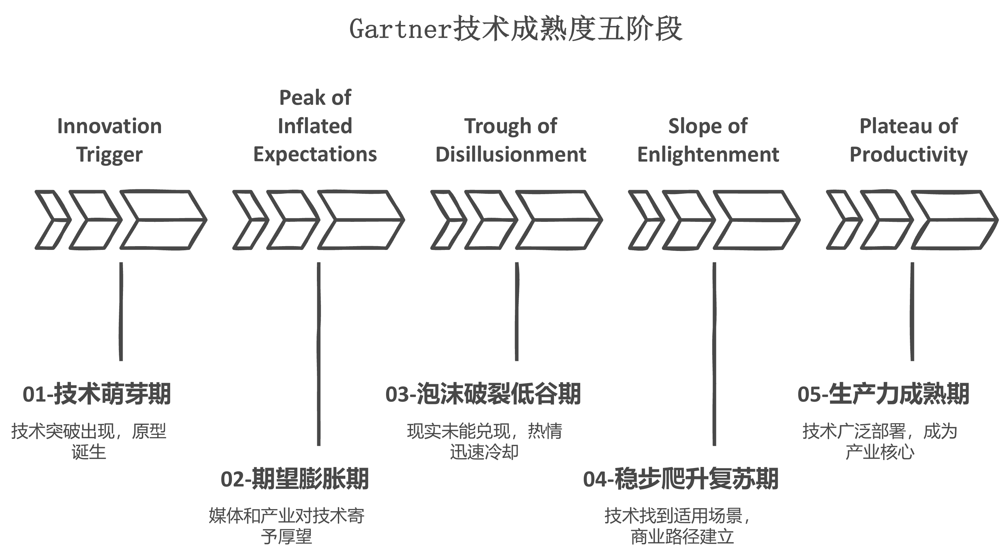

# 第1章 揭秘人工智能：从概念到现实

## 1.1 AI到底是什么？

过去十年里，"人工智能"这个词频繁出现在大众视野中，从新闻报道到生活应用，从企业战略到政府政策，几乎无所不在。但与此同时，AI究竟是什么、它为何而来、又将走向何方，仍困扰着不少人。它到底是科幻小说中冷酷无情的机械大脑，还是如今我们手机中轻松对话的语音助手？它是一种技术、一门学科，还是一种新的社会力量？要真正理解AI，我们必须先厘清它的定义、类别和能力边界。

本节将从人工智能的基本概念讲起，解释它的广义与狭义定义，并引出"强AI"与"弱AI"的本质区别，区分AI与人类智能的异同。接着，我们会从功能与技术的角度出发，对AI进行分类，介绍其在现实生活中的典型应用。我们还将澄清一些大众对AI的误解与幻想，为后续更深入地探讨AI的历史演进和现实图景打下基础。最后通过国内政策、企业应对、科研的角度，阐述中国AI发展以及国际的挑战。

### 1.1.1 人工智能的基本定义

#### 人工智能的广义与狭义定义

人工智能（Artificial
Intelligence，简称AI）是一门致力于研究、开发用于模拟、延伸和扩展人类智能的理论、方法、技术及应用系统的交叉学科。换句话说，如果把人类大脑比作计算机系统，AI就是我们试图通过算法复制这台系统的方式。

从广义上看，人工智能指的是任何能够执行需要人类智能才能完成的任务的系统；比如自动驾驶技术，它并不局限于执行单一任务，而是涉及多方面的智能，包括感知、决策、控制和学习。自动驾驶汽车需要不断处理来自环境的复杂信息，例如交通标志、行人、其他车辆的运动等，并根据这些信息做出驾驶决策。这要求系统不仅能识别物体、做出判断，还能预测未来的情况并采取相应的行动。例如，Tesla的自动驾驶系统就是基于深度学习和传感器融合技术，通过大数据训练来实现车辆自主驾驶功能。这一技术体现了广义人工智能的多任务能力，涵盖了人类驾驶所需的多方面智能。

而从狭义角度看，AI更多是指具有学习能力、推理能力和问题解决能力的计算机程序。举例而言，智能语音助手如Siri，便是典型的狭义AI产物，它们能听懂语音、执行指令，但并不具备真正的理解与意识。

#### 弱AI与强AI的区别

在人工智能领域，我们还经常听到"弱AI"和"强AI"这两个概念。这同样是一种对AI的分类方式，它们代表了人工智能在能力、目标和应用范围上的不同。

弱AI，也称为狭义AI，是目前实际应用中最为常见的人工智能类型。弱AI专注于执行特定任务，通常表现出在某些专业领域内的超常能力，但它缺乏理解和意识，不能超越任务范围进行推理或决策。弱AI系统没有自我意识、情感或理解能力，它仅根据预先设定的规则或通过训练数据来做出决策。首先，弱AI具备单任务能力，在特定领域内表现出强大的执行力。例如，图像识别系统可以准确地识别各种物体，但它并不能理解图像本身所承载的"含义"，也无法将这一识别能力迁移至其他类型的问题上。其次，弱AI的"智能"并不意味着真正的认知或意识。它所表现出的智能行为，仅仅是对人类指令的精密响应。它不具备意识与理解能力，无法真正理解其行为背后的意义或目标，也无法体验情感，更没有自主意识。尽管存在上述限制，弱AI仍展现出显著的优势。在其擅长的任务上，通常能够高效而精准地完成操作，甚至超过人类的表现。如今，许多基于弱AI的应用，如语音助手、翻译系统、推荐引擎等，已经广泛融入我们的日常生活，极大提升了人类的工作效率与生活便利。

与专注于单一任务的弱人工智能不同，强AI，又被称为通用人工智能（AGI），是一种理想中的人工智能形式。它不仅能完成特定任务，还能像人类一样在广泛的情境中自主学习、推理、决策，并具备意识、情感和自我反思的能力。强AI的目标是能够执行人类所有智能行为，解决任何智能任务，而不需要人工编程或者大量的训练数据。首先，强AI展现出广泛的任务能力。它不仅可以在多个领域中完成各类任务，还能够根据不同情境灵活调整自身行为。这种智能能够从经验中学习，进行推理，形成新的知识体系，从而像人类一样应对未知问题和复杂环境，展现出高度的灵活性与适应性。更进一步，强AI被认为具有自我意识与理解能力。它不仅能够执行任务，更能理解任务背后的意义，具备对自身行为和思维过程的反思能力。这意味着它能够做出自主决策，设定目标，并主动采取行动去实现这些目标，从而展现出某种形式的"意识"。此外，强AI可能还具有情感与社会交往能力。在这种设想中，它能够识别和理解他人的情绪，并在交互中做出情感化的反应，实现类似人类的情感沟通。这种能力使得强AI在社交、协作等复杂人类活动中具备潜在的参与可能。然而，需要强调的是，目前强AI仍处于理论探索阶段。尽管人工智能在自然语言处理、图像识别、机器翻译等特定领域已取得突破性进展，但至今尚未出现任何一种系统，能够在所有领域中展现出与人类相当的通用智能。因此，强AI仍是人类对未来智能发展的设想与目标，而非现实中的技术存在。

总的来说，弱AI已经广泛应用于各个领域，并且在特定任务中表现出强大的能力，而强AI仍然是一个远未实现的梦想。未来的人工智能可能会逐渐跨越这两个阶段，向着更为通用和智能的方向发展。

讲完这两类概念，需要注意的是，广义/狭义AI与强/弱AI并非一组概念对照，它们分别从AI的定义外延和能力内涵出发，用于描述人工智能的不同层面。总结来说，

所有弱AI都属于狭义AI，但不是所有广义AI都是强AI。强AI是广义AI中的"终极目标"，而弱AI是目前应用最广泛的形式，见表1-1

表1-1 广义/狭义AI VS 强/弱AI对比

---

   **区别维度**         **广义AI vs 狭义AI**               **弱AI vs 强AI**

   **概念侧重**     描述人工智能的范围/定义宽度     描述人工智能的能力强弱/自主性

   **关注焦点**          是"AI包含哪些功能"         是"AI能不能像人一样思考和意识"

   **典型应用**    图像识别、自动驾驶都属于广义AI    AlphaGo是弱AI，通用AGI是强AI

   **定义角度**   是一种分类学层次（外延 vs 内涵）   是一种智能水平分类（工具 vs
                                                                通用）

---

#### AI与人类智能的异同

经过数十年的发展，人工智能与人类智能在许多方面存在相似之处，但在本质上却有着显著的差异。理解这两者的异同，可以帮助我们更准确地评估AI的潜力和局限性。

**感知与学习**

人工智能与人类在感知和学习方面存在诸多相似之处。二者都能够通过感知系统获取外部信息并据此作出反应。例如，人工智能可以通过图像识别技术处理视觉信息，就如同人类通过眼睛观察周围环境；AI的语音识别技术在某种程度上也模仿了人类通过听觉理解语言的过程。这种基于感知的信息处理，体现了人类与AI在认知机制上的某些共通性。然而，二者之间也存在明显差异。人类在感知能力上展现出极高的多样性和灵活性，能够在复杂环境中迅速做出判断和反应。相较之下，AI的感知能力则显得较为局限。它通常需要大量训练数据来完成特定任务，并在面对陌生情境时表现出一定的被动性。人类可以凭借直觉、经验乃至情感进行迅速判断，而AI则往往必须依赖明确的规则或大量样本数据才能作出反应。

**推理与决策**

在推理和决策层面，AI与人类也存在着既有相似又有差异的特点。人工智能可以通过机器学习模型，对过去的数据进行分析，从而预测未来的趋势并做出判断。这一过程与人类通过逻辑思维和经验做出决策的方式在某种程度上是相似的，尤其体现在"预测功能"上。然而，人类的决策不仅建立在理性推理之上，还深受情感、价值观和社会文化背景的影响。AI的决策过程，尤其是在弱人工智能系统中，完全依赖于数学模型与算法的运作，缺乏情感与直觉。在围棋比赛中，AlphaGo展示了卓越的决策能力，但它的"判断"是基于庞大的历史数据和优化算法，而并不具备人类那样的直觉与感知力。

**适应性与创造力**

在适应性方面，AI和人类都能够通过学习改进自身行为。例如，深度学习中的神经网络系统可以在处理大量数据后自动提取特征并不断优化，这一机制与人类在经验积累中进行知识更新与行为调整的过程类似。尽管如此，AI在创造力方面仍难以企及人类。人类具有跨越经验边界、打破既有范式的独特能力，能够在艺术、哲学、科技等领域创造出前所未有的成果。相比之下，AI的创造往往是一种"统计式创造"------基于既有数据的重组和变换，缺乏真正的原创性和灵感。比如毕加索在创作《格尔尼卡》时，不仅融合了立体主义与表现主义，还深刻表达了对战争的愤怒与对生命的尊重，这种将情感、历史与艺术形式融合的创造过程，是目前AI无法完成的。当前如
DALL·E、Midjourney
等生成式AI可以创作风格多变的图像，但这些图像大多是根据已有艺术数据进行概率重组，缺乏深层语境的理解与真正的创作动机。这种本质上的差异，使得人类艺术家的"意义建构"与AI的"生成模拟"之间始终存在鸿沟。

**处理情感与意识**

AI与人类在情感处理方面也呈现出一定程度的相似性。某些人工智能系统可以通过语音识别和情感分析技术识别用户的情绪，并给出相应反应。例如，智能客服系统能够根据用户语气判断其满意度，并进行适当回应，从而改善交互体验。但这种模拟远不能等同于真正的情感理解。AI无法体会情绪，也不具备情感的自主性和深层结构。人类情感深植于生理机制、大脑活动与社会环境之中，具有复杂的层次与深刻的意识背景。在日常交往中，人类能够通过微表情、语调、肢体语言等多维度信号感知他人情绪，并据此作出判断，而AI只能基于数据与模式识别对情绪进行分类反应，缺乏真正的理解能力。

**自我意识与自主性**

在某些场景中，AI似乎也能表现出"自我调整"的能力。例如，在执行任务过程中，AI可以动态调整算法参数以优化任务效果，这种能力看似具备一定的自主性。然而，真正的自我意识远不止于此。人类不仅能感知自己的存在，还能反思行为、形成价值观，并在多重因素影响下自主作出决策。我们拥有目标设定与自我塑造的能力，而这些是目前AI所不具备的。AI的"自我优化"行为本质上仍是依据既定目标函数和数据规则进行操作，并不包含对"自我"的认知与意识。因此，尽管AI在效率、计算和特定任务执行方面具有人类无法匹敌的优势，它在情感、创造力和意识等方面与人类之间仍存在着根本差异。AI可以成为强大而可靠的工具，但它不能替代人类所独有的情感深度、文化创造力与内在反思力。未来的挑战在于如何实现AI与人类智能的协同发展，使两者在各自擅长的领域中实现优势互补，共同推进社会的进步与文明的演进。

### 1.1.2 AI的分类与功能

人工智能（AI）的种类繁多，可以从不同的角度进行分类。每种分类依据不同的标准和技术，帮助我们更好地理解AI的多样性和复杂性。以下是根据能力、技术以及具体功能对AI进行的分类。

#### 按能力分类

AI的功能可以从不同角度进行划分。根据其处理和解决问题的能力，AI主要可以分为感知、决策和生成三类，如图1-1所示。

{width="5.239583333333333in"
height="2.7107261592300964in"}

1-1 AI能力分类

**感知类AI：**

感知类AI致力于从环境中获取信息并理解外部世界。这类AI通过感官输入（如图像、声音等）来"感知"世界，并进行分析与判断。其应用主要集中在图像识别、语音识别、自然语言处理等领域。感知类AI的核心任务是将复杂的感官信息转化为机器能够理解和处理的形式。图像识别系统：例如，安防监控中的人脸识别系统，能够通过摄像头捕捉视频流并识别人脸，从而提高安全性；语音识别技术：如Google
Assistant或苹果Siri，它们能够听懂并执行用户的语音指令。语音识别技术广泛应用于智能家居、车载系统等领域；自然语言处理（NLP）：例如，语音助手和聊天机器人，它们不仅能"听懂"人类语言，还能生成自然流畅的对话，完成一些基本任务。

**决策类AI：**

决策类AI的主要功能是通过数据和算法做出判断、决策或推荐。这类AI不仅需要感知输入，还需要从历史数据中学习模式，做出合理的判断。决策类AI常用于医疗诊断、金融风控、智能推荐等领域。金融风控模型：如银行和金融机构使用的信贷审批算法，它们能够分析个人的信用历史、行为数据和其他特征，来决定是否批准贷款申请；医疗诊断系统：AI在医学影像中应用广泛，通过分析X光片、CT扫描、MRI图像等数据，AI可以帮助医生做出诊断，例如通过分析乳腺癌影像帮助医生早期发现病变。

**生成类AI：**

生成类AI的功能是通过算法生成新的数据、内容或信息。这类AI常常具有创作性和想象力，能够生成图像、音频、文本等。生成类AI是目前AI领域发展最为迅速和引人注目的方向之一，尤其是在艺术创作、自动化内容生成等领域。图像生成AI：如MidJourney，它们能够根据用户输入的文字描述生成高质量的图像，甚至可以创作出极具艺术感的作品；文本生成AI：例如OpenAI的GPT系列，可以根据输入的文本生成连贯的文章、小说、诗歌或对话。它们也能用来自动化写作、客服支持等任务；音乐生成AI：如AIVA，它可以创作背景音乐，甚至为电影和游戏制作原声带。

#### 按技术分类

根据AI系统的构建技术，可以分为符号主义（Symbolism）、连接主义（Connectionism）和行为主义（Behaviorism）这三类。每种技术代表着不同的理论基础和方法论。

**符号主义AI：**

符号主义是最早期的AI流派，强调通过规则和符号来表示知识，并依赖于推理来解决问题。符号主义AI侧重于人类知识的形式化和系统化，它使用逻辑和符号来表示世界的结构和规律。专家系统：早期的医学诊断专家系统（如MYCIN系统）使用大量规则库来帮助医生进行诊断。这些系统依赖于人工制定的规则，通过推理来得出结论。

**连接主义AI：**

连接主义AI，特别是深度学习，是目前AI技术中最为重要的流派。它模仿人类大脑神经元的结构，采用人工神经网络（ANN）来进行信息的处理和模式的学习。连接主义AI不依赖显式的规则，而是通过大量数据的训练来自动提取特征和规律。卷积神经网络（CNN）：常用于图像识别和视频分析。CNN能够自动从大量图像中提取特征，并且在图像分类、物体识别等任务中表现出极高的准确性；循环神经网络（RNN）：用于自然语言处理和语音识别，RNN能够处理序列数据，如语音、文本等。它常被应用于机器翻译和语音助手中。

**行为主义AI：**

行为主义AI更加关注环境与行动之间的交互，强调智能体通过与环境互动学习。行为主义AI的代表技术是强化学习（Reinforcement
Learning），它通过奖励和惩罚机制引导AI进行自我学习，优化行为策略。AlphaGo：使用深度强化学习，AlphaGo通过与自己对弈不断提升围棋水平，最终击败了世界冠军李世石；自动驾驶：自动驾驶汽车使用强化学习来不断优化行驶策略，它能够根据不同的道路和交通环境作出反应，逐渐学习如何更安全、更高效地驾驶。

这三大AI技术流派的主要区别如下表1-2所示：

表1-2三大AI技术流派关键对比

---

    **流派**                     **核心理念**                                   **方法代表**                                  **优势**                               **局限**                          **典型应用**

   **符号主义**      智能=操作符号规则（逻辑、语言、知识库）             专家系统、逻辑推理、语义网络                    推理严谨、可解释性强            规则构建困难、不适应复杂和模糊环境    早期医学诊断系统、自动定理证明

   **连接主义**           智能=神经网络中模式的统计学习           神经网络、深度学习（CNN、RNN、Transformer）   学习能力强、适用于大数据和复杂感知任务         缺乏因果推理、黑箱性强         图像识别、语音识别、自然语言生成

   **行为主义**   智能=与环境交互中习得的策略（基于试错和强化）             强化学习（Reinforcement                   适合动态环境、可以学习策略          学习过程代价高、难以解释、不稳定          AlphaGo、机器人控制
                                                                            Learning）、Q-learning

---

#### 具身智能：智能与身体的协同进化

近年来，随着人工智能的发展不断迈向更高层次，一个新的研究方向逐渐引起了学界与产业界的广泛关注------具身智能（Embodied
Intelligence）。这一概念突破了传统以"脑"为中心的AI范式，强调智能不仅是算法与数据的产物，更是感知、决策、生成与行动协同作用的结果，尤其关注智能体与其所处物理世界之间的深度互动。

具身智能的核心思想在于，智能并非孤立于环境而存在。相反，它植根于身体的存在与对外界的感知之中。换言之，真正的智能不仅依赖于计算系统内部的数据处理能力，也离不开智能体通过"身体"与环境之间的持续交互。在具身智能的视角下，认知与动作密不可分，感知与行为相辅相成。首先，具身智能强调身体与环境之间的互动性。AI系统在执行任务时不再只是被动地接受输入、输出结果，而是积极参与到与现实世界的双向互动中。例如，一个配备传感器与执行器的机器人，需要通过对周围环境的感知，做出行动选择，并在反馈中不断修正自身行为。这种模式不仅提升了AI的灵活性与适应性，也为其处理复杂、动态的现实问题提供了新的可能。其次，具身智能强调来自真实世界的反馈机制。与传统数据集训练的AI模型不同，具身智能系统往往需要在现实环境中不断接受反馈、持续学习。它通过传感器捕捉环境变化，并据此实时调整自身行为，类似于人类依赖视觉、听觉、触觉等感官在环境中做出判断的方式。这种与世界的直接交互，使得具身智能能够具备更强的情境理解能力与即时应对能力。一个广为人知的具身智能实例是波士顿动力公司研发的四足机器人"Spot"。这一机器人不仅配备了多种传感器以感知周边环境，还能够根据感知结果做出灵活反应，例如避开障碍物、在不平坦地形上行走、甚至上下楼梯。Spot的行为并非仅仅源于预设程序，更是在对环境变化的持续感知与实时决策基础上产生的。这种能力正是具身智能的核心体现------通过身体感知与环境互动，展现出接近生物智能的适应性和灵活性。

总的来说，具身智能为我们理解和构建未来的人工智能系统提供了一种更为立体和动态的视角。它不仅关注算法的推理能力，也强调智能体在现实世界中如何"活"起来，如何以身体为媒介与外部世界建立有效连接。随着机器人技术与AI算法的进一步融合，具身智能有望成为推动智能技术向更高层次发展的重要方向。

### 1.1.3 AI的典型功能

人工智能的飞速发展早已超越实验室的边界，逐步渗透到人类社会的各个角落。从学术理论到实际落地，AI技术展现出前所未有的强大能力与广泛应用前景，正重塑着工作、生活乃至产业运行的基本方式。如今，人工智能的核心功能涵盖了图像识别、语音交互、预测分析、自动控制以及生成创作等多个方向，在这些技术维度下，各行各业正迎来效率与智能水平的双重跃升。

**图像识别：赋予机器"视觉"的能力**

图像识别是人工智能最早实现重大突破的领域之一，依托于深度学习中的卷积神经网络（CNN），AI系统如今已能准确识别图像中的人物、物体、场景，甚至完成复杂的任务如情绪识别和医学影像诊断。在交通管理中，图像识别技术被广泛用于自动车牌识别、违章检测与红绿灯状态识别，构建出高效的智能交通系统；在内容审核方面，社交媒体平台借助AI自动识别并屏蔽暴力、色情等违规图像，为网络空间的安全与清朗保驾护航。

**语音交互：让机器"听懂"并回应人类**

语音交互技术的发展，使得人与机器之间的交流更为自然与高效。其核心涵盖语音识别（ASR）、自然语言理解（NLU）和语音合成（TTS）等关键环节，使AI能够听、懂并回应人类语言。在日常生活中，各类智能语音助手如
Siri、小爱同学、天猫精灵等，能够通过语音控制家电、查询天气、设置提醒，为用户提供便捷的服务。在企业服务中，AI语音客服系统正逐步取代传统坐席人员，实现自动应答与流程引导，大幅提升服务效率与一致性。而对于听障人士，语音转文字系统则打破了沟通的障碍，推动信息的无障碍共享。

**预测分析：数据驱动的智能决策**

在信息爆炸的时代，预测分析成为AI帮助人类理解未来趋势的重要手段。通过对历史数据的挖掘与建模，AI能够识别潜在模式并进行趋势预测，广泛应用于金融、零售、公共管理等领域。例如，在金融风控中，AI系统可以通过分析用户的信用记录、消费行为与违约历史，评估贷款的风险等级，从而辅助银行做出更稳健的放贷决策；在电商平台上，预测分析则驱动个性化推荐系统，根据用户行为习惯推送可能感兴趣的商品，提升转化率与用户体验；而在公共安全领域，AI则可根据历史案件数据预测犯罪高发区域，协助警力科学部署，实现社会治理的智能化。

**自动控制：让机器自主感知与行动**

将AI技术与传感器、嵌入式系统相结合，使得机器获得感知环境并自主行动的能力，极大推动了自动化与智能硬件的发展。在自动驾驶领域，车辆集成激光雷达、摄像头与深度学习算法，能够实现对周边环境的实时感知、路径规划与决策控制，构成一个闭环运行系统。在制造工厂中，工业机器人借助AI执行高精度的焊接、搬运、检测等工作，可在高强度环境下长时间稳定运作，大幅提升生产效率和品质。在家庭领域，AI赋能的智能家居系统则根据环境信息自动调节空调、灯光与安防设备，构建出更加舒适、安全与节能的居住空间。

**生成创作：从执行者走向创作者**

生成式人工智能（Generative
AI）标志着AI能力的又一跃升，它不再仅仅是人类的"工具"或"执行者"，而开始展现出一定程度上的创造力，成为内容的"共同创作者"。在文本创作方面，诸如GPT模型能够撰写文章、生成剧本、编写代码，甚至协助用户进行文学创作与技术调试；在图像生成领域，Midjourney
与 DALL·E
等模型则可根据用户输入的文字描述自动创作出艺术插画、产品设计草图等图像内容；在音视频方面，AI不仅可以模拟人声，还能创作音乐、合成视频，为媒体、广告、娱乐等行业带来全新的内容生产方式。这类技术的迅猛发展，正逐步改变我们对"创意"与"艺术"边界的认知。

### 1.1.4 大众对AI的常见误解与流行想象的澄清

人工智能的发展迅猛，引发了公众的浓厚兴趣和广泛讨论，但其中也存在大量误解与误读。最常见的误区之一，是将AI等同于科幻电影中的"智能生命体"，例如《终结者》中的天网、《机械公敌》中的机器人或《黑客帝国》中的母体。这些虚构作品中的AI具有人类甚至超越人类的智能，能够自我决策、进化甚至反叛，极大地激发了人们的想象力，也加剧了对AI"失控"的恐惧。然而，现实中的AI本质上是依赖大量数据、算法模型和特定任务目标的工具型技术，不具备情感、自主意识或价值判断能力。它们执行任务的前提，是被"设计好"或"训练好"，而不是像电影角色那样具备自由意志。

另一个常见误解，是公众往往高估了AI的"通用性"与"自主性"。例如，当我们看到AI打败了围棋世界冠军或写出仿人类文章时，容易误以为它"无所不能"。但事实上，这些系统在超出训练范围后往往一筹莫展。例如，图像识别AI可能在识别猫和狗方面接近100%准确，但在面对一张马赛克化或角度稍有不同的猫图时就可能出错；语言模型虽然能写诗作文，但它并不理解情感，只是在"预测下一个最可能的词"。更有甚者，有人认为AI将"全面替代人类"，造成失业潮甚至社会崩塌。这种"替代论"虽有一定现实依据，但也忽略了AI带来的正向影响。AI确实会对一些重复性高、可量化的岗位构成挑战，例如基础文书处理、数据录入、简单客服等，但它也创造了新的就业机会和职业形态，比如算法工程师、数据标注员、人工智能伦理顾问等。此外，AI更可能成为人类的"增强工具"，而非"替代者"。医生可借助AI更快诊断病症，教师可通过智能系统实现个性化教学，记者也能利用AI辅助整理新闻线索。这些例子表明，人机协作才是未来的主流趋势。

还有一些流行误解源于AI被神化或妖魔化。一方面，某些科技宣传过于强调AI的"智慧"与"神秘"，将其包装成仿佛超自然的存在；另一方面，一些媒体则渲染AI"夺权""毁灭世界"的风险，使得大众对AI充满焦虑。实际上，AI既不是救世主，也不是恶魔，它只是技术演进中的一个新阶段，其发展和应用始终离不开人类的设计、监管与伦理指导。

澄清这些误区，有助于公众形成理性、客观、全面的AI认知，从而避免盲目崇拜或无端恐慌。理解AI不是为了追逐潮流，而是为了让我们作为社会个体与集体，能够更有准备地面对这个正在改变世界的技术洪流。

## 1.2 AI简史：从图灵机到大模型

人工智能并非一个新时代的产物，其概念的雏形早在20世纪中叶便已萌芽。从哲学对"思维机器"的幻想，到今天深度学习模型所取得的突破，AI的发展历程跨越了近一个世纪，经历了从冷门学术研究到全球科技竞争核心的剧烈变迁。

### 1.2.1 概念诞生：从图灵测试到达特茅斯会议

1947年，英国数学家艾伦·图灵在一次公开演讲中首次提出："机器是否能够思考？"这个发问并非只是修辞，而是抛出了一个前所未有的哲学命题。图灵认为，如果人类的智能本质可以形式化为逻辑过程，那么在理论上，机器就能够"模拟"这些过程。

1950年，他发表论文《计算机器与智能》（Computing Machinery and
Intelligence），正式提出"图灵测试"的概念。测试场景是：一名评审与一个人和一台机器分别进行文本对话，如果评审无法判断谁是人类、谁是机器，则认为该机器具备"智能"。图灵在文中大胆预测，到2000年，计算机通过测试的概率将达到30%。虽然这一预测显得乐观，但它奠定了AI研究的逻辑起点。

与此同时，其他学者如诺伯特·维纳（控制论之父）和克劳德·香农（信息论创始人）也在探讨人类与机器之间的"信息"与"控制"问题，为AI发展提供了交叉学科的支撑。

1956年，达特茅斯会议被广泛认为是AI正式诞生的历史时刻。此次会议由麦卡锡、明斯基、罗切斯特和香农共同发起，在夏季的达特茅斯学院举行，参会者提出的基本假设是："每一种学习或其他任何形式的智能，都可以用一个机器加以精确描述。"

麦卡锡首次提出"Artificial
Intelligence（人工智能）"这一术语，会议中确立了四个关键研究方向：问题求解与搜索算法、知识表示、自然语言理解和机器学习。虽然此次会议并未立即催生实用技术成果，但它为之后几十年的AI研究设定了路线图。

在会议之后的十年间，美国政府、尤其是国防部高级研究计划局（ARPA）开始资助AI项目，这些投入促成了早期自动定理证明程序和语义网络等成果的诞生。AI逐步从一种思想实验，转变为一门具有工程实践目标的交叉学科。

图灵的思想、达特茅斯会议的启蒙和早期政府资助，共同构成了AI诞生阶段的"三大支柱"。它们不但开启了一场新的科技革命，也促使人类开始重新思考"智能"的本质。

### 1.2.2 第一代：专家系统与符号主义

20世纪60至80年代，被称为人工智能的"黄金早期"，这一时期的核心研究范式是"符号主义"或称"逻辑主义"。其核心思想在于：人类智能主要体现在处理抽象符号（如语言、公式、规则等）的能力上，因此，构建一套可以表达、操作这些符号的计算模型，就有可能实现人工智能。

最具代表性的技术成果是"专家系统"（Expert
System）。专家系统是一种模拟人类专家在特定领域进行推理和决策的软件系统。它通常包含一个"知识库"（储存专家的规则和经验）和一个"推理引擎"（用于分析和决策）。例如，医学诊断系统
MYCIN、地质勘探系统 DENDRAL
就是当时广为人知的专家系统。专家系统在商业和工业界得到了广泛应用，尤其在金融、医疗、制造和军事领域。例如，美国的诊断系统
XCON 被用于数字设备公司（DEC）的计算机装配流程中，显著提高了效率。

但符号主义AI的一个主要问题是其"常识瓶颈"------虽然系统可以处理特定领域的规则，但缺乏应对复杂或模糊问题的灵活性。例如，如果规则中没有明确写出"一个人不可能同时在两个地方"，系统可能不会自动做出这个判断。此外，知识的输入和维护成本极高，依赖大量人工编写规则，难以扩展。

尽管如此，第一代AI奠定了"人工智能可以被编码"的基本逻辑架构，也为后来的统计学习和数据驱动方法准备了问题模型和研究范式。符号主义在今天仍有其余脉存在，尤其在某些需要可解释性的应用（如法律、医学）中依然具有重要价值。

### 1.2.3 第二代：统计学习的兴起

20世纪90年代，随着计算能力的提升和数据获取方式的多样化，人工智能研究逐步从"符号逻辑驱动"转向"数据驱动"的新范式------即统计学习方法的广泛应用。这一转变标志着第二代AI的崛起，也奠定了日后深度学习的基础。

与专家系统依赖人类专家手工编写规则不同，统计学习方法强调通过大量数据训练模型，让机器自动学习模式和规律。其中一个关键工具是机器学习（Machine
Learning），它通过构建算法，使得系统可以从历史数据中预测未知结果。例如，早期的垃圾邮件过滤器就是统计学习的一个应用。通过分析大量被标记为"垃圾邮件"与"正常邮件"的样本，系统可以学习邮件中哪些词汇、结构或发送行为更可能与垃圾邮件相关，从而自动判断新邮件是否为垃圾邮件。

这一时期的代表技术包括：

- 决策树：通过不断分裂数据特征节点构建分类模型。
- 支持向量机（SVM）：寻找最优超平面实现数据分类。
- 朴素贝叶斯分类器：基于概率理论判断样本归属。
- K-近邻算法（KNN）：基于距离度量寻找最相似样本进行预测。

同时，这一阶段也伴随着"大数据"概念的兴起。企业和机构开始积累大量结构化与非结构化数据，统计学习模型得以在真实数据环境中验证其有效性。例如，亚马逊的推荐系统、谷歌的搜索排序算法、金融机构的风险建模等，均源自这一阶段的技术积累。

然而，第二代AI虽然比专家系统更具灵活性，但依然存在"特征工程"依赖强、对复杂语义理解能力有限等局限。这些瓶颈为第三代AI，也就是深度学习的兴起，留下了技术缺口。

### 1.2.4 第三代：深度学习、大模型革命以及诺贝尔奖对AI的认可

进入2010年代，人工智能迎来了被称为"深度学习革命"的第三次浪潮。这一波变革不仅在学术界取得重大突破，更直接推动了语音识别、计算机视觉、自然语言处理等关键领域的产业化落地。

所谓深度学习，是一种基于多层神经网络的机器学习方法，它模拟人脑神经元的连接方式，通过多层"感知"与"抽象"来理解和生成信息。深度学习之所以取得成功，关键在于三方面因素的叠加：第一大规模数据的可获得性：社交媒体、移动设备、传感器的普及为模型提供了丰富的训练数据。第二计算能力的提升：GPU和分布式计算使得训练大规模神经网络成为可能。第三算法创新：如反向传播算法、卷积神经网络（CNN）、循环神经网络（RNN）等模型结构的改进。

2012年ImageNet图像识别比赛成为标志性事件，加拿大学者Geoffrey
Hinton团队所提出的深度卷积神经网络AlexNet，大幅超越传统方法的识别准确率，引发全球AI研究的转向。随后的几年里，深度学习推动了包括自动驾驶、智能客服、人脸识别、语言翻译等在内的应用层创新。

**AI对科学研究的深刻影响：诺贝尔奖的认可**

随着人工智能的发展和影响，也越来越受到顶级学术荣誉的肯定。2024年诺贝尔奖的两项科技奖------物理学奖和化学奖，分别通过间接或直接的方式，对AI技术在科学研究中的关键作用给予了认可，这标志着AI已成为推动自然科学前沿发展的重要驱动力。

**2024年诺贝尔物理学奖：高强度激光与AI助力实验控制**

2024年诺贝尔物理学奖授予了三位科学家，以表彰他们在高强度、超短脉冲激光技术上的突破性贡献。这些技术广泛应用于物质的极端状态研究，比如在飞秒（10\^-15
秒）时间尺度上探测电子运动。这些精密实验需要对激光参数、材料响应等进行极其精确的控制与预测，而AI算法，尤其是基于深度学习的系统优化与实时数据分析技术，正逐步成为实验的"智控大脑"。

**2024年诺贝尔化学奖：AI辅助分子设计与药物发现**

2024年诺贝尔化学奖表彰了在"分子机器"和"AI辅助药物设计"领域取得突破的研究者。特别值得注意的是，其中的一项关键贡献是将AI技术，尤其是深度学习和图神经网络（Graph
Neural Networks,
GNN），用于预测分子结构的活性与稳定性，从而大幅缩短药物筛选周期。

### 1.2.5 第四代：通用大模型与AI系统化

自2020年以来，人工智能的发展进入了一个全新的阶段，学术界通常将这一阶段称为"第四代AI"。这一代人工智能的核心特征是通用性（generalization）、系统化（systemization）、推理能力（reasoning）、多模态能力（multimodality）以及任务迁移（task
transfer）。第四代AI不再只是执行特定任务的工具，而是逐步成为一种具备自主学习、复杂推理、系统集成能力的"通用智能平台"，正在重新定义我们对"智能"的认知边界。

**通用大模型的崛起：从GPT到DeepSeek**

第四代AI的标志性成果之一，是以GPT-3、GPT-4为代表的通用预训练语言模型（Large
Language Models,
LLMs）。这些模型的规模之大、训练数据之广、能力之强，远超之前的所有技术体系。

GPT（Generative Pre-trained
Transformer）系列由OpenAI研发，其模型架构基于Transformer机制，通过自监督学习在互联网上的海量语料库中进行训练。模型通过"语言建模"任务，学习了词语间的概率关系，最终能够进行自然语言理解与生成、自动摘要、翻译、文本分类、信息抽取等复杂语言任务。

中国的DeepSeek模型体系也表现出强劲的技术实力。其模型在中文语境下的精度、推理能力、响应速度等方面，均达到了世界先进水平。此外，百度的"文心一言"、阿里的"通义千问"、讯飞的"星火大模型"、智谱AI的"ChatGLM"等也纷纷推出，构成了中国在通用语言模型领域的重要力量。

这些模型不仅体现在问答对话层面，更具备跨任务泛化能力。它们可以回答历史问题、解读医学报告、撰写商业策划书、生成计算机代码、甚至对视频画面进行描述与分析，标志着通用AI的初步实现。

**推理能力的飞跃：AI开始"思考"**

不同于传统模型依赖特定训练数据与固定任务规则，第四代AI展示出跨语境、跨领域的"逻辑推理能力"。

以GPT-4为例，它不仅可以执行"识别事实"的任务，还能进行多轮思维链式推理（Chain-of-Thought）。例如，在面对一道复杂的逻辑题时，模型可以自动分解问题步骤，逐步得出答案，并解释每一步推理逻辑。

此外，推理能力的提升使得AI可以胜任更高级的工作任务。例如，AI开始在法律文书撰写、商业策略制定、科研数据归纳、程序算法设计等领域发挥作用。微软将其命名为"Copilot"（副驾驶），强调其"辅助决策"而非"替代人类"的角色。这一点在未来AI伦理讨论中具有重大意义。

**多模态智能：突破文字边界**

第四代AI不再局限于文本处理，而是逐步具备"多模态"能力，即同时处理和理解图像、音频、视频、代码、传感器数据等多种信息源。

OpenAI发布的GPT-4
Vision、Google推出的Gemini模型、Meta的ImageBind，以及中国的DeepSeek-VL、文心一言多模态版本，均具备图文理解、图像生成、语音对话、视频描述等功能。例如，用户上传一张图像，模型不仅可以识别其中的物体，还能分析画面构图、判断事件背景，甚至结合文本上下文给出叙述性的解释。

这种能力将AI从"文字智能"推向"感知智能"。在自动驾驶、医疗影像诊断、视频监控、教育评估等领域，多模态AI被广泛应用，提高了系统的理解精度和响应能力。

**AI系统化：从模型走向系统的跃迁**

随着人工智能大模型能力的不断增强，社会各界对AI潜力的认识也愈加深入。然而，实践中逐渐显现出一个关键问题：再强大的模型，若无法有效嵌入业务流程、系统环境和组织架构，其能力将难以转化为真正的生产力。这促使人们开始反思"模型中心主义"的局限，并转而关注如何实现AI的"系统化"落地。

第四代AI的核心转向，正是在于从单点智能走向系统性智能。AI不仅仅是一个模型，而是一个可以持续感知、理解、行动并与外部系统交互的智能系统。这种系统化的智能正在以多种形式展开，其代表性技术路径包括智能体框架、知识增强生成架构、插件生态系统和流程编排平台等。

**智能体（Agent）框架：AI成为可管理的任务执行者**

在第四代AI系统中，智能体（Agent）成为重要的结构单元。与传统模型只能单次响应指令不同，智能体具备任务规划、自主调度、持续执行与反馈学习等能力。它可以根据环境状态与用户需求，灵活地调整执行路径，在保持交互性的同时实现复杂任务的自主完成。这使得AI不再只是"工具"，而成为具备一定程度"自治行为"的智能伙伴。

**RAG架构：将知识检索与生成能力融合**

RAG（Retrieval-Augmented
Generation，检索增强生成）架构是在应对大模型"幻觉问题"过程中诞生的重要技术路径。传统生成模型往往基于参数中存储的知识生成内容，可能产生不真实或不准确的信息。而RAG架构通过引入检索机制，使AI在生成内容前主动查找外部知识库中的相关资料，从而提升生成内容的准确性与时效性。例如，在企业知识问答系统中，RAG使AI能够准确调用最新的产品文档或政策条款，从而给出可靠解答，增强用户信任。

**插件生态：扩展AI的行动边界**

插件系统的引入，极大拓展了AI的功能边界。通过调用插件，AI可以不局限于文字生成，而是具备与其他系统交互、调用服务接口、执行网络任务等能力。例如，ChatGPT
插件生态和 GitHub Copilot Extension
允许AI在聊天过程中调取实时天气、完成机票预订，或在编程平台上直接操作代码文件。这种"行动能力"的增强，使AI更贴近实际工作与生活需求，变得更为实用与高效。

**流程编排平台：AI接管任务链条**

AI的系统化发展也体现在流程自动化平台的兴起。例如，LangChain、AutoGPT等工具，支持构建基于多步骤任务链的复杂智能流程。AI不仅能完成单一任务，还能在多个子任务之间进行逻辑判断与资源调度，实现"从任务提出到任务完成"的全过程自主运行。这样的能力极大拓展了AI的应用场景，使其逐步接管传统上由人类执行的知识型劳动链条。例如，一个现代AI助理可以接收用户的自然语言输入，如"请为我准备一份上周的销售报告摘要并邮件发送"。AI系统将自动完成以下流程：从知识库检索相关数据，访问内部CRM系统提取销售数据，生成摘要内容，通过预设邮件服务发送报告，并可通过语音接口向用户反馈操作完成状态。这一"从输入到输出的完整工作流"，正是AI系统化能力的集中体现。

随着人工智能系统的不断演进，AI不再是一个孤立的模型或算法，而是逐步发展为能够感知环境、连接系统、管理任务并持续学习的复杂智能生态。这种"从模型到系统"的跃迁，不仅是第四代AI的技术突破方向，更是AI迈向广泛社会应用的必经之路。在未来的发展中，AI系统化将成为推动行业智能转型和社会协同创新的关键力量。

**从协作工具到自主智能体**

第四代AI的另一个显著发展是从"人机协作"转向"人机共创"，乃至某些特定领域的"AI自主任务执行"。所谓"自主智能体"（Autonomous
Agents），指的是能够感知环境、制定计划、做出决策并执行动作的AI系统。它不仅被动响应人类请求，还可主动发现问题、调度资源、优化策略。例如：在科研中，AI可以自主提出实验假设、分析实验结果，并设计下一轮试验计划；在商业管理中，AI智能体可监测市场变化，自动调整营销策略、调整库存计划；在游戏领域，AI智能体可与人类进行复杂博弈，创造全新的游戏体验。

这标志着AI正逐步摆脱"命令执行者"的角色，具备一定程度的"任务自治能力"。尽管目前的自主性仍有限，但其潜力不可忽视。

**向通用人工智能（AGI）迈进**

通用人工智能（Artificial General Intelligence,
AGI）一直是AI研究的"圣杯"，即一种具备自我学习、自主意识、多领域迁移能力的智能体。第四代AI的诸多特征------语言理解、多模态感知、逻辑推理、自主任务执行------正在逐步逼近AGI的边界。

尽管目前我们尚未真正实现AGI，但从GPT-4、Claude、Gemini等模型的表现来看，"弱通用智能"的雏形已经显现。未来几年，随着模型结构、训练方式、算力基础的进一步突破，AI是否会实现质的飞跃，仍有待观察。

可以确定的是，AI正在经历一场从"功能型工具"到"系统性智能"的深度跃迁。第四代AI不再只是技术突破的产物，它正渗透进生产关系、知识结构和社会治理的肌理之中，成为新文明形态的基础构件。

### 1.2.6 技术成熟度曲线

人工智能的发展并非一帆风顺。从最初的学术构想到今天的深度应用，AI技术经历了多轮热潮与低谷的循环。这种演化过程可以用"技术成熟度曲线"（Hype
Cycle）加以解释。这一概念由著名咨询公司Gartner提出，是一个描述新兴技术从引入到成熟、再到广泛应用过程的可视化工具。通过该曲线，我们能够更科学地理解AI技术所经历的阶段、所面临的挑战，以及其真正释放价值的路径。Gartner的技术成熟度曲线包括五个典型阶段，如下图1-2所示。

{width="6.299305555555556in"
height="3.511124234470691in"}

图1-2 Gartner技术成熟度五阶段

将AI的发展历程映射到技术成熟度曲线，可以更清晰地把握其波动轨迹，如下图1-3所示。

{width="6.299305555555556in"
height="3.333652668416448in"}

图1-3 人工智能技术成熟度对照

**人工智能的多路径成熟之路**

尽管人工智能整体正朝着日益成熟的方向迈进，但在不同的应用领域，其发展节奏和成熟程度却呈现出明显差异。这种差异不仅体现了各领域技术基础与应用场景的复杂性，也揭示出AI从实验室走向产业化所面临的不同路径与挑战。

**图像识别与语音识别：进入"生产力成熟期"**

图像识别与语音识别是AI技术中最早实现规模化应用的领域之一。依托于深度神经网络（如卷积神经网络CNN和循环神经网络RNN）的广泛使用，这两项技术已经取得了高度成熟的性能表现。无论是在自动驾驶中的视觉系统，还是智能手机与家居设备中的语音交互，这些AI能力已深度嵌入现实生活，并展现出强大的商业化能力。可以说，这些领域已经进入"生产力成熟期"，其技术和市场双重驱动的格局日趋稳定。

**自然语言处理：生成式AI带动的跃迁**

在经历了一段时间的"复苏期"后，自然语言处理（NLP）因生成式AI（Generative
AI）的突破而迎来前所未有的发展浪潮。以GPT系列模型为代表的预训练语言模型，不仅显著提升了语言理解和生成能力，也使得NLP跨越了传统的规则与特征工程范式，步入深度学习主导的新阶段。然而，与这一跃迁同步而来的，是伦理风险、内容幻觉、隐私保护等一系列复杂问题的出现，使该领域在成熟的同时也面临新的不确定性与社会考验。

**自动驾驶：从热潮到现实的过渡期**

自动驾驶作为AI技术最具未来感的应用之一，曾长期处于技术炒作周期的"期望膨胀期"。然而，随着实际部署面临的法律责任、安全边界、极端场景适应性等问题逐渐暴露，该领域正在经历向"泡沫低谷期"的过渡。尽管自动驾驶在高速公路、特定园区等受控环境中取得了积极成果，但要真正实现全面商业化仍需攻克感知精度、决策系统鲁棒性和城市复杂交通场景的高度适应能力等难题。

**通用人工智能（AGI）：仍在"萌芽期"的技术构想**

相比之下，通用人工智能（Artificial General Intelligence,
AGI）依然处于技术发展的萌芽阶段。当前对AGI的构想更多来自理论模型与哲学探讨，尚未形成稳定的技术路径或验证框架。尽管业界对AGI持有极高期望，但其真正实现仍面临巨大的科学与工程挑战。当前AGI的讨论更多是一种技术理想，其发展进程可能远比狭义AI系统复杂和缓慢。

**顺应曲线：面向AI的未来发展观**

未来AI的发展仍将遵循技术成熟度曲线（Technology Hype
Cycle）的基本路径，从技术萌芽、期望膨胀、幻灭低谷，最终迈向生产力的广泛释放。多模态学习、边缘智能、具身智能等新兴方向的兴起，预示着AI正从单一功能模型向系统协作、场景感知、实时反应的方向演进。这种演进将使AI更深度地嵌入社会系统，成为医疗影像诊断、工业自动化、城市交通调度、个性化教育等多行业转型升级的关键支撑。

我们必须清醒认识到：技术从来不是一蹴而就的奇迹，而是建立在长期研究、反复试错和系统积累之上的成果。唯有以理性和持续观察的视角审视AI的发展路径，才能有效辨识那些真正具有变革意义的突破点，避免被短期炒作和幻想牵引，从而在技术浪潮中稳步前行，真正实现AI与社会的深度融合与良性共进。

## 1.3 中国AI发展的关键进展

### 1.3.1 政策驱动：国家战略与政府支持

中国人工智能（AI）发展的迅猛进展，离不开国家层面的战略部署和政策引导。自2017年《新一代人工智能发展规划》发布以来，国家持续加大对AI领域的支持力度，推动AI技术的研究、应用和产业化。

**《新一代人工智能发展规划》的发布**

2017年7月，国务院发布《新一代人工智能发展规划》，明确将AI发展上升为国家战略，提出到2030年建成世界主要人工智能创新中心的目标。该规划强调：到2020年，AI总体技术和应用与世界先进水平同步，核心产业规模超过1500亿元，带动相关产业规模超过1万亿元。到2025年，AI基础理论实现重大突破，部分技术与应用达到世界领先水平，核心产业规模超过4000亿元，带动相关产业规模超过5万亿元。到2030年，AI理论、技术与应用总体达到世界领先水平，核心产业规模超过1万亿元，带动相关产业规模超过10万亿元。

该规划还提出构建开放协同的AI科技创新体系，强化基础理论研究，突破关键共性技术，建设智能经济和智能社会，完善法律法规和伦理规范体系。

**持续的政策支持与战略部署**

在《新一代人工智能发展规划》发布后，国家各部委相继出台多项政策文件，支持AI技术的发展与应用。

2025年3月，政府在全国人民代表大会上提出，将加大对AI应用、风险投资和其他技术创新的支持，推动生物制造、量子技术、具身AI和6G等未来产业的发展。

2025年4月，习近平总书记在中共中央政治局集体学习时强调，要加强AI领域的自主创新，推进高端芯片和基础软件的研发，构建自主可控的AI基础设施。

国家还设立了人工智能标准化技术委员会，制定AI领域的技术标准，推动AI产业的规范化发展。
此外，AI还被纳入数字中国、智慧城市、制造强国等国家级战略中，形成"政策---科研---产业"三位一体的驱动模式，加速了AI成果从实验室走向产业链。

**地方政府的积极响应与布局**

各地方政府积极响应国家战略，结合自身优势，制定了符合本地实际的AI发展规划。

北京市设立了人工智能创新发展试验区，推动AI技术在城市治理、医疗健康等领域的应用；上海市打造了张江人工智能岛，集聚AI企业和科研机构，形成产业集群；深圳市建设了全球AI应用示范基地，推动AI技术在制造业、金融等领域的深度融合。这些地方政策的实施，为AI技术的落地应用提供了良好的环境和支持。

### 1.3.2 产业升级：AI企业的崛起与创新

在国家战略的推动与政策激励下，中国AI产业进入了爆发式增长的阶段，涌现出一批具有国际竞争力的龙头企业与创新型初创公司，逐步形成了从基础设施到行业应用的完整产业链。这一过程中，不仅有"国家队"企业的战略引领，还有众多民营企业与创业团队的技术突破与商业创新，形成了产业升级的多元动力。

**大模型引领AI技术生态重构**

2023年以来，中国大模型研发持续加速，推动AI基础能力跃迁。以百度、阿里巴巴、腾讯、科大讯飞、字节跳动、华为等为代表的企业纷纷发布自研大模型，形成"百模大战"格局。

百度"文心一言"是国内首批对标GPT的大语言模型，强调多模态融合、知识增强与安全可控，服务于搜索、自动驾驶、内容创作等多个场景。

阿里"通义千问"聚焦大语言模型和多模态模型一体化发展，强调与阿里云生态融合，并在医疗、政务等垂直行业展开落地。

讯飞"星火认知大模型"主打中文语境下的知识理解与复杂问答，提出"认知智能+通用人工智能"的技术路线，并快速在教育、政法、金融等领域部署。

字节跳动"豆包"、商汤"日日新"、华为"盘古"系列也在图像生成、工业建模、自动驾驶等方面形成各自优势。

这些大模型的发展不仅展示了中国企业在算力、算法、数据等方面的快速提升，也推动了AI基础能力平台化，从单点突破走向通用智能基础设施建设。

**垂直场景深化推动产业落地**

除了头部企业的大模型竞争，众多中小AI公司聚焦于行业垂直场景，通过技术与应用的深度融合，形成了更强的商业闭环。

商汤科技通过其SenseCore平台将AI技术广泛应用于智慧城市、智能汽车、AI教育等领域。

旷视科技将AI算法嵌入工业视觉系统中，为智能制造提供检测、识别、监控等智能视觉能力。

依图科技聚焦医疗AI，开发CT影像诊断、心电图分析等系统，支持医生对癌症、肺结节等疾病的快速筛查。

第四范式以AutoML与平台化AI服务为核心，为金融、零售、制造等行业提供模型训练、部署与迭代的一站式解决方案。

这些公司通过"AI +
行业"的路线，将复杂的算法能力封装为易用的服务或平台，使非技术客户也能部署和使用AI，显著提升行业智能化水平。

**产业链协同与AI基础设施建设**

AI的发展离不开背后的硬件基础与算法框架支撑。近年来，随着"国产替代"需求增强，中国企业也在加快芯片、框架、数据等底层能力的突破。

在芯片方面，寒武纪、地平线、中科院旗下的"海光"芯片等持续优化AI加速计算能力，逐步减少对国外GPU的依赖。

在开源框架层，百度的PaddlePaddle（飞桨）已成为国内影响力最大的深度学习框架。

在数据基础层，阿里、腾讯、华为等在自建数据中心、云服务平台（如阿里云、华为云）方面持续加码，为大模型训练和AI服务部署提供强大支撑。

此外，多个城市正在建设AI超算中心、智算中心，通过政企共建的方式，为本地AI创新提供算力保障与基础资源，促进AI生态加快成熟。

**AI资本热潮与产业孵化机制**

伴随着技术和场景的快速演进，资本市场对AI持续关注，形成强大的金融助推力。风投机构如红杉资本中国、真格基金、高瓴创投等纷纷布局AI初创企业。地方政府设立多支AI专项产业引导基金，推动本地AI产业集聚。企业孵化平台如腾讯AI加速器、阿里"创学院"等帮助初创团队对接资源、快速成长。这种产学研资的多维联动，正在催生新一轮AI产业集群与创业热潮。

**"出海"与国际化发展的步伐**

中国AI企业正逐步走向国际市场，尤其在"一带一路"沿线国家、东南亚、中东等区域形成较强的"AI出海"动能。商汤与中东地区政府合作开发智慧安防系统；云从科技与新加坡合作建设智能机场；华为基于盘古大模型的工业智能方案已在中亚、欧洲部署；阿里云在马来西亚、印度尼西亚等地推动云服务与AI平台输出；大疆、地平线等公司将计算机视觉能力应用于全球无人机与车载市场。

中国人工智能产业正进入一个从"技术突破"迈向"产业成熟"的关键转型期。从大模型到行业应用，从基础设施到全球拓展，从资本投入到生态协同，AI正成为中国经济高质量发展的新引擎。未来，推动AI产业进一步突破"核心技术受制"、"人才结构单一"、"应用场景碎片化"等瓶颈，将成为产业持续升级的关键。

### 1.3.3 学术力量：高校与研究机构的贡献

在中国人工智能崛起的过程中，高校与科研机构发挥了不可替代的基础支撑与原始创新作用。无论是顶层学科布局、前沿技术突破，还是人才培养与国际合作，中国的AI发展离不开学术界深厚的积淀和持续的探索。

首先，国内顶尖高校构建了完整的人工智能学科体系。以清华大学、北京大学、浙江大学、上海交通大学等为代表，这些高校在人工智能基础理论、计算机视觉、自然语言处理、智能控制等方向设有重点实验室和研究中心。清华大学早在2018年设立"人工智能研究院"，涵盖智能芯片、AI伦理、智能制造等多个研究方向，北京大学则强化"数智交叉"，推进"人工智能+X"的交叉融合学科建设。

近年来，高校纷纷设立人工智能本科专业，截至2023年，全国已有150余所高校获批建设"人工智能"一级学科或专业，形成了产学研一体化的人才输送体系。例如，浙江大学的"AI+教育"计划，不仅在本硕博各层次设置课程，还积极推动智能教育平台开发与实践应用。

其次，国家级科研机构在AI基础研究与重大技术突破方面承担着中坚力量。中国科学院自动化研究所、中国科学技术大学智能科学实验室、北京智源研究院、鹏城实验室、之江实验室等机构在人工智能算法优化、类脑智能、语言模型、边缘计算等领域持续产出具有国际影响力的研究成果。例如，北京智源研究院主导研发的"悟道"大模型，已在语义理解、推理能力等维度达到国际先进水平。以中国科学院为代表的"系统攻关+开放协同"模式，推动了AI基础研究从"跟跑"向"并跑"甚至"领跑"转变。鹏城实验室推动人工智能与5G、算力网络等融合发展，构建了新一代智算平台，为全国范围内的AI科研与训练提供了关键基础设施支撑。

再者，高校与研究机构在推动国际合作和开放创新方面也发挥了桥梁作用。中科院自动化所与MIT、清华大学与伯克利人工智能研究中心（BAIR）、复旦大学与Facebook
AI
Lab等开展了长期科研合作，不仅提升了中国AI科研的国际影响力，也为中国AI技术标准输出奠定了基础。

此外，在科技论文、国际会议、科研专利等关键科研成果维度，中国学术界的表现也日益突出。根据2023年AI顶级会议统计（如NeurIPS、ICLR、ACL等），中国作者在论文总数和被引次数方面持续增长，显现出科研影响力持续增强。尤其在自然语言处理（NLP）、计算机视觉（CV）和强化学习（RL）领域，中国学者在多个分支方向上已具备国际一流水准。

值得一提的是，中国在AI伦理、安全、社会治理等领域的研究也日益重视。清华大学、南开大学、哈尔滨工业大学等高校设立了人工智能伦理研究中心，系统开展"可信AI"、"公平性机制"、"算法透明性"等议题研究，为国家AI政策和法律法规提供智库支持。例如，清华大学发布《中国人工智能伦理发展报告》，受到联合国教科文组织关注，成为国际AI治理讨论中的重要声音。

学术界还积极推动科研成果的社会转化。许多高校和研究机构通过孵化器、校企合作、科研平台对接等方式推动科研成果"下山入海"。如中国科学院与华为共建"昇腾AI创新中心"，清华大学设立"清华X-lab"支持AI创业项目落地，既拓展了学术成果的应用广度，也培育出一批新兴AI企业。教育部主导的"智能科技与教育融合创新研究"计划、科技部支持的"人工智能基础理论研究重点专项"等项目，进一步提升了科研机构的原始创新能力与系统布局能力。

综合来看，中国的高校与科研机构正在从单一研究者驱动向多学科、多机构、多方参与的协同创新网络迈进。未来，在政策支持与国际合作的持续推动下，中国的AI学术力量将更加多元、系统和国际化，成为引领全球AI发展的关键源动力之一。

### 1.3.4 国际竞争与挑战

尽管中国在人工智能领域取得了引人瞩目的成绩，构建了较为完整的产业链和科研体系，但其AI发展仍然面临严峻复杂的国际竞争格局与深层次结构性挑战。AI不仅是一项技术，也是一种战略资源，甚至被视为国家安全与地缘政治的核心要素。随着全球AI竞赛日趋激烈，中国在技术领先、生态独立、话语权建设与国际合作方面的压力愈加明显。

**全球人工智能新冷战格局初现**

在地缘政治持续博弈的大背景下，人工智能已被列为科技强国竞争的核心战略方向。美国、欧盟、日本、韩国等国家和地区将AI作为"国运之争"的战略焦点，推出一系列国家级AI发展战略和限制性政策，并在人才、算力、基础技术、技术出口等方面对中国形成系统性围堵。

美国尤其将AI与国家安全深度绑定。早在2016年，白宫发布《国家人工智能研究与发展战略规划》，明确将AI作为"支配21世纪技术霸权的核心力量"。2020年，美国国家安全委员会人工智能特别委员会（NSCAI）发布重磅报告，呼吁联邦政府动员整个国家资源全面加强AI投资，并指出必须防止中国在AI领域赶超。随后出台的《芯片与科学法案》（CHIPS
and Science
Act）、《出口管制改革法案》（ECRA）等则进一步限制中国获得高端AI芯片、EDA软件与算力服务，直接影响中国企业训练大模型的能力。

美国不仅在硬件层面实施技术封锁，还在软件层面进行生态"卡位"。目前全球主流AI开发框架如TensorFlow、PyTorch均由美国主导研发与维护，占据国际科研与工业应用的主导地位。尽管中国研发了飞桨（PaddlePaddle）、昇思（MindSpore）等国产框架，但生态建设、开发者社区活跃度、国际传播力仍需大幅提升。

与此同时，欧盟通过出台《人工智能法案》（AI
Act），在全球推行"可信AI"标准，强化算法可解释性、伦理责任与监管合规等要求。这些法规虽然具有良好的治理目标，但也被部分观察人士认为可能形成新的"技术壁垒"，间接遏制中国在AI服务输出、算法平台输出方面的国际空间。

**关键技术与基础设施"卡脖子"困局**

中国AI产业链虽日趋完备，但在核心基础技术和关键算力设施方面仍存在结构性"短板"。高性能GPU芯片主要依赖英伟达、AMD等美国厂商，近年来中美关系紧张加剧后，英伟达A100、H100等AI训练主力芯片的出口被严格管控，导致中国AI企业与高校训练大模型成本激增、周期变长，创新能力受到一定影响。此外，芯片设计工具（EDA）、先进制程光刻机、晶圆代工环节也被美方联合其盟国严格限制对华出口，使得中国在AI算力硬件"自主可控"路径上仍面临较大障碍。尽管华为昇腾芯片、寒武纪处理器等国产替代方案正加快推进，但整体性能、通用性与生态匹配度仍在追赶阶段。

更值得注意的是，AI不仅需要强大的算力，还依赖稳定的数据流通和海量高质量训练数据。近年来，以数据跨境流动为核心的数据主权议题日益突出。欧美国家对中国企业的数据收集与处理行为实施严格审查，如TikTok在美国遭遇"国家安全"指控、华为智能终端被限制海外市场扩张等，显示数据已经成为新的国际竞争焦点。

**技术生态与标准话语权的被动局面**

在全球AI治理规则与技术标准的制定方面，中国的国际话语权仍不充分。AI标准主要由欧美主导的国际标准组织如ISO/IEC
JTC
1、IEEE、OECD等主导，而中国虽然积极参与，但在标准起草、主导权力、制度输出等方面仍处于被动位置。例如，欧盟《人工智能法案》中强调的"高风险AI"分类标准，可能对中国在智能监控、智能金融等领域的AI产品进入欧盟市场造成负面影响。同时，美国在多边框架下主导的"民主国家AI联盟倡议"（Global
Partnership on
AI）也排除中国参与，试图构建以价值观为基础的技术联盟，从治理理念上边缘化中国。为提升话语权，中国政府和科研界正加大AI伦理与治理研究，推动"负责任AI"与"可信AI"的本土版本。例如，清华大学发布《中国人工智能伦理发展报告》，中科院推出"AI治理白皮书"，积极参与联合国教科文组织、世界互联网大会等多边治理场合，在"发展权与治理权平衡"、"技术去殖民化"等议题上发出中国声音。

但整体来看，中国仍需提升其在国际AI治理架构中的制度性影响力，推动形成更加包容、多元、平衡的全球AI治理体系。

**人才结构与国际化生态的挑战**

虽然中国AI相关人才储备总量世界领先，但顶尖人才的国际化、原创性与交叉融合能力仍需提升。根据2024年发布的《全球AI人才流动报告》，全球AI领域顶尖科学家大多仍集中在美国、英国、加拿大等国，中国在吸引顶级人才方面竞争力不足。

一方面，海归人才回流虽在持续增加，但"留而不用"与科研体制"官本位"现象仍部分存在，难以充分激发创新潜力。另一方面，部分前沿方向如神经形态计算、类脑智能等需要跨数学、神经科学、材料科学等领域的人才协作，而目前国内尚缺系统性跨学科人才培养机制。国际交流与合作受制于地缘政治局势，在某些领域如联合科研、国际访问学者计划、全球数据共享等方面日益受限，限制了人才视野与知识流动效率。

**应对策略：构建具有中国特色的人工智能战略体系**

在全球人工智能进入系统化、产业化与治理并进的新阶段背景下，中国正积极构建一套以自主创新为核心、多边合作为支撑、风险防控为底线的国家AI发展新战略。这一战略旨在应对技术外部依赖、安全治理挑战与全球竞争格局变动，打造具有中国特色的人工智能发展路径，并在全球AI格局中形成独立、稳健、可持续的话语权与影响力。

**加快国产技术体系构建：夯实AI发展的自主底座**

当前，技术"去依赖化"已成为中国AI发展的首要任务。在"算力中国"战略、"东数西算"工程及"昇腾生态"体系的引导下，中国正在系统推动AI芯片、操作系统、开发平台等核心环节的自主研发与工程化落地。以华为昇腾芯片为代表的一批国产算力基础设施，已逐步形成覆盖云端、边缘和终端的全栈技术生态。这一系列举措的核心目标，是构建一个"去美化"的、可控可用的AI基础设施体系，为国家AI发展提供战略安全保障。

**推动全球南方合作网络：拓展"去中心化"国际合作版图**

面对发达国家主导的技术与标准体系，中国正在通过"一带一路"倡议等多边合作机制，积极构建以东南亚、非洲、拉美为支点的全球南方AI合作网络。这一合作网络不仅包括AI技术转移与落地应用，还涵盖算法伦理、标准互认与能力建设等内容。通过共同研发、人才交流与基础设施建设等形式，中国正在塑造一个"去西方中心化"的国际AI合作新版图，助力全球数字鸿沟的弥合，同时提升自身在全球技术治理中的影响力。

**提升国际标准话语权：从"规则跟随者"走向"规则制定者"**

在AI技术日益成为全球制度竞争新高地的趋势下，中国正逐步从标准体系的"参与者"向"主导者"转型。近年来，越来越多的中国企业与科研机构积极参与ISO、IEC、ITU等国际标准组织的技术委员会与起草工作，尤其在可信AI、AI伦理、医疗健康AI、智慧城市等前沿领域提出具有中国特色的技术标准与治理建议。这种由"技术出海"向"规则出海"的转变，标志着中国正迈入全球AI秩序构建的主场。

**强化AI安全与治理能力：筑牢风险防控制度底线**

人工智能带来巨大红利的同时，也伴随着深刻的伦理与治理挑战。为有效防范"算法歧视""模型幻觉""数据泄露"等风险，中国正加快构建涵盖算法审查、数据保护、风险评估在内的AI治理体系。2023年出台的《生成式人工智能服务管理办法》与《个人信息保护法》形成了对内容生成与数据处理的双重规制框架，构建出具有中国特色的AI安全与伦理治理基础。这一制度体系不仅对国内AI企业起到了规范与引导作用，也为国际AI治理提供了"中国方案"。

**打造全球化AI人才生态系统：构筑创新发展的核心驱动**

人才始终是技术竞争的第一资源。为破解高端AI人才供给不足的瓶颈，中国正在加快构建以"人工智能卓越工程师培养计划"为核心的多层次人才培养体系。与此同时，通过设立中英AI双博士项目、中美联合实验室、联合科研资助机制等国际合作平台，中国正打造一个具有全球吸引力的AI人才流动与成长生态。这一战略不仅提升了本土人才的国际化能力，也为中国AI走向全球提供了持续的人才支撑。

**未来展望：AI大国向AI强国的演进逻辑**

未来五到十年，将是全球人工智能产业格局重塑的关键期。中国AI发展的核心逻辑不再是"技术模仿+政策推动"的线性增长，而是"生态协同+规则塑造"的系统性跃迁。

若能在基础理论、底层技术、人才体系与治理机制等关键环节取得自主可控的突破，并在全球范围内形成可信、可持续的AI价值输出能力，中国完全有可能从"AI大国"跃升为真正具有全球影响力的"AI强国"。

换言之，真正的国际竞争力不仅体现在技术层面，更体现在塑造全球共识、制定未来规则与建立可持续生态的能力上。在百年未有之大变局中，人工智能不仅是国家间竞争的新战场，更是全球协作与治理的前沿阵地。中国AI的未来之路，必须既有定力，也有智慧；既要自立，也要共赢。
