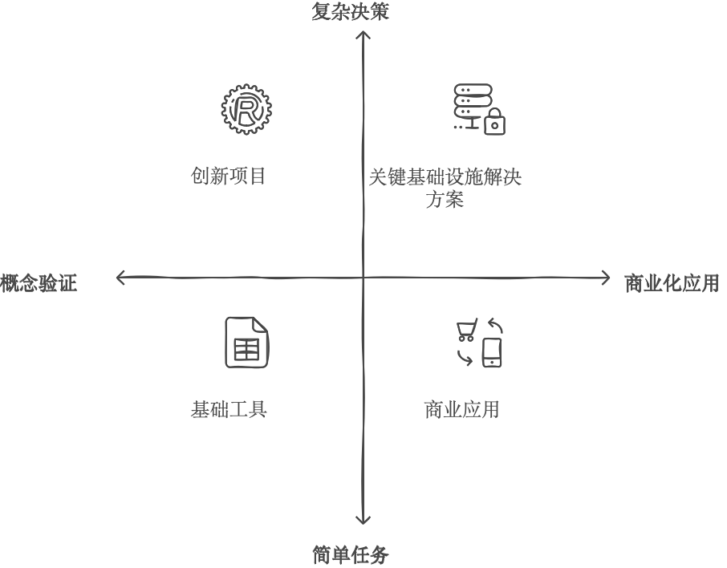
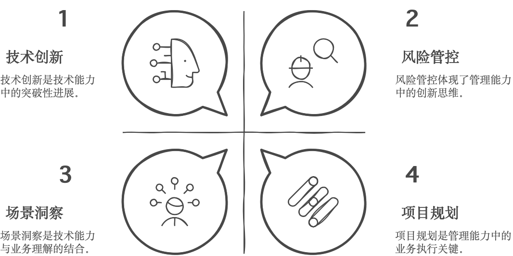

# 第四章：从AI使用者到AI思维者

## 4.1 场景战略：双维定位与选择方法论

### 4.1.1 双维定位

在人工智能深度嵌入社会与经济运行体系的背景下，**如何科学识别"值得做、能落地、可放大"的AI应用场景，已成为政府、企业乃至整个社会共同面对的关键命题**。一方面，AI带来了前所未有的转型机遇；另一方面，数据基础、能力水平与实施环境的差异，使AI落地路径充满不确定性。

无论是政务智能化、城市治理现代化，还是企业流程重构与业务增长，"选对场景"已成为AI战略成败的首要前提。在资源有限、任务繁复的现实约束下，构建一套**科学、通用、可复制**的场景评估方法论显得尤为迫切。

##### 模型构建：从"试错"走向"策略优先"

"双维定位"正是针对上述挑战提出的实践框架。该方法通过两个核心维度------**业务价值密度**与**实施落地难度**，构建出AI应用场景的二维评估矩阵，帮助组织明确优先级、聚焦资源配置，并形成"先试点、再复制、后放大"的系统推进路径，双维定位九宫格定位如图4-1所示。

{width="6.299305555555556in"
height="4.262510936132983in"}

**图4-1 双维定位九宫格定位图**

具体而言：

➢
**业务价值密度（纵轴）：**衡量AI应用对系统目标的正向贡献，如投资回报率（ROI）、战略契合度、服务对象受益度、效率提升潜力等；

➢
**实施落地难度（横轴）：**评估从试点到规模落地的复杂性，包括数据可得性、模型成熟度、系统集成复杂性、组织适配程度与跨部门协作强度等。

这两个维度相交构成九宫格矩阵，将候选AI场景划分为九类场景，有助于在实践中明确"应优先推进哪些、应储备孵化哪些、应暂缓搁置哪些"。

该方法不仅适用于企业内部的场景优选，也可广泛服务于**政府公共治理、行业平台建设、区域数字化统筹**等复杂系统的场景规划，为人工智能在更大范围的落地提供科学依据。

双维定位不仅提升了场景筛选的科学性，也推动组织从"经验试错"走向"策略优先"，实现了AI应用从项目导向向价值导向的转型升级。同时，它也为后续的智能体开发、模型部署与系统集成提供了清晰的方向锚点。

##### 落地策略建议：构建"可落地、能复制、可演化"的推进路径

完成"双维评估"后，需要将评估结果转化为组织行动，形成**分阶段、分资源、分机制**的差异化推进路径。以下基于九宫格中的核心象限，提出三类落地策略：**杠杆型、攻坚型、战略型**，并结合典型实践案例进行说明。

**杠杆型场景（中价值 ×
低难度）：**快速破局，构建AI样板间**。**适用于以流程效率提升、操作自动化为主要目标的应用，特征是价值适中但落地成本低、反馈周期短、易于复制扩散。价值密度指标聚焦于流程优化类需求，效率提升率通常可达20%\--50%；难度系数指标要求技术成熟度
\> 80%、数据可获得性 \> 90%、组织适配度 \>
75%。推进策略上，应作为\"AI第一枪\"试点任务优先完成，打造组织内首批可展示成果，部署节奏以\"短平快\"为导向，2\~6周完成上线、试点、评估，推动形成\"轻量复制模板\"，支持后续在不同部门或单位横向铺开。

**攻坚型场景（高价值 ×
中难度）：**作为中期重点，锚定能力突破口。往往支撑业务模式创新或核心流程再造，具有显著战略价值，但在技术、组织协同或合规性方面存在中等难度。价值密度指标要求潜在收益增幅
\>
100%，具备业务形态重构能力；难度系数指标显示技术成熟度40\--60%，跨部门协作复杂度
\>
70%。推进策略上，需纳入组织级专项工程计划，设立跨部门项目小组进行共建，通过\"阶段性交付+灰度上线+滚动评估\"的方式管理复杂性，结合政策资源、数据中台和AI能力平台提供基础支撑。

**战略型场景（高价值 ×
低难度）：**优先推进，聚焦核心业务重塑。兼具高价值与可实施性，战略契合度高、数据资源成熟、技术积累扎实，往往属于\"核心主干场景\"，一旦落地将撬动组织结构性变革。价值密度指标涉及核心业务重构，战略契合度
\> 90%；难度系数指标要求政策支持力度 \>
80%，数据合规、技术储备充足。推进策略上，建议直接纳入\"组织年度重点工作\"\"主管领导专项\"，确保战略资源调配，通过\"能力平台+模型仓+场景工坊\"组合方式推进，形成复用与演化基础，成为组织AI转型的标志性成果和管理信号。

综合上述三类场景的特点与推进策略，可以发现AI应用落地遵循着清晰的演化规律：从单点突破到系统构建，再到战略重塑。这一过程体现了\"点-线-面\"的渐进式发展路径，其推进框架见表4-1。

表4-1 AI应用场景的分阶段推进策略

---

    推进阶段       推进重点       典型场景类型           成果形态

    起步试点     快速上线验证        杠杆型       成果样板 + 快速复制机制

    中期推进     系统能力构建        攻坚型       协同能力 + 运行闭环机制

    长期演化     战略业务重塑        战略型        结构性成果 + 管理机制

---

具体而言，杠杆型场景作为\"点\"的突破，帮助组织快速建立AI应用信心和基础能力；攻坚型场景构成\"线\"的延展，通过系统性能力建设形成可复制的方法论；战略型场景实现\"面\"的覆盖，推动组织整体的智能化转型。

### 4.1.2 场景自评

在完成\"双维定位\"的初步筛选后，组织往往面临进一步的问题：某个看似可行的场景，是否真的\"值得做\"？又是否已经\"准备好\"？

为避免因判断失误带来投入浪费、试点失败等风险，需要一套系统化的自评机制，对候选AI应用场景进行更细致的多维度诊断。

为了让场景筛选更加精准，我们设计了\"AI应用十问模型\"。这套评估体系能够量化分析每个候选场景，避免AI项目中常见的三类问题：与企业战略目标不匹配、预期收益估算过高、以及技术方案脱离实际。

以下是十问模型的核心问题：

1\. **\*\*战略卡位\*\***：该场景是否支撑\"十四五\"数字化转型核心指标？

2\. **\*\*收益量化\*\***：能否实现10倍级效率提升或成本节约？

3\.
**\*\*数据准备\*\***：结构化数据覆盖率是否超70%？非结构化数据是否完成知识化？

4\.
**\*\*技术穿透\*\***：这个场景是否必须用AI才能解决？传统方法是否已经无法满足需求？

5\. **\*\*ROI测算\*\***：3年内能否实现投入产出平衡？

6\. **\*\*流程适配\*\***：现有业务流程能否承受≤30%的改造幅度？

7\. **\*\*用户接受\*\***：关键用户是否参与场景设计？试点意愿是否≥80%？

8\. **\*\*风险管控\*\***：能否通过沙箱机制控制业务中断风险？

9\. **\*\*持续运营\*\***：是否有专项预算支持模型迭代？

10\. **\*\*进化空间\*\***：是否具备向Agent演进的技术扩展性？

##### 自评流程设计

**适用对象**：政府/企业数字化转型负责人、AI项目经理

**评估周期**：建议每季度滚动更新，重大技术迭代后需专项复评

**为确保自评过程的系统性和可操作性，我们将整个流程分解为五个递进阶段，具体实施路线见表4-2。**

表4-2 AI场景自评五阶段实施路线图

---

  阶段                 核心任务

  1\. 场景锚定         筛选符合组织战略的候选场景，建立场景库

  2\. 数据预审         核查数据质量与治理成熟度，构建数据基线

  3\. 十问评估         按标准流程逐项评分，记录关键证据链

  4\. 风险推演         对高风险项（如技术穿透性\<6分）进行重复测试

  5\. 决策分级         输出场景实施优先级矩阵，匹配资源投入策略

---

通过这一标准化流程，组织可以确保每个候选场景都经过充分论证。其中，第三阶段的\"十问评估\"是核心环节，需要依据统一的评分标准进行量化打分。

##### 十问评分卡模板

每项评分1-5分，建议评分门槛参考：40分以上可优先推进，具备落地条件；30-40分需完善部分模块后推进；30分以下建议暂缓，重新评估或孵化。为保证评估结果的客观性和可比性，我们为每个评估维度制定了具体的评分标准。各维度的评分细则见表4-3。

表4-3 AI应用十问评分标准对照表

---

    评估维度                            评分标准

  1\. 战略卡位  5分：直接对应\"十四五\"数字化率/渗透率指标 3分：间接关联
                                    1分：无政策关联

  2\. 收益量化    5分：效率提升≥10倍或成本节约≥80% 3分：效率提升3-5倍
                                   1分：收益无法测算

  3\. 数据准备  5分：结构化数据≥85%且知识图谱覆盖率≥70% 3分：仅达标一项
                                  1分：数据质量不达标

  4\. 技术穿透 5分：AI为唯一可行方案（替代方案效率\<30%） 3分：需人机协同
                                   1分：传统方案更优

  5\. ROI测算    5分：3年累计收益/投入≥2.0 3分：1.0-2.0 - 1分：无法回本

  6\. 流程适配   5分：改造幅度≤15%且异常熔断率\<3% 3分：改造幅度25%-30%
                                  1分：需重构核心流程

  7\. 用户接受   5分：关键用户全程参与设计且试点意愿≥90% 3分：部分参与
                                     1分：用户抵制

  8\. 风险管控 5分：三层防御体系完备（业务/数据/模型层） 3分：仅基础防护
                                    1分：无风险预案

  9\. 持续运营 5分：年度预算含30%迭代经费且更新周期≤1季度 3分：预算不专项
                                  1分：无持续投入计划

    10\.              5分：已预留Agent扩展接口且多模态通道≥3类
    进化空间             3分：具备基础扩展性 1分：技术架构封闭

---

需要注意的是，这套评分标准应根据组织实际情况进行校准。例如，对于数字化基础较薄弱的传统企业，可以适当调整\"数据准备\"维度的评分门槛。

##### **自评流程建议**

为确保"十问模型"在实际应用中可落地、可复用，建议采用如下三步法：

**场景信息梳理阶段**，由业务部门主导，整理场景目标、数据现状、技术预期、组织边界等基本信息，并使用\"场景需求模板\"进行标准化登记，确保信息收集的完整性和规范性。

**联合评分与复审阶段**，组织业务、技术、管理多方进行打分，同时引入专家或外部顾问团队对重要场景进行复审校准，提升评分准确性，避免单一视角的局限性。

**结果归档与入库阶段**，将评分结果归入\"场景档案库\"，用作后续\"双维九宫格\"排布、资源排期与预算分配的依据，形成可追溯、可复用的决策支撑体系。

**【图片建议3】自评流程图**

为了更好地理解\"十问模型\"的实际应用，下面以企业内部知识问答助手Bot为例，完整演示从场景信息梳理到最终评分的全流程操作。

**案例示范：**企业知识助手Bot自评评分全流程

场景名称：企业内部知识问答助手Bot

申报单位：人力资源部 & 信息技术部联合申报

项目目标：帮助员工便捷获取公司制度、流程、联系人及常见操作指南，提升内部服务效率，减少人力支持压力。

基于前文介绍的"十问模型"，项目团队对该场景进行的评估打分见下表4-4。

表4-4 企业知识助手Bot自评评分

+------------------+------------------+------------------------------------+-------------------------------------------------------------------------------+-----------------+
| **序号**         | **评估维度**     | **自评问题**                       | **情况说明**                                                                  | **评分（1-5）** |
+------------------+------------------+------------------------------------+-------------------------------------------------------------------------------+-----------------+
| Q1               | 价值维度         | 是否对核心业务目标产生正向价值？   | 可节省人工答复时间约60%，减少HR热线咨询量；支持组织内部"信息一站式找人找事"。 | 5               |
+------------------+                  +------------------------------------+-------------------------------------------------------------------------------+-----------------+
| Q2               |                  | 是否能量化收益（ROI、效率等）？    | 初步测算每年节省人工成本约35万元；员工满意度提升预计超20%。                   | 4               |
+------------------+------------------+------------------------------------+-------------------------------------------------------------------------------+-----------------+
| Q3               | 数据维度         | 是否具备可用的数据源？             | 已收集规章制度、常见问答等3000余份，文档PDF已完成统一归档。                   | 5               |
+------------------+                  +------------------------------------+-------------------------------------------------------------------------------+-----------------+
| Q4               |                  | 数据是否具备质量保障与结构化能力？ | 80%以上文本为标准模板，已完成拆页、去重、向量化处理，具备较高可用性。         | 4               |
+------------------+------------------+------------------------------------+-------------------------------------------------------------------------------+-----------------+
| Q5               | 技术维度         | 是否已有成熟AI模型/能力平台支撑？  | 拟接入已有文档搜索引擎 + LLM接口（企业内私有化GPT服务），无需定制开发。       | 5               |
+------------------+                  +------------------------------------+-------------------------------------------------------------------------------+-----------------+
| Q6               |                  | 是否涉及系统对接或复杂流程重构？   | 不涉及核心业务系统，仅嵌入企业微信侧边栏，实施复杂度低。                      | 5               |
+------------------+------------------+------------------------------------+-------------------------------------------------------------------------------+-----------------+
| Q7               | 组织维度         | 是否明确责任部门及项目牵头人？     | HR部牵头、IT部配合，已成立项目小组，包含项目经理、AI开发工程师各1人。         | 5               |
+------------------+                  +------------------------------------+-------------------------------------------------------------------------------+-----------------+
| Q8               |                  | 是否存在潜在的合规/伦理/安全风险？ | 涉及政策内容均为内部公开材料，已完成敏感字段标注与脱敏，无明显风险。          | 5               |
+------------------+                  +------------------------------------+-------------------------------------------------------------------------------+-----------------+
| Q9               |                  | 是否已有业务测试样例或验证记录？   | 已在5个部门内试运行测试版本，问答命中率达89%，反馈良好。                      | 4               |
+------------------+                  +------------------------------------+-------------------------------------------------------------------------------+-----------------+
| Q10              |                  | 是否具备持续运营与优化的机制支撑？ | 初步建立更新机制，由HR协同IT月度更新知识库，仍需进一步固化流程。              | 3               |
+------------------+------------------+------------------------------------+-------------------------------------------------------------------------------+-----------------+
| **总分**                                                                                                                                                 | **45 / 50**     |
+----------------------------------------------------------------------------------------------------------------------------------------------------------+-----------------+

**【图片建议4】案例评分结果可视化**

*建议在此处插入柱状图或雷达图，将案例的10个维度评分进行可视化展示，直观展示评分分布，便于理解评估结果。*

✅**结论分析**：建议优先试点部署，技术与组织准备充分。该场景具备明确的业务价值与ROI预期，数据与模型准备充分，实施路径清晰，风险可控，组织牵头明确，建议立即纳入\"季度AI试点清单\"，进行快速部署与打样复制。

### 4.1.3 AI应用成熟领域实践

经过"双维定位"与"AI应用十问模型"的系统评估，组织能够初步识别出一批**价值密度高、实施难度适中，具备推广潜力的AI应用场景**。这些场景不仅在局部试点中已取得初步成效，更在多个行业与系统中被不断验证，具备**向规模化落地演进的"高潜力赛道"特征**。

#### 政务领域：服务协同与流程再造的重点应用带

政务系统是AI落地最早、政策牵引力最强的领域之一，典型应用高度聚焦于"流程型、高频型、规范型"任务，基于对各地政务AI应用的调研分析，政务领域的主要应用类型及其成熟度下表4-5：

**表4-5 政务领域AI应用类型与成熟度分析**

---

    **应用类型**               **典型场景**            **成熟度**                **特征**

   智能问答与热线辅助   政务咨询机器人、12345工单辅助       ★★★★★       成本降低明显，已进入迭代优化期

    智能审批        不动产登记、工程许可、低保审核      ★★★★☆      流程标准、数据闭环，便于模型训练

    文书生成            执法文书、政策要点汇总          ★★★★☆         适合大模型提示词+模板复用

   风险监测与舆情分析     网络舆情监测、预警通报系统        ★★★★☆            与RPA/BI系统深度集成

---

#### 企业领域：以效率与智能辅助为导向的通用能力带

在企业侧，AI的落地从"协助人"到"替代人"逐步演化，尤其在劳动密集型、文本处理密集型、高频预测型任务中表现出显著优势。通过对不同行业企业AI应用实践的深度调研，总结出企业领域的核心应用场景见下表4-6。

**表4-6 企业领域AI应用类型与成熟度分析**

---

    **应用类型**               **典型场景**             **成熟度**                 **特征**

   财务与结算自动化        智能发票识别、报销审核           ★★★★★      结构化数据多、OCR成熟、RPA接入便捷

    销售支持         客户画像、智能报价、提案生成        ★★★★☆            大模型+CRM集成趋势增强

    法务助手              合同初审、合规检索             ★★★★☆       适合半结构化文档、模板标准化较高

    运营报告生成      周报/月报自动写作、舆情简报汇总      ★★★★☆          与BI系统联动，提升管理效率

    智能客服              多轮问答、智能分流             ★★★★☆      成本降低显著，覆盖通用业务响应场景

---

#### 产业领域：以专业场景为突破口的"技术嵌入带"

随着"行业大模型"与"专业智能体"的演进，AI正逐步向工业现场、能源管理、医疗诊断等高专业壁垒领域渗透。这类场景虽然技术难度较高，但一旦落地，价值杠杆极大，其主要类型及其发展现状见下表4-7：

**表4-7 产业领域AI应用类型与成熟度分析**

---

    **应用类型**              **典型场景**           **成熟度**              **特征**

    智能质检        外观识别、缺陷检测、异常预警      ★★★★☆        图像识别+规则模型深度融合

    预测性维护        电梯、电机、发电机寿命预测       ★★★★☆       高价值、需历史工况数据支撑

    医疗辅助诊断         医学影像分析、报告草拟         ★★★★☆      医疗文书规范度高，适合RAG模型

    供应链优化       库存预测、智能补货、路径优化      ★★★★☆       需大数据、知识图谱辅助建模

---

#### 智能办公：全员覆盖、速赢见效

智能办公场景是AI应用的\"入门级\"场景，特点是覆盖面广、见效快、用户感知度高，适合作为组织AI转型的第一批试点项目。典型应用包括会议纪要生成系统、公文智能批阅、智能客服等，通过ASR+NLP技术、自然语言处理等方式实现会议记录、文档审批、问题解答等功能，通常可实现30-50%的效率提升和显著的时间节省。

实施此类场景需要优先选择标准化程度高、流程固定的场景切入，采用\"小切口、快迭代\"策略在1-2个月内完成从需求到上线的闭环，同时重视用户体验与界面设计以降低使用门槛。

#### 职能提效：专业深化、流程重构

职能提效场景聚焦于特定专业领域的深度应用，通常涉及复杂业务规则与专业知识的沉淀，适合作为组织AI转型的第二阶段重点项目。典型应用包括财政智能审核、法务合同审查、医疗影像诊断等领域，通过OCR+规则引擎、知识图谱等技术实现票据核验、条款风险识别、病理分析等功能，普遍可实现90%以上的准确率提升和显著的效率改善。

实施此类场景需要深度结合领域专家经验构建专业知识图谱，采用\"人机协同\"模式让AI负责初筛与建议、人工保留关键决策权，同时建立完善的异常处理与人工介入机制。

#### 业务变革：模式创新、生态重塑

业务变革场景是AI应用的高阶形态，往往涉及核心业务流程再造与商业模式创新，适合作为组织AI转型的战略级项目。典型应用包括城市数字孪生、产业链智能协同、智慧园区管理等，通过融合IoT+AI预测算法、构建产业知识图谱等方式，实现交通优化、供需匹配、资源配置等功能，通常可带来20-50%的效率提升。

实施此类场景需要采用\"顶层设计+分步实施\"策略确保战略一致性，构建跨部门、跨系统的数据共享机制，建立长效运营与持续优化机制确保系统可持续演进。

通过系统梳理这些成熟应用领域的典型场景与实践案例，组织可以更加清晰地识别适合自身发展阶段的AI应用方向，避免盲目跟风与资源浪费，实现AI应用从\"有\"到\"优\"的质变。

## 4.2 实施路径：五步穿透法

当组织已识别出一批具备可行性与战略价值的AI候选场景时，真正的挑战才刚刚开始。很多项目在初期看似方向明确、技术成熟，却在推进过程中陷入"久议不决、久决不落"的困境。其根本原因在于：**从场景识别到系统上线，缺乏一套清晰的执行路径与协同机制**。

在复杂组织体系中推进AI落地，必须遵循"**场景驱动、小步快跑、持续进化**"的核心原则，确保试点项目能够快速起步、及时反馈、滚动优化。这不仅依赖于精准的场景筛选，更依赖于**从"可行"走向"成型"的穿透式推进路径**。

为此，本章提出一套覆盖从规划到规模化运营的系统方法论------**五步穿透法**。它通过五个连续环节的系统推新，确保AI应用从概念设计到规模落地的全流程穿透，有效解决了AI项目中常见的\"规划与落地脱节\"、\"技术与业务隔离\"、\"短期见效与长期演进冲突\"等问题，帮助组织打通AI项目从设计到交付、从能力构建到业务集成的全过程，实现**从单点突破到系统演化的闭环落地如下图4-2所示。**

{width="6.299305555555556in"
height="3.4717760279965004in"}

图4-2 五步穿透法实施流程图

### 4.2.1 场景锚定：聚焦高价值突破点

场景锚定的核心在于通过双维定位划分场景优先级，基于\"价值-难度\"矩阵，将AI应用场景划分为杠杆型场景、攻坚型场景、战略型场景三大类别。同时运用十问模型评估量化场景可行性，通过\"战略卡位、收益量化、数据准备、技术穿透\"等10项指标（每项1-5分）量化评估优先级，确保总分高的场景优先实施，有效规避资源浪费与技术悬浮风险。

这一阶段的关键交付物是《场景优先级清单》，该清单明确资源分配策略，包含场景描述、ROI测算、资源需求等核心要素，为后续实施提供决策依据。表4-8提供了一个典型的场景优先级评估示例，展示了如何运用价值-难度双维度对不同AI应用场景进行量化评估和排序。

**表4-8 场景优先级评估示例**

---

  **场景名称**    **业务价值**   **实施难度**   **ROI（3年）**   **优先级**

  智能审批        ★★★★★          ★★☆☆☆          1:8              P0

  城市洪涝预警    ★★★★☆          ★★★★☆          1:5              P1

---

### 4.2.2 知识数据准备：夯实AI燃料库

场景锚定后，需为AI模型注入高质量\"燃料\"，通过系统性数据治理，将原始数据转化为可用的结构化知识，并确保安全合规，为智能体开发奠定坚实基础。

知识数据准备阶段需要通过系统性的行业知识图谱构建和数据血缘治理，为AI模型注入高质量\"燃料\"。在行业知识图谱构建方面，需要进行数据融合，整合结构化数据（数据库、传感器日志）与非结构化数据（政策文档、会议纪要），提取实体（如机构、条款）与关系（如归属、约束），并通过NLP技术搭建语义网络，实现实体链接与推理。通过将大量政策文件转化为可检索的语义网络，能够有效支持跨部门知识调用。在数据血缘治理方面，需要制定数据完整性（≥95%）、一致性（≥90%）标准，建立异常数据自动清洗机制，并采用联邦学习、隐私计算技术，实现跨部门数据\"可用不可见\"。通过同态加密等技术，供应链数据能够在确保隐私前提下完成多方联合建模。

这一阶段的核心交付物包括高质量训练集和数据血缘地图。高质量训练集需要定义统一标签体系（如合同类型、风险等级），覆盖核心业务场景，政务问答平台通过标注大量政策问答对，涵盖生育补贴、社保查询等高频需求。数据血缘地图则通过可视化展示标注数据来源、处理路径及依赖关系，支持快速溯源与故障排查，能源企业构建的设备数据血缘图覆盖采集、清洗、建模全链路，故障定位效率可提升40%以上。

### 4.2.3 智能体开发：领域知识注入

知识数据就绪后，需将行业经验与业务规则注入AI模型，将其从\"通用工具\"转化为\"领域专家\"。

智能体开发阶段的核心任务是将行业经验与业务规则注入AI模型，将其从\"通用工具\"转化为\"领域专家\"。在轻量化微调方面，采用参数高效微调（PEFT）技术，如LoRA（Low-Rank
Adaptation），仅训练适配层参数，算力消耗降低60%，公积金问答系统基于大语言模型微调少量参数，政策解读准确率可从70%提升至92%以上，开发周期缩短至2周内。在Prompt调试与优化方面，需要分场景定制Prompt结构，如合同审查场景Prompt需包含\"条款引用→风险等级→修正建议\"三段式逻辑，并使用可视化平台实时观测生成结果，迭代优化Prompt逻辑。在可解释性增强机制方面，通过集成LIME、SHAP等工具，输出特征权重与推理路径，破除\"黑箱\"信任壁垒，医疗AI在影像诊断中展示关键区域特征，能够显著提升医生采纳率。

这一阶段的核心交付物包括可解释性模型和《Prompt优化手册》。可解释性模型需要同步生成决策依据（如条款编号、数据来源），供应链风控模型输出\"高风险\"结论时，能够自动关联合同条款与历史违约案例。《Prompt优化手册》则包含场景化Prompt模板（如政务、法务、财务等）、调试避坑指南（如避免模糊指令、多轮追问设计）以及最佳实践案例，HR简历初筛Prompt优化后筛选效率可提升数倍。

### 4.2.4 工程打磨：跨越"可用"到"好用"鸿沟

智能体开发完成后，需通过工程化手段确保技术与业务系统无缝融合，并优化用户体验，实现从\"能用\"到\"好用\"的跨越。

工程打磨阶段的核心任务是通过工程化手段确保技术与业务系统无缝融合，并优化用户体验，实现从\"能用\"到\"好用\"的跨越。在系统对接与适配方面，需要通过API网关统一管理老旧系统接口，兼容SOAP、REST等协议，降低耦合性，工程审批Agent通过整合多个部门系统，能够将审批流程从数十天压缩至数天，人工介入减少80%以上。部署模式可选择界面集成（如OA系统嵌入智能审批助手，用户操作路径不变）或无感集成（AI决策自动触发，如反欺诈实时拦截，用户零感知）。在用户旅程优化方面，需要通过用户访谈、行为日志分析识别卡点（如界面复杂、响应延迟），采用\"最小化交互\"原则，减少冗余步骤，智能审批系统可将填写字段从20项精简至5项关键信息。在A/B测试与交付验证方面，需要分对照组与实验组对比效果（如点击率、任务完成率），政务App优化智能导办功能后用户留存率可显著提升，并邀请业务部门参与全流程UAT测试，确保端到端闭环。

这一阶段的核心交付物包括与系统集成的智能应用和《用户体验优化报告》。与系统集成的智能应用需要通过UAT测试，关键指标（如响应速度、准确率）达标，电网预测性维护系统上线后，故障误报率可控制在3%以下，预警响应时效达到秒级。《用户体验优化报告》则包含用户痛点分析与优化方案、A/B测试数据对比（如任务完成率、满意度评分）以及后续迭代建议（如功能扩展优先级）。

### 4.2.5 持续运营：构建自我进化能力

AI系统的价值释放依赖长效运营机制，需通过数据反馈驱动模型迭代，并建立指标化监控体系。

持续运营阶段的核心任务是构建自我进化能力，通过数据反馈驱动模型迭代，并建立指标化监控体系。在构建\"反馈飞轮\"方面，需要建立用户反馈→数据标注→模型训练→效果验证→迭代上线的闭环链路，政策问答机器人通过每日收集大量咨询问题，动态扩展知识库，问题解决率可从75%提升至92%以上。在模型更新机制方面，需要制定差异化的迭代策略，高频场景（如客服）季度更新，响应速度提升目标≥20%，低频场景（如风控）半年更新，准确率目标≥95%，并采用MLOps工具管理模型版本，支持一键回滚。在指标化运营仪表盘方面，需要监控日均调用量、平均响应时长、用户满意度、故障率等核心指标，设置阈值自动触发告警（如响应延迟\>2秒触发扩容）。

这一阶段的核心交付物包括《AI运营看板》和《模型迭代日志》。《AI运营看板》集成业务指标与技术指标，提供实时监控能力。表4-9是《AI运营看板》的结构示例，用于动态呈现关键指标的当前表现与目标达成情况。

**表4-9 AI运营看板示例**

---

  **指标**               **当前值**     **目标值**       **状态**

  日均调用量             10万           15万             ▲20%

  平均响应时长           1.2s           \<1s             ▼0.3s

---

《模型迭代日志》则记录版本号、更新内容、效果对比（如准确率提升5%）、回退预案等关键信息，确保模型演进的可追溯性和可控性。

## 4.3 系统集成：四层融合模式

随着AI项目从单点试验迈向组织级规模化部署，如何将智能能力稳定集成至现有业务流程、IT架构与数据系统，成为AI能否"真正落地"的关键。系统集成的深度，直接决定了AI的用户体验、数据价值与长效运营能力。

在复杂组织中推动智能化系统建设，针对这一挑战，"四层融合模式"应运而生，旨在帮助组织根据自身的数字化基础与业务发展阶段，选择最契合的AI系统集成路径，确保智能化能力与业务场景实现深度融合、有序演进。

### 4.3.1 四层融合模式介绍

本方法从**集成深度**与**业务嵌入方式**两个维度出发，将AI与业务系统的结合模式划分为四类层级，由浅入深、逐步穿透。同时基于「技术-数据-业务-生态」四个维度构建完整闭环，形成从底层支撑到顶层价值释放的完整体系：

●
**技术层**：通过统一AI开发平台实现多模态算法的标准化封装，解决不同技术栈的兼容性问题。例如，华为云ModelArts平台集成了数据准备、模型开发、训练、评估、部署和管理等全流程功能，支持主流的AI框架，如TensorFlow、PyTorch和MindSpore
[华为
ModelArts：AI开发者的一站式开发平台深度解析-CSDN博客](https://blog.csdn.net/m13026178198/article/details/142765816)，为企业提供一站式AI开发解决方案。在IDC《中国工业AI综合解决方案2024年厂商评估》中，华为在战略、能力、市场份额三个维度取得第一，位于领导者类别，越来越多的工业企业选择华为云Stack开展AI应用创新
[AI大模型高效开发神器来了 ，解读ModelArts 8大能力 - 华为云开发者联盟 -
博客园](https://www.cnblogs.com/huaweiyun/p/18520419)，通过标准化的AI开发流程和多框架支持，帮助制造企业快速实现AI模型的开发与部署。

●
**数据层**：建立跨系统数据中台，支持结构化/非结构化数据的实时同步与清洗，通过分布式数据库和联邦学习技术保障数据安全。例如，TDSQL是腾讯云企业级分布式数据库，旗下涵盖金融级分布式、云原生、分析型等多引擎融合的完整数据库产品体系，提供业界领先的金融级高可用、计算存储分离、数据仓库、企业级安全等能力
[TDSQL -
墨天轮百科](https://www.modb.pro/wiki/50)，在第七次全国人口普查中，腾讯云联合企业微信提供云计算、大数据等核心技术支持，首次使用电子化方式进行登记，在短短15天内完成我国14亿人口的普查数据登记
[如何15天完成14亿人口普查数据登记？云计算、大数据立功\|数据库\|电子\|企业微信_新浪科技_新浪网](https://finance.sina.com.cn/tech/2020-11-05/doc-iiznezxs0157477.shtml)，实现了大规模数据的安全采集、传输和处理，为政务数据中台建设提供了重要的技术实践。

●
**业务层**：设计可配置的业务流程引擎，将AI能力以微服务形式嵌入核心业务系统。例如，智能审批与RPA（机器人流程自动化）结合可实现自动化审核报销单据、比对发票数据与企业政策，减少人工干预，加快审批速度，使报销流程更顺畅
[报销系统对比中的智能审批，RPA究竟给企业带来了什么？ \|
合思](https://www.ekuaibao.com/blog/386402.html)。弘玑Cyclone结合东兴证券实际工作环境特点，将受限于系统孤立局面下的大量手工工作设计为通过自动化的方式来提升业务运营效率，RPA机器人能够自动打开对应财务表单及内往报单表，将各个项目数据按照对应字段填入
[东兴证券财务智能化_东兴证券RPA机器人-弘玑Cyclone](https://www.cyclone-robotics.com/cases/info_5.html)，实现了\"智能预审+人工确认\"的协同模式，显著提升了财务流程的自动化程度和处理效率。。

●
**生态层**：构建开放API接口与开发者社区，吸引第三方ISV（独立软件供应商）接入，形成覆盖行业上下游的AI应用生态。例如，美团开放平台对外提供了外卖、团购、配送等20余个业务场景的OpenAPI，供第三方开发者搭建应用时使用
[美团开放平台SDK自动生成技术与实践 -
美团技术团队](https://tech.meituan.com/2023/01/05/openplatform-sdk-auto-generate.html)，通过开放平台SDK和完善的开发者服务体系，吸引了数万家第三方开发者和ISV接入，形成了覆盖餐饮商户管理、配送服务、营销工具等完整的生态链条，美团开放平台架构如下图4-3所示。

{width="6.299305555555556in"
height="3.4196227034120734in"}

图4-3 美团开放平台架构

该模式以「技术解耦---数据贯通---业务适配---生态协同」为递进路径，推动AI系统集成从初始的"功能叠加"向更高层次的"价值共生"演进，该融合模式的核心特征、适用场景及关键技术要求见表4-10。

表4-10 四层AI系统融合模式对比

+------------------+-------------------------------------------------------------------------------+------------------------------------------------------------------------------+----------------------------------------------------------------------+
| **融合模式**     | **特征**                                                                      | **适用场景**                                                                 | **技术需求**                                                         |
+------------------+-------------------------------------------------------------------------------+------------------------------------------------------------------------------+----------------------------------------------------------------------+
| **独立应用模式** | **完全独立**：新建AI系统或APP，与现有IT架构无数据交互或流程联动；             | 创新试点项目、高保密性场景。                                                 | **数据隔离**：独立部署数据库、知识库甚至大模型，避免与现有系统混用； |
|                  |                                                                               |                                                                              |                                                                      |
|                  | **快速验证**：适用于技术敏感度高、需快速试错的场景。                          |                                                                              |                                                                      |
+------------------+-------------------------------------------------------------------------------+------------------------------------------------------------------------------+----------------------------------------------------------------------+
| **界面集成模式** | **轻度耦合**：通过界面整合技术实现窗口集成到现有系统页面，不改造原有架构；    | 现有系统功能增强，如OA系统嵌入智能审批助手、报销系统嵌入报销制度问答助手等。 | **微前端架构**：实现模块化加载。                                     |
|                  |                                                                               |                                                                              |                                                                      |
|                  | **灵活扩展**：可快速嵌入多个业务系统。                                        |                                                                              |                                                                      |
+------------------+-------------------------------------------------------------------------------+------------------------------------------------------------------------------+----------------------------------------------------------------------+
| **功能集成模式** | **深度嵌入**：以功能模块形式植入现有系统，如CRM系统新增"AI总结客户需求"按钮； | 核心业务系统智能化改造。                                                     | **原系统二次开发**：与原系统技术栈适配。                             |
|                  |                                                                               |                                                                              |                                                                      |
|                  | **无缝体验**：用户操作流程不变，AI能力自然融入。                              |                                                                              |                                                                      |
+------------------+-------------------------------------------------------------------------------+------------------------------------------------------------------------------+----------------------------------------------------------------------+
| **无感集成模式** | **全自动触发**：AI决策融入业务流程，用户无感知参与。                          | 风险自动化处置，如银行利用AI进行反欺诈识别和实时拦截。                       | **高可靠性**：故障自动切换与降级机制。                               |
+------------------+-------------------------------------------------------------------------------+------------------------------------------------------------------------------+----------------------------------------------------------------------+

这四层融合模式不是"择一而用"，而是可根据组织成熟度**逐步演进、动态组合**，构建起覆盖试点验证到系统重塑的能力体系。

### 4.3.2 四类模式对比与选型建议

基于集成深度与复杂度，AI系统集成可分为四种模式：独立应用型、接口集成型、功能集成型和无缝集成型，见下表4-11。

表4-11 集成模式对比

---

  **模式**       **优势**                   **挑战**                 **推荐技术与工具**

  **独立应用**   上线快、风险小、隔离强     孤岛风险大、不可复用     轻量大模型、微服务容器、独立部署平台

  **界面集成**   用户接受度高、开发周期短   交互逻辑复杂、系统耦合   微前端、Widget组件、API对接中间件

  **功能集成**   流程闭环好、数据打通       系统重构成本高           二次开发框架、SDK适配层、本地插件

  **无缝集成**   响应实时、体验丝滑         架构复杂、容错要求高     事件驱动架构（EDA）、中台引擎、自动化运维平台

---

✅ **选型建议：**

**若现有系统封闭老旧**（如基于10年前传统架构开发的封闭系统），建议优先采用**独立应用**或**界面集成**方案，快速验证AI应用价值；

**若系统具备模块化扩展能力或支持平台化改造**，推荐采用**功能集成**方式推进；

针对**实时风控、预测性维护**等高并发业务场景，建议分阶段演进至**无感集成**架构。

#### 4.3.4 四层融合模式的典型案例

##### 案例一：中山市AI政务服务平台

随着政务数字化进入深水区，地方政府在构建高效、便民、可信赖的服务体系方面面临系统分割、流程复杂、响应滞后等多重挑战。中山市依托本地化部署的AI大模型能力，联合政务云资源，探索构建面向未来的智能政务服务平台，为政务服务现代化提供了可复制的实践范式。

平台设计聚焦"四层融合"架构，系统性推动技术、数据、业务与生态的联动优化：

- **技术层融合**：以DeepSeek大模型为核心，搭建统一的AI能力平台，集成OCR、NLP等基础组件，部署边缘计算节点实现"就近处理"，有效提升了智能问答与工单流转的响应速度与处理效率。
- **数据层融合**：通过政务数据中台建设，实现跨部门数据整合与流通，并引入区块链技术，保障数据共享过程中的安全性与可追溯性，为AI决策提供可信数据基础。
- **业务层融合**：对政务审批流程进行深度重构，引入AI辅助决策机制，在关键节点实现人机协作，既确保效率提升，又明确AI支持的边界与规范，保障政策执行的一致性与透明度。
- **生态层融合**：通过开放API接口，吸引第三方开发者构建垂直政务应用，形成以开发者社区为核心的生态体系，增强平台可拓展性与持续创新能力。

在实施路径上，中山采用"Chat--Assistant--Copilot--Agent"四阶段迭代模型，逐步推进AI能力的嵌入与深化：起步于独立部署的智能问答机器人，解决政策咨询等高频需求；随后引入智能填表助手，提升材料填报效率；进入Copilot阶段后，为审批人员提供智能化决策建议；最终过渡至Agent阶段，实现跨部门协同审批的自动执行，形成闭环式智能代办体系。

平台建设带来了显著成效：全国政务服务平台注册用户超过10.8亿人次，累计访问量突破903亿次，政务办理效率、市民满意度大幅提升。据IDC预测，到2025年，中国政务云市场规模将突破1500亿元，其中由AI驱动的智能服务将占据30%以上。中山的探索不仅验证了大模型在基层政务中的可用性，也为我国数字政府转型提供了重要的本地经验样本。

**参考资料：**

- [2025年AI政务服务大变革：提升效率、便民利民新机遇_DeepSeek_人工智能_数字化](https://www.sohu.com/a/864713645_121902920)
- [国家政务服务平台上线运行五周年
  赋能&#34;高效办成一件事&#34;](https://dsjj.wenzhou.gov.cn/art/2024/6/7/art_1228999626_59000787.html)
- [当AI&#34;牵手&#34;政务之后_权威发布_数字中国建设峰会](https://www.digitalchina.gov.cn/2024/xwzx/qwfb/202503/t20250305_4984547.htm)

##### 案例二：中国移动智能算力采购管理系统

作为全球最大的移动通信运营商，中国移动在推进智能算力基础设施建设中，面临前所未有的规模与复杂度挑战。2024年启动的AI服务器集中采购项目，总量达8054台（其中7994台为AI服务器及配套产品），整体采购规模预计超150亿元。如此超大体量的集采，在传统模式下暴露出诸多问题：一是采购规模庞大，资金与交付压力并存；二是技术要求复杂，涵盖AI训练服务器、交换设备等多类型产品；三是供应商管理难，涉及5至7家中标厂商协调；四是风险控制要求高，项目关乎国家算力安全与数字基础设施稳定。

为应对上述挑战，中国移动构建了基于"四层融合"的智能采购解决方案，全面提升采购管理的智能化水平。

- 在**技术层**，打造智能采购决策平台，集成供应商评估、风险预警、价格分析等AI能力，并部署通过"双备案"的"九天"大模型，实现采购文档审核和合同条款提取自动化。
- 在**数据层**，建设统一采购数据中台，打通供应商资质、历史业绩、市场价格等数据，建立信用评价体系，强化风险监控。
- 在**业务层**，重构采购流程，嵌入AI辅助决策节点，建立"AI建议+专家决策"的人机协作评标机制，提升效率与专业性。
- 在**生态层**，搭建供应商协同平台，支持在线投标、进度跟踪、质量反馈全流程数字化，并与华为、浪潮等头部厂商深化协同，构建稳定产业生态。

结合上述方案，中国移动按"四阶段路径"推进AI能力升级：从Chat模式（智能客服）到Assistant模式（辅助撰写招标文件），再到Copilot模式（辅助专家决策），最终实现Agent模式（自动完成核心环节）。实施后，采购周期明显缩短、评标效率大幅提升、管理成本显著降低，成功完成业内最大规模AI服务器集采，为算力基础设施建设提供有力支撑，树立了央企智能采购的创新范式。

**参考资料**：

- [万台AI服务器集采！中国移动的智算雄心 -
  C114通信网](https://m.c114.com.cn/w118-1260662.html)
- [中国移动九天大模型正式对外提供生成式人工智能服务－国务院国有资产监督管理委员会](http://www.sasac.gov.cn/n2588025/n2588124/c30482038/content.html)
- [三大运营商相继开标，最大规模AI服务器订单要来？\_手机新浪网](https://finance.sina.cn/stock/relnews/hk/2024-04-23/detail-inasuqpz0142313.d.html)

### 4.3.3 实施指引

##### 渐进式实施路径

AI系统集成并非一蹴而就的技术工程，而是一个持续演进的战略过程。成功的组织往往遵循\"独立验证
→ 轻度集成 → 深度融合\"的实施主线，通过阶段性价值验证来降低实施风险。

在制造业领域，这一路径得到了充分验证。企业通常先部署独立的AI质检应用，通过分析大数据、优化算法、自动化决策等方式验证缺陷检测模型的效果。当技术可行性和业务价值得到确认后，再将AI能力嵌入现有的MES（制造执行系统）中，实现车间级的智能化质检，从而完成从点状应用到系统性集成的跨越。

遗留系统的改造策略同样关键。组织需要建立\"保留-替换-重构\"的系统清单，对核心业务系统采用\"影子系统\"并行测试法，确保在技术升级过程中主营业务不受影响。实践经验表明，预留10%-15%的预算用于适配老旧接口和消化技术债务，是保障项目成功的重要举措。

多系统协同联动方面，领先企业正在构建\"AI能力平台+系统中台+统一接口规范\"的三位一体架构。2024年能源人工智能创新发展大会聚焦\"AI赋能·智启未来\"主题，深入探讨了行业大模型、智能运维、安全可信AI等前沿技术在能源电力领域的应用实践。多家能源企业通过设立AI集成专项办公室，统一标准接口与认证流程，成功实现了多系统的协同适配。

##### 实施成功的关键要素

**战略引领与组织保障**是实施成功的根本前提。AI融合必须从组织战略层面予以明确定位，获得高层领导的持续支持和资源保障。同时，建立跨部门协作机制，破除传统的组织壁垒，培养具备\"+AI业务\"复合能力的人才队伍，营造鼓励创新的组织文化氛围。

**技术架构与数据治理**构成实施成功的技术基础。组织需要建立统一的数据治理标准，构建完善的知识管理体系，彻底打破各部门间的数据孤岛。在技术层面，设计开放且灵活的架构体系，制定标准化的接口规范，构建安全可控的技术保障机制。

##### 实施过程中的典型陷阱

**技术导向的误区**是最常见的陷阱之一。许多组织过度关注技术的先进性，却忽视了业务的实际需求。避免这一陷阱的关键在于始终坚持以业务价值为导向，建立量化的价值评估机制，确保业务部门全程深度参与技术方案的设计和实施过程。

**能力跨越的冒进**同样值得警惕。一些组织盲目追求高级的融合模式，却忽视了自身的现状和能力基础。成功的实践表明，应当基于组织现状选择适宜的融合模式，采用分层递进的实施策略，建立阶段性评估机制确保每个步骤都扎实有效。

**孤岛效应的重现**是传统IT建设中的老问题在AI时代的新表现。各部门各自为政导致AI应用碎片化，难以形成整体合力。规避这一陷阱需要建立统一的AI治理框架，构建共享的AI能力平台，促进跨部门的协作与经验互鉴。

##### 向智能组织的演进展望

当前，人工智能技术正以前所未有的速度与各行业深度融合。在AI赋能下，场景化应用日益普及，从电网侧向用户侧延展，在能源转型中发挥着越来越重要的作用。

展望未来，AI将经历从辅助工具向核心战略资产的根本性转变。应用模式将从单点突破向网络化协同演进，组织结构将围绕AI能力重新设计，形成\"人机共生\"的新型组织形态。在这一进程中，跨组织的AI生态将逐步成型，推动资源共享与能力互补，最终构建起行业级的智能协同网络。

AI的最终价值不在于\"会回答\"，而在于\"能融入\"。系统集成是AI从技术原型走向规模化应用的关键桥梁。通过四层融合模式的系统性实施，组织能够构建起从能力建设到组织变革的完整路径，实现AI应用从点状突破到全面渗透的战略性转型，为数字化转型与智能化升级奠定坚实基础。

**参考资料**：

- [智能生产：探索MES与AI的融合优势_无锡芯软智控科技有限公司](https://www.wxxinsoft.com/article-item-411.html)
- [2024年能源人工智能创新发展大会成功召开 -
  中国日报网](https://tech.chinadaily.com.cn/a/202411/25/WS674434daa310b59111da55cb.html)
- [能源有AI
  丨&#34;储能+X&#34;驱动千行百业绿色转型\-\--国家能源局](https://www.nea.gov.cn/20250418/35ce766b94cb42d893b7c23e76834999/c.html)

## 4.4 AI落地的核心能力构建

在完成场景战略识别、实施路径规划与系统集成设计之后，组织想要真正实现AI的业务落地与可持续发展，必须建立一套覆盖全流程、可复制、可运营的能力支撑体系。这种体系并非只涉及模型算法或数据接口层面的"技术部署"，而是一种"系统工程"------贯通从技术选型、工程开发、应用集成到持续演进的闭环机制。

随着AI技术从实验室走向实际应用，政府与央国企面临的首要挑战是如何在复杂多变的技术生态中做出科学的选型决策。技术选型不仅关乎项目成败，更直接影响组织的长期数字化转型路径。

本节聚焦三个维度展开阐述：**技术选型与适配、关键应用技术、工程化护航能力**，构建"技术---系统---运营"的落地三角支柱。

### 4.4.1 技术选型与适配：决策对路，落地才稳

技术选型如同AI工程化征程的第一道关卡，决定着整个项目的成败走向。模型选择失当、部署方案不合理、能力需求错配，都会让项目陷入\"重理论、轻实践\"的困境。基于\"战略-场景-技术-生态\"的系统性思维框架，技术团队需要围绕具体的业务目标（如将审批时效提升60%）、真实的数据环境（如日均处理10万条非结构化政策文件）、严格的安全要求（如政务数据三级密保）等关键要素，建立起从\"需求洞察-技术匹配-部署验证-持续优化\"的完整能力体系。

#### 技术选型的核心原则

**业务导向**始终是技术选型的第一准则。技术服务于业务，而非为了炫技而引入复杂方案。以杭州市人工智能产业发展为例，该市在2023年发布的[杭州市人民政府办公厅关于加快推进人工智能产业创新发展的实施意见](https://www.hangzhou.gov.cn/art/2023/7/27/art_1229063382_1834100.html?utm_source=chatgpt.com)中明确提出，要围绕城市治理、民生服务、产业发展等重点领域，构建\"需求牵引、应用驱动\"的技术选型机制。杭州市政务服务系统在智能化改造过程中，针对不同业务场景的特点，采用了差异化的技术路径：对于高频咨询类业务采用RAG检索增强技术，对于复杂审批流程采用智能流程引擎，对于多语种服务需求则部署了多模态大模型，最终实现了政务服务效率的整体提升。

**能力匹配**原则强调技术复杂度与组织承载力的平衡。过于超前的技术选择可能导致\"消化不良\"，而过于保守又会错失发展机遇。根据工信部2024年发布的[人工智能赋能新型工业化
\|
电子信息产业网](https://www.cena.com.cn/special/2024rgznfn.html?utm_source=chatgpt.com)[人工智能赋能新型工业化典型应用案例》](https://www.ncsti.gov.cn/kjdt/tzgg/202501/P020250102472111103210.pdf?utm_source=chatgpt.com)统计，浙江省入选的14个项目中，超过60%的项目都采用了\"分阶段实施、逐步升级\"的技术演进策略。这些项目在初期普遍选择了技术成熟度较高、实施风险相对可控的解决方案，待团队能力和项目经验积累到一定程度后，再循序渐进地引入更为复杂的前沿技术。评估框架如图4-4所示。

{width="6.299305555555556in"
height="4.922635608048994in"}**图4-4 技术选型四维评估框架**

演进兼容性考验着技术架构师的前瞻眼光。新技术的引入不应该成为系统的\"孤岛\"，而要与现有IT基础设施形成有机整体。国家电网公司在数字化转型过程中的实践经验值得借鉴：该公司在推进智能电网建设时，创新性地采用了\"能力分层、接口标准化\"的架构设计理念，通过统一的API网关和微服务架构，确保新引入的AI能力能够与现有的生产管理系统、客户服务系统、设备监控系统等实现无缝集成，既保护了历史投资，又为未来技术演进预留了充足空间。

安全自主原则在当前国际环境下显得尤为重要。在满足功能需求的基础上，优先选择安全可控、自主可控的技术路径已成为政府和关键行业的共识。根据[生成式人工智能服务管理暂行办法_国务院部门文件_中国政府网](https://www.gov.cn/zhengce/zhengceku/202307/content_6891752.htm)的相关要求，涉及关键信息基础设施的AI应用必须通过安全评估。中国商飞在C919大型客机的研发过程中持续推进关键环节的国产化替代。在智能制造系统中，其生产管理系统采用了国产软件"魔方网表"（[制造业中最复杂的项目之一：C919国产大客机的制造_中华网](https://tech.china.com/article/20230725/072023_1382241.html)^、^[国产化率达
60%，国产大飞机C919
产业链揭秘-icspec](https://www.icspec.com/news/article-details/2183419)^、^[全流程覆盖，四相科技助力C919国产大飞机生产智能化 -
中国日报网](https://cn.chinadaily.com.cn/a/202305/31/WS64770992a31064684b053ee4.html)），满足了大规模复杂装配任务下的协同管理需求。同时，商飞在智能车间部署了包括国产图形处理芯片、高精度定位系统等关键技术，构建了具备自主控制能力的智能制造体系。

#### 技术选型的方法论

**场景-技术匹配矩阵**：构建\"场景-技术\"二维矩阵，横轴为业务场景，纵轴为技术选项，通过打分评估每种技术在特定场景下的适用性。某省级政府在推进\"智慧政务\"建设时，针对\"政策咨询\"、\"材料审核\"、\"业务预审\"等10个场景，分别评估了RAG、文本分类、实体识别等15项技术的适用性，形成了清晰的技术选型地图，智慧政务AI选型评估如图4-5所示。

{width="6.299305555555556in"
height="4.00224300087489in"}

图4-5 智慧政务AI选型评估矩阵

**技术成熟度评估模型**：基于技术成熟度曲线（Hype
Cycle）评估各项技术的发展阶段，平衡创新性与稳定性 [Gartner Hype Cycle
Research Methodology \|
Gartner](https://www.gartner.com/en/research/methodologies/gartner-hype-cycle)。以国家电网构建企业知识库为例[国家电网数字化转型白皮书](http://www.sgcc.com.cn/html/sgcc/col2017042108/2021-04/15/20210415094523.shtml)，通过评估发现向量数据库和语义检索技术已进入成熟期，而知识图谱仍处于复苏期，多模态检索处于期望膨胀期。基于此评估，最终选择了\"向量数据库+语义检索\"的技术组合，项目实施周期缩短40%。

**全生命周期成本模型**：全生命周期成本（Total Cost of Ownership,
TCO）模型是一种综合性评估工具，用于全面衡量技术方案在引入、部署、运维、升级、迭代直至退役等全过程中所产生的总成本[Definition
of Total Cost of Ownership - IT Glossary \|
Gartner](https://www.gartner.com/en/information-technology/glossary/total-cost-of-ownership-tco)。以杭州市智慧交通信号优化系统为例[每日互动&#34;数智绿波&#34;产品助力杭州智慧交通体系建设](https://www.getui.com/news/2022112544)，自研方案前期投入1300万元，年度维护80万元；商业方案前期投入900万元，年度运营成本280万元。基于5年周期测算，自研方案TCO为1700万元，比商业方案节省26%，且具备数据自主权和定制化能力，最终选择自研路线。

#### 算力部署模式选择

算力是AI应用落地的基础设施，不同的算力部署模式各有优劣，政府与央国企需根据自身特点做出科学选择。主流算力部署模式比较见下表4-11。

表4-11 主流算力部署模式

+--------------+----------------------------------------+--------------------------------------+-----------------------------------------------------------------------------------------------------------------------+
| **部署模式** | **优势**                               | **劣势**                             | **适用场景**                                                                                                          |
+--------------+----------------------------------------+--------------------------------------+-----------------------------------------------------------------------------------------------------------------------+
| 自建算力中心 | 数据安全性高、资源独占、长期成本优势   | 前期投入大、建设周期长、技术门槛高   | 数据安全要求高、算力需求稳定且大、技术团队强的央企                                                                    |
|              |                                        |                                      |                                                                                                                       |
|              |                                        |                                      | 适用于财政、政法等密级≥三级的场景，采用国产化算力集群（如兆芯CPU+海光GPU）保障「数据不出域」。                        |
+--------------+----------------------------------------+--------------------------------------+-----------------------------------------------------------------------------------------------------------------------+
| 公有云租用   | 快速部署、按需付费、技术门槛低         | 长期成本高、数据安全风险、资源竞争   | 算力需求波动大、技术团队弱、资金预算有限的地方政府。                                                                  |
+--------------+----------------------------------------+--------------------------------------+-----------------------------------------------------------------------------------------------------------------------+
| 混合云模式   | 灵活性高、平衡安全与成本、渐进式投入   | 架构复杂、管理难度大、需要跨环境协同 | 既有核心数据又有非敏感数据、算力需求多样化的综合性组织。                                                              |
|              |                                        |                                      |                                                                                                                       |
|              |                                        |                                      | 适用于客服、舆情等业务波动大（如双11期间流量激增5倍）的场景，采用「自有云+公有云」弹性架构（如阿里云ECS自动扩缩容）。 |
+--------------+----------------------------------------+--------------------------------------+-----------------------------------------------------------------------------------------------------------------------+
| 边缘计算     | 实时性强、降低传输成本、适合分布式场景 | 单点算力有限、管理复杂、标准化程度低 | 适用于智慧终端、城市感知装置等低时延（≤100ms）场景，采用轻量化推理框架（如TensorRT+Paddle Lite）。                    |
+--------------+----------------------------------------+--------------------------------------+-----------------------------------------------------------------------------------------------------------------------+

上表总结了各类部署模式的特点及适用场景。基于实践经验，我们建议采用**云边融合、合规优先**的部署策略，根据数据安全等级和计算需求特性进行动态决策。在选择部署模式时，需考虑以下关键因素：

**数据安全与合规**：涉及国家安全、商业秘密或个人隐私的数据处理，建议优先考虑**自建或私有云模式**。某央企在处理涉密业务数据时，采用物理隔离的专用算力集群，确保数据不出内网。

**算力需求评估**：分析业务负载特征，确定算力规模与部署模式。**上海12345政务热线智能化升级**[沙丘社区](https://www.shaqiu.cn/article/r0d6YQZo9lwB)
引入\"星辰\"政务大模型，深度嵌入政务热线生产和运营流程，为话务员提供智能话务总结、智能填单/派单、智能知识库问答等功能，显著提升政务服务效率。

**技术能力匹配**：自建模式对技术团队要求高，需具备基础设施运维、算力调度优化等能力。中国联通元景大模型MaaS平台[中国联通](https://www.chinaunicom.com.cn/43/menu01/628/news?id=2d84884d-9885-4f86-9335-738d8fc76c36)为缺乏专业技术团队的政企客户提供\"算力即服务\"模式，降低了技术门槛。

**投资回报分析**：通过5年TCO（全生命周期成本）分析，评估不同模式的投资回报。

基于亚信科技智能化MaaS底座[亚信科技-数智化全栈能力提供商](https://www.asiainfo.com/)实践，当日均GPU利用率超过60%时，自建模式的TCO优势显著，因此对高利用率的基础算力采用自建模式，对低利用率的特殊算力采用云租用模式。

在确定算力部署模式后，下一步关键是选择合适的AI模型。不同模型的算力需求、部署复杂度和应用效果差异显著，需要与算力规划形成有机配合。模型选择需平衡能力上限与落地成本，形成「通用-专用-智能体」的梯度矩阵：

**通用大模型**（如GPT、DeepSeek）：适合对话、摘要等轻交互任务（日均交互量≤10万次），其显著优势在于强大的零样本学习能力，能够在无需专门训练的情况下应对多样化任务。然而，此类模型也存在"幻觉"（hallucination）问题，即生成内容可能与事实不符，需在实际应用中谨慎控制。

**微调模型**（如基于BERT的领域模型）：适合流程协同、业务指导等中等复杂度任务（涉及3-5个系统对接），需投入5000-10000条标注数据进行微调，在特定领域具有更高的准确性和适应性。

**智能体系统（Agent）**（如AutoGPT衍生架构）：用于调度指挥、合规审查等复杂场景（需拆解5-10个子任务），需集成大模型（任务理解）+RAG（知识调用）+Tools（系统操作），实现多步骤任务的自动化执行。

在模型选型确定后，为解决「模型多、适配难」问题，需构建「中台+协议+报告」的适配体系：

**统一模型接入中台（MaaS层）**：采用K8s容器化部署，支持TensorFlow、PyTorch等主流框架，提供模型注册、版本管理、监控告警等功能，可将模型部署时间从7天缩短至1天。

**多模型兼容协议**：制定「输入输出标准化协议」（如JSON格式+固定字段）、「推理性能SLA」（如响应时间≤500ms），实现模型动态切换无感知，确保系统7×24小时可用。

**部署前适配报告**：输出「算力需求清单」（如GPU显存≥8GB）、「数据格式规范」（如文本编码UTF-8）、「风险评估表」（如隐私泄露风险等级），支撑决策层资源调配，有效降低运行成本。

#### 模型选型策略

模型是AI应用的核心，政府与央国企需在通用与专用、开源与闭源、国产与国际等多维度做出科学选择。从以下几个维度考量。

###### 通用大模型vs垂直模型考量因素

这两类选型维度比较见表4-12。

表4-12 选型维度比较

---

  **维度**                **通用大模型**          **垂直领域模型**

  能力广度                高（覆盖多领域知识）    低（专注特定领域）

  专业深度                中（普遍性知识）        高（领域专业知识）

  部署成本                高（算力需求大）        低（轻量化部署）

  数据需求                大（通用语料）          小（领域数据）

  适用场景                多场景初步应用          特定场景深度应用

---

在实际应用中，可采用混合应用策略进行落地，主要包括三种模式：一是\"通用底座+垂直微调\"模式，以通用大模型为基础，利用领域专业数据进行微调训练，显著提升模型在特定领域的专业能力和准确性；二是\"通用模型+垂直RAG\"模式，保持通用模型架构不变，通过构建领域知识库来增强模型的回答能力，在无需重新训练的情况下实现领域知识的有效融合；三是\"多模型协作\"模式，根据不同任务的特点和需求，智能调用具有不同专业能力的模型，通过多个模型的协同工作形成完整的业务解决方案，实现各模型优势互补和整体效能最大化。

###### 开源vs闭源模型**选型考量因素**：

**安全与合规方面**，开源模型代码透明可审计但需自行确保合规，闭源模型由供应商保障合规但缺乏透明性。**成本结构上**，开源模型前期开发成本高但后期使用成本低，闭源模型开发门槛低但持续调用费用较高。**掌控与定制维度**，开源模型支持深度定制和完全掌控但对技术能力要求较高，闭源模型使用门槛低但定制空间有限。组织应根据自身的技术实力、安全要求、成本预算和业务特点选择最适合的模型类型。

###### 国产vs国际模型**选型考量因素**：

自主可控方面，关键领域和核心业务应优先考虑国产模型以确保技术安全和供应链稳定，避免受到外部技术限制影响。中文理解能力上，国产模型在中文语境理解、本土政策法规把握等方面通常具有天然优势，能够更准确地处理中文特有的语言特征和文化背景。技术能力维度，需要根据具体任务特点和应用场景选择最适合的技术方案，在某些专业领域国际模型可能仍具有技术领先性，可采用混合调用策略实现优势互补。组织应综合考虑安全要求、应用场景和技术特点，选择最符合业务需求的模型方案。

#### 数据与知识体系构建

数据与知识是AI应用的燃料，高质量的数据与结构化的知识体系是AI能力落地的关键保障。

##### 数据治理体系建设

构建完善的数据治理体系需要从资产盘点、质量管理和标准化三个维度协同推进。首先，全面梳理组织数据资产，建立\"价值-敏感度\"二维分级体系⁴，通过系统化的数据资产盘点⁵，实现数据资源的规范化管理。其次，建立覆盖\"采集-存储-处理-应用\"全链条的数据质量管理机制，通过自动化工具实现数据质量的实时监测与问题预警。最后，制定统一的数据标准，打破数据孤岛，实现跨部门数据的语义一致与格式统一。

###### **知识图谱构建策略**

知识图谱构建需要从领域设计、知识融合和更新验证三个层面系统规划。在领域知识图谱设计方面，基于业务场景需求，设计领域本体与关系模型，构建包含核心业务要素的知识网络。在多源知识融合技术方面，整合结构化数据、半结构化文档与非结构化文本，通过自然语言处理技术⁶自动抽取实体与关系，构建统一知识体系。在知识更新与验证机制方面，建立\"专家审核+众包验证+自动更新\"的三层知识管理机制，确保知识图谱的时效性与准确性。

###### 数据安全与隐私保护

数据安全与隐私保护是数据治理的核心要求，需要从分类保护、隐私计算和合规评估三个维度构建防护体系。在数据分类分级保护方面，基于数据敏感度实施差异化保护策略，对敏感信息实施\"脱敏存储、加密传输、权限控制、操作审计\"的全方位保护。在隐私计算技术应用方面，通过联邦学习⁷、安全多方计算等技术实现\"数据可用不可见\"，在不共享原始数据的前提下实现跨机构的AI模型协同训练。在数据安全合规评估方面，建立覆盖数据全生命周期的安全合规评估机制⁸，确保AI应用符合相关法律法规要求。

**\*\*引用出处：\*\***

¹ 国家电网三层算力架构：基于国家电网探索边缘数据中心建设运营的相关报道

²
政务算力共享平台：参考陕西省数据和政务服务局《关于深入实施\"东数西算\"工程加快构建全国一体化算力网的实施意见》

³ 云边协同模式：基于石化行业云边协同智能计算的技术实践案例

⁴ 数据分类分级治理规范：商希雪，韩海庭.
数据分类分级治理规范的体系化建构\[J\]. 电子政务，2022(10): 75-87.
[数据分类分级治理规范的体系化建构 - 安全内参 \|
决策者的网络安全知识库](https://www.secrss.com/articles/48083)

⁵ 数据资产盘点方法：数据治理重要的一环：如何实施数据资产盘点.
[https://zhuanlan.zhihu.com/p/430723824](https://zhuanlan.zhihu.com/p/430723824)

⁶
自然语言处理与知识图谱：深度学习-自然语言处理(NLP)-知识图谱：知识图谱构建流程.
[深度学习-自然语言处理(NLP)-知识图谱：知识图谱构建流程【本体构建、知识抽取（实体抽取、
关系抽取、属性抽取）、知识表示、知识融合、知识存储】 - 元気森林 -
博客园](https://www.cnblogs.com/-402/p/16529422.html)

⁷
联邦学习在医疗健康领域的应用：面向医疗健康领域的联邦学习综述：应用、挑战及未来发展方向.
[&#34;智能健康与医疗&#34;专辑+面向医疗健康领域的联邦学习综述：应用、挑战及未来发展方向](https://cje.ustb.edu.cn/article/doi/10.13374/j.issn2095-9389.2024.12.24.001)

⁸ 数据安全合规评估：财政部《关于加强数据资产管理的指导意见》.
[关于印发《关于加强数据资产管理的指导意见》的通知](https://www.mof.gov.cn/jrttts/202401/t20240115_3925914.htm)

#### 安全与合规保障体系

随着AI应用深入业务核心，安全与合规已成为政府与央国企必须重点考虑的关键因素。

##### AI应用的安全风险分析

**模型安全风险**：包括模型投毒、对抗样本攻击、模型逆向等风险。某央企在部署客服机器人时[2024世界人工智能大会
国内首份&#34;大模型安全实践&#34;报告发布-清华大学](https://www.tsinghua.edu.cn/info/1182/112711.htm)，通过对抗训练增强模型鲁棒性，并建立了敏感词过滤与异常响应监测机制，有效防范了恶意引导攻击。

**数据安全风险**：包括训练数据泄露、推理过程数据窃取等风险。某省政务平台采用数据水印技术对训练数据进行标记[2024世界人工智能大会
国内首份&#34;大模型安全实践&#34;报告发布-清华大学](https://www.tsinghua.edu.cn/info/1182/112711.htm)，建立了全过程数据访问审计机制，实现了数据泄露的溯源与责任追究。

**应用安全风险**：包括API滥用、权限绕过等风险。某市智慧城市平台实施了严格的API访问控制与频率限制[2024世界人工智能大会
国内首份&#34;大模型安全实践&#34;报告发布-清华大学](https://www.tsinghua.edu.cn/info/1182/112711.htm)，并通过异常行为检测系统实时监控API调用模式，成功拦截了95%的异常访问尝试。

##### **合规性评估与管控**

**法律法规符合性评估**：全面梳理AI应用涉及的法律法规要求，建立合规性评估清单。某央企构建了包含《网络安全法》《数据安全法》《个人信息保护法》等20部法律法规的合规性评估框架[2024世界人工智能大会
国内首份&#34;大模型安全实践&#34;报告发布-清华大学](https://www.tsinghua.edu.cn/info/1182/112711.htm)，确保AI应用全面合规。

**伦理风险评估**：建立AI伦理委员会，对AI应用的公平性、透明性、可解释性等进行评估。某省政府在部署社会救助智能审核系统前，组织了包含法律、伦理、技术专家在内的评估小组，对系统可能带来的伦理风险进行了全面评估，并制定了相应的风险缓解措施。[2024世界人工智能大会
国内首份&#34;大模型安全实践&#34;报告发布-清华大学](https://www.tsinghua.edu.cn/info/1182/112711.htm)

**第三方安全认证**：引入第三方机构进行安全评估与认证。某央企的智能客服系统通过了国家网络安全等级保护三级认证和个人信息保护认证，增强了系统的公信力与合规性。[2024世界人工智能大会
国内首份&#34;大模型安全实践&#34;报告发布-清华大学](https://www.tsinghua.edu.cn/info/1182/112711.htm)

##### 安全运营体系建设

安全运营体系建设涵盖安全运营中心（SOC）建设、应急响应机制和持续安全评估三个方面。在安全运营中心建设方面，某城市银行通过构建"智能化、自动化、实战化"的安全运营体系，逐步搭建态势感知与安全运营平台（NGSOC），并以资产为中心收集资产、脆弱性、日志、流量等基础数据，完成生产数据中心安全数据的集中关联分析与安全告警发现[智能化、自动化、实战化，某城市银行的安全运营体系化建设之路](https://www.qianxin.com/news/detail?news_id=12142)。此外，华能澜沧江水电基于深信服安全运营平台，构建了"1+N"模式安全运营中心，实现了对所有在滇华能单位信息大区网络安全的统一监测和管理[筑牢网络安全之堤------华能澜沧江水电加强网络安全运营体系建设-深信服](https://www.sangfor.com.cn/case/4d5f20b463a7463ea530d166286ce735)。

在应急响应机制方面，上海某制造业在遭受勒索病毒攻击后，安恒信息紧急展开应急响应，包括攻击取证系统漏扫、补丁加固，安全产品临时加固等，最终成功遏制了病毒的进一步传播[上海某制造业勒索病毒应急响应案例](https://www.dbappsecurity.com.cn/content/details209_22167.html)。此外，某央企制定了分级响应机制，对不同级别的安全事件明确了响应时限与处置流程，并定期开展应急演练，确保在安全事件发生时能够快速有效应对[智能化、自动化、实战化，某城市银行的安全运营体系化建设之路](https://www.qianxin.com/news/detail?news_id=12142)。

在持续安全评估方面，福建省人民医院于2023年提出安全运营中心的编排自动化与响应的方案，通过自动化高效的事件响应和管理，降低大量的人力资源和专业技能的依赖[案例分享 -
福建省人民医院：基于医院安全运营中心的编排自动化与响应的建设与探索-中国医院协会信息专业委员会](https://www.chima.org.cn/Html/News/Articles/16945.html)。同时，某省政务服务平台实施了季度安全评估制度，通过自动化安全扫描与人工渗透测试相结合的方式，持续发现并修复安全隐患，确保系统安全水平不断提升[智能化、自动化、实战化，某城市银行的安全运营体系化建设之路](https://www.qianxin.com/news/detail?news_id=12142)。

### 4.4.2 关键应用技术："三把钥匙"破解三大难题

随着大模型技术的快速发展，一系列关键应用技术已成为AI落地的核心支撑，政府与央国企需要深入理解并灵活应用这些技术，以提升AI应用的实用性与可靠性，围绕知识调取、任务执行与系统打通等核心挑战，三类关键技术能力成为AI项目落地的"基础设施"，如下图2-5。

{width="6.299305555555556in"
height="3.0718832020997375in"}

图2-5 项目落地的关键技术

#### **RAG：构建组织\"智库引擎\"**

##### 技术原理与价值

RAG（Retrieval-Augmented
Generation，检索增强生成）技术通过将外部知识库与生成式AI模型结合，有效解决了大模型\"幻觉\"与知识时效性问题。该技术通过引入权威知识源提升回答准确性，降低模型生成的事实性错误；无需重新训练模型即可更新知识，增强知识时效性；相比全量微调，RAG技术对算力要求低，实施成本更低，有效降低部署门槛；同时生成内容可追溯到具体知识来源，保障内容可溯源性，增强可信度。

##### 实施**架构与关键组件**

RAG通常包含四个核心组件：知识库构建负责收集、清洗、分块、索引组织机构内的文档资料；向量化引擎将文本转化为向量表示，支持语义检索；检索模块基于用户查询检索相关知识片段；生成模块将检索结果与原始查询结合，生成准确回答。

##### 典型应用案例

**以某省政务知识问答系统为例，**该省政务服务中心构建了覆盖12个领域、8万条政策法规的知识库，通过RAG技术实现了高精准的政策咨询服务[政务痛点难破局？AI
智能体 + 知识库 + 工作流如何重塑服务效能 -
53AI-AI知识库\|大模型知识库\|大模型训练\|智能体开发](https://www.53ai.com/news/zhishiguanli/2025031179865.html)。系统采用\"双层检索+多源融合\"架构：首先通过关键词检索确定领域范围，再通过语义检索获取精准知识片段，最后结合多个知识源生成综合回答。该系统上线后，政策咨询准确率从原来的76%提升至93%，平均响应时间从15分钟缩短至5秒，大幅提升了政务服务效率。

##### 优化策略

RAG系统的优化策略主要包括四个方面：首先是知识分块策略优化，根据业务特点设计合理的分块粒度，某央企通过将原有固定长度分块改为语义完整性分块，检索准确率提升18%[FunnelRAG:
A Coarse-to-Fine Progressive Retrieval Paradigm for
RAG](https://arxiv.org/html/2410.10293v1)；其次是构建\\\"粗检索+精检索\\\"的多级检索架构，平衡效率与准确性[大模型RAG应用优化策略与实战案例解析-百度AI原生应用商店](https://qianfanmarket.baidu.com/article/detail/1131130)；第三是上下文增强，在检索结果中加入相关上下文信息，提升回答的连贯性与完整性[检索增强生成（RAG）的分块策略指南 -
Zilliz
向量数据库](https://zilliz.com.cn/blog/guide-to-chunking-sreategies-for-rag)；最后是建立反馈优化机制，收集用户反馈，持续优化检索策略与知识库质量。

#### Tools插件机制

###### 技术原理与价值

Tools插件机制允许AI模型调用外部工具和API，极大扩展了模型的能力边界，使其从\\\"只会对话\\\"升级为\\\"能够行动\\\"。其核心价值体现在四个方面：能力扩展方面，突破模型固有能力限制，接入专业工具与业务系统；实时交互方面，获取最新信息，执行实时操作，提升应用价值；降低幻觉方面，通过工具获取确定性信息，减少模型臆测；业务自动化方面，实现从对话理解到业务执行的端到端流程。

###### **实施**架构与关键组件

Tools插件系统通常包含五个核心组件：工具注册中心管理可用工具的描述、参数规范与调用方式；意图识别模块理解用户意图并选择合适的工具；参数抽取模块从用户输入中提取工具所需参数；工具调用引擎执行工具调用并处理返回结果；结果整合模块将工具执行结果与模型生成内容整合。

###### **典型**应用案例

**以某央企智能办公助手为例**[From Mind to Machine: The Rise of Manus AI
as a Fully Autonomous Digital
Agent](https://arxiv.org/html/2505.02024v1)**，**该央企开发了集成30多个内部系统API的智能办公助手，员工可通过自然语言对话完成跨系统的复杂任务。例如，当员工提出\"帮我统计上个季度销售部门的差旅费用，并与预算对比\"的请求时，系统能自动调用人事系统API获取部门人员名单、财务系统API查询差旅费用数据、预算系统API获取预算信息，并生成分析报告。该系统上线后，跨部门数据获取时间平均缩短85%，日常报表生成效率提升300%，极大释放了管理人员的时间。

###### 实施策略

Tools插件的实施策略包括四个关键环节：建立工具优先级策略，制定工具调用的优先级规则；构建参数验证机制，在工具执行前进行参数合法性验证，防止错误操作；完善执行结果解释，将工具执行结果转化为用户易理解的自然语言描述；设计失败处理策略，制定工具调用失败的优雅降级与替代方案。

#### Agent框架

###### **技术**原理与价值

Agent框架是一种能够自主规划、执行复杂任务的AI系统架构，通过\\\"思考-行动-观察\\\"循环实现目标导向的问题解决。其核心价值体现在四个方面：首先是复杂任务处理能力，能够分解并解决多步骤、多领域的复杂问题；其次具备自主决策功能，可根据环境反馈动态调整行动计划；第三是专业能力协同，能够整合多个专业智能体的能力，实现\\\"专家团队\\\"协作；最后是持续学习机制，通过经验积累不断优化决策策略。

###### 实施架构与关键组件

Agent框架通常包含五个核心组件：**任务规划器**负责将复杂任务分解为可执行的子任务序列，确保目标的有序推进；**工具调用器**根据任务需求选择并调用合适的工具完成子任务，实现能力的灵活组合；**记忆模块**存储历史信息与执行经验，为长程决策提供知识支撑；**反思机制**持续评估执行结果并优化后续决策，形成自我改进的闭环；**协作机制**在多Agent系统中协调不同智能体的行动，实现团队化作业。

###### 典型应用案例

**以某市智慧城市运营中心为例**[什么是多智能体系统？类型、应用和优势 \|
Astera](https://www.astera.com/zh-CN/type/blog/multi-agent-system/)**，**该市构建了基于多Agent协作的智慧城市运营系统，包含交通管理、能源调度、应急响应等10个专业Agent。在一次大型活动保障中，系统自主协调多个Agent：交通Agent根据人流预测调整信号灯配时与公交调度；能源Agent优化区域供电负荷；安防Agent加强重点区域监控并预警异常情况。各Agent通过中央协调机制实现信息共享与决策协同，成功应对了活动期间出现的多起突发状况，将平均应急响应时间从传统的15分钟缩短至3分钟，实现了城市管理从\"被动响应\"到\"主动预防\"的转变。

###### 实施策略

Agent框架的实施需要重点关注四个策略维度：**任务分解策略**要求建立科学的任务分解方法，例如，百度千帆大模型开发与服务平台支持开发者通过prompt编排的方式，将复杂任务分解为多个子任务，并为每个子任务分配合适的Agent[大模型Agent任务规划的十种高效策略](https://cloud.baidu.com/article/3373835)；**Agent专业化设计**需根据业务领域特点设计专业化Agent并明确职责边界，避免功能重叠与冲突；**协作协议设计**应建立Agent间的通信协议与协作机制，确保信息高效流转与决策同步；**人机协作界面**则要设计合理的人机交互机制，允许人类在关键节点进行干预，保持人机协同的灵活性。

### 4.4.3 工程化护航：构建从"能用"到"好用"的飞轮

技术能力的落地离不开工程化实践的支撑，政府与央国企需要建立完善的工程化体系，从系统联通、流程打磨到持续反馈，工程化能力是保障AI能跑得动、用得久的基础，确保AI应用从概念到生产的顺利转化。

#### 系统集成

根据业务需求与技术条件，可选择API集成、中间件集成、数据集成、微服务集成等不同模式。打破数据孤岛需要统一数据标准、数据中台建设、数据网关技术和联邦数据技术等综合方案。某省政府建立了覆盖15个领域的政务数据标准[数据中台建设案例有哪些？](https://www.transwarp.cn/bd/4603)，某央企通过数据中台整合了26个业务系统的数据资产[解锁银行数字化转型新引擎------数据中台体系建设实践 -
华为](https://e.huawei.com/cn/blogs/industries/finance/2024/engine-of-digital-bank)，某市智慧城市平台采用数据网关技术实现了300多个数据源的实时接入与转换[产业&#34;实数融合&#34;创新示范平台案例集/南财金融终端打破传统金融数据孤岛 -
广州市政务服务和数据管理局网站](https://zsj.gz.gov.cn/sjhy/content/post_10216163.html)。

#### 场景打磨

从\"能用\"到\"好用\"的用户体验提升需要绘制用户旅程地图、优化交互模式、个性化适配和渐进式引导。A/B测试与交付验证要建立多维测试指标体系、灰度发布策略、用户反馈收集机制和快速迭代流程。某央企针对一线工人设计了语音优先的交互方式，使用率提升250%[A
comprehensive guide to effective customer journey mapping \| Webflow
Blog](https://webflow.com/blog/user-journey)。

#### 持续迭代

构建反馈飞轮需要建立多源反馈收集、数据标注与质检、模型迭代策略和效果验证机制。运营指标体系应包含技术指标（准确率、召回率、响应时间）、业务指标（处理效率、错误率、成本节约）、用户指标（使用频率、满意度、推荐意愿）和运营指标（覆盖率、渗透率、活跃度）。

#### 结语

政府与央国企在AI落地过程中，技术能力构建的关键成功因素包括：业务导向的技术选型、多维度的系统思维、渐进式实施策略、全过程安全合规和持续优化机制。未来，AI技术将向专业化应用、深度系统集成、完善安全保障等方向演进，技术国产化率将超过80%，AI与大数据、物联网、区块链等技术的融合创新将加速，AI安全将从被动防御向主动免疫演进。

**从"可运行"迈向"可持续"：**AI落地的核心不在一次性部署成功，而在于是否能成为可持续的"系统能力"。围绕技术选型、关键技术、工程支撑的核心能力建设，正是实现AI从"工具"走向"伙伴"、从"试点"走向"生态"的基础条件。

## 4.5 AI‑Ready 组织：能力与文化

在AI技术快速发展的背景下，政府与央国企要实现智能化转型，不仅需要先进的技术和清晰的战略，更需要强大的组织能力作为支撑。组织能力建设是AI应用从试点走向规模化的关键保障，涵盖人才培养、数据治理、组织结构和文化变革等多个维度。本节将系统阐述政府与央国企如何构建支撑AI落地的组织能力体系，为智能化转型提供坚实基*础*。

### 4.5.1 AI人才梯队建设

在AI时代，人才是政府与央国企智能化转型的核心驱动力。构建适应AI发展的人才体系，不仅关系到组织能否有效应用AI技术，更决定了智能化转型的深度与广度。本节将系统阐述政府与央国企如何构建多层次、全方位的AI人才体系，为智能化转型提供坚实的人才支撑。

#### AI人才结构设计

##### 多层次人才梯队构建

AI时代的人才结构呈现金字塔形态，需要从战略、管理、技术、应用等多个层面构建完整的人才梯队，如图4-6所示。

{width="6.299305555555556in"
height="2.82661198600175in"}

图4-6 AI人才金字塔

###### **战略引领层**

战略引领层是组织AI转型的顶层设计者，负责制定AI战略规划、资源配置与组织变革。其核心职责包括制定组织AI发展战略并明确应用方向与目标，协调人才、资金、数据等关键资源以保障战略落地，以及推动组织结构与流程再造来破除转型障碍。在能力要求方面，战略引领层需要具备前瞻性的战略思维以把握AI发展趋势与组织需求，拥有协调跨部门资源形成转型合力的资源整合能力，以及推动组织变革的领导力与影响力。

###### 技术研发层

技术研发层是组织AI能力的核心构建者，负责AI技术研发、平台搭建与技术创新。其核心职责包括研发适应组织需求的AI算法与模型、搭建AI基础平台与开发环境、解决AI应用过程中的技术难题。在能力要求方面，需要精通机器学习、深度学习、自然语言处理等AI核心技术的专业技能，具备AI系统设计、开发与部署的工程能力，以及能够突破技术瓶颈、推动技术创新的创新思维。

###### 业务融合层

业务融合层是连接AI技术与业务场景的桥梁，负责需求分析、场景设计与应用落地。其核心职责包括深入理解业务痛点、提炼AI应用需求，设计AI应用场景与解决方案，评估AI应用效果并持续优化迭代。在能力要求方面，需要同时具备业务知识与AI技术理解的复合知识，能够将AI技术与业务场景有机结合的场景思维，以及AI项目规划、实施与管理的项目管理能力。

###### 应用推广层

应用推广层是AI应用的实践者与推广者，负责系统运维、用户培训与应用推广。其核心职责包括确保AI系统稳定运行与持续优化，培训业务人员使用AI工具与系统，总结应用经验并推动成功经验复制推广。在能力要求方面，需要具备AI系统运维与故障处理的运维技能，能够将复杂技术转化为易懂培训内容的培训能力，以及应用推广与经验复制的推广思维。

##### 复合型人才培养

AI时代的人才不再是单一领域的专才，而是跨学科、跨领域的复合型人才。政府与央国企需要重点培养以下几类复合型人才：

###### AI+行业专家

AI+行业专家需要深度理解特定行业知识与业务规律，掌握AI技术在行业中的应用方法，能够识别行业痛点并设计AI解决方案。其培养路径包括选拔行业资深专家进行AI技术培训，组建跨领域项目团队促进知识融合，设立行业AI实验室开展应用研究。

###### 技术+管理人才

技术+管理人才需要具备扎实的AI技术基础，掌握项目管理与团队领导方法，能够统筹技术与业务资源推动项目落地。其培养路径包括选拔技术骨干进行管理能力培训，委以项目负责人职责积累管理经验，建立技术管理双通道提供职业发展空间。

###### 数据+业务分析师

数据+业务分析师需要精通数据分析与挖掘技术，深入理解业务流程与决策机制，能够将数据洞察转化为业务决策。其培养路径包括选拔业务分析人员进行数据科学培训，组建数据分析团队嵌入业务部门，开展数据驱动决策实践积累经验。

##### 人才结构实践案例

###### **\"金字塔人才结构\"模型**

Mayrett公司构建了"金字塔型"人才结构，基层实施工程师占比约60%，研发和测试设计人员等中层技术人才占比约20%至30%，顶层的首席设计师数量较少且最为稀缺。在人才梯队资源池的储备人才选拔过程中，需区分三种类型的中级技术人才，并为有潜力的中级人才提供针对性培训，助其成长为高级人才。表现不佳的中级人才则引导其转向要求较低的实施工程师岗位。该结构可确保员工充分发挥潜力，不同层级的技术人才完成不同层级的任务，避免人力资源浪费，提高工作效率，为公司创造更多利润。

###### **\"T型人才\"培养计划**

某省政府实施\"T型人才\"培养计划[探寻福建&#34;AI+&#34;的&#34;智&#34;与&#34;竞&#34; \_ 工信要闻 \_
省工信厅](https://gxt.fujian.gov.cn/zwgk/xw/jxyw/202505/t20250507_6909126.htm)，重点培养既有专业深度又有跨界广度的复合型人才。计划通过\"内部培养+外部引进\"双轨制，建立了300人的AI人才库。在内部培养方面，选拔业务骨干进行为期6个月的AI技术培训，培养\"AI+业务\"复合人才；在外部引进方面，从高校、企业引进AI技术专家，通过\"师徒制\"快速融入政务环境。同时，建立\"项目制\"培养机制，组建跨部门项目团队，在实践中培养复合能力。该计划实施一年后，培养复合型人才120名，孵化AI创新项目40个，显著提升了政府数字化治理能力。

#### AI人才培养机制

##### 多元化培养路径

AI人才培养不能依赖单一渠道，需要构建内外结合、线上线下融合的多元化培养体系。

###### **内部培养体系**

内部培养体系应建立分层培训机制，针对不同层级、不同岗位人员设计差异化培训课程，包括领导层的AI战略规划、数字化转型、变革管理，管理层的AI项目管理、数据治理、团队建设，技术层的AI算法原理、开发框架、工程实践，以及业务层的AI应用案例、工具使用、业务融合等内容。同时，要突破传统课堂培训局限，构建以实践为导向的学习模式，通过项目式学习围绕实际项目开展培训实现理论与实践相结合，通过导师带徒制让资深专家带领新人传授经验与技能，通过轮岗交流制在技术与业务部门间轮岗促进知识融合。

###### 外部合作培养

外部合作培养需要建立校企合作模式，与高校、科研院所建立长期合作关系，共同培养AI人才。具体包括与高校共建专业或课程的联合培养计划，为学生提供实习岗位、选拔优秀人才的实习基地建设，以及共同承担科研项目、促进技术创新与人才培养的科研项目合作。同时，要构建产业生态协同机制，与产业链上下游企业、创新机构建立协同培养机制，通过定期组织技术交流会分享最新进展与应用经验，共建联合创新实验室开展前沿技术研究，以及与合作伙伴开展人才交流计划拓展视野与能力。

##### 持续学习机制构建

AI技术快速迭代，人才培养不能一蹴而就，需要构建持续学习机制，保持人才能力的不断更新与提升。

###### 学习型组织建设

学习型组织建设需要建立系统化的知识管理体系，促进知识积累与共享。通过构建AI技术与应用知识库沉淀组织智慧，总结成功经验与失败教训形成可复制的方法论，建立专家社区促进知识交流与创新。同时，要设计有效的学习激励机制，激发持续学习动力，包括将学习成果转化为积分与晋升、奖励挂钩的学习积分制，建立AI技能认证体系明确学习目标与路径，以及定期举办创新竞赛激发学习与应用热情。

###### 自主学习支持

自主学习支持需要提供丰富的学习资源，支持员工自主学习。在学习资源供给方面，要构建内部学习平台提供课程、案例与工具，保障员工学习时间如每周固定学习日，提供学习经费支持参加外部培训与认证。在个性化学习路径方面，要根据个人特点与职业发展需求设计个性化学习路径，通过能力评估诊断评估个人能力现状、识别提升空间，根据评估结果制定个性化学习计划，定期评估学习效果、调整学习计划。

###### 人才培养实践案例

**\"AI人才加速器\"计划**

某央企集团实施\"AI人才加速器\"计划[从单点到全员：极客时间 AI
人才培养全景方法论和实战_数字人才培养_极客时间企业版_InfoQ精选文章](https://www.infoq.cn/article/ayxzotghedr0r8cku6eb)，构建了完整的AI人才培养体系。该计划采用\"3+3\"模式：三类培养对象（技术专家、业务专家、管理人才）与三种培养方式（集中培训、项目实践、导师辅导）相结合。在集中培训阶段，邀请行业专家进行为期一个月的理论培训；在项目实践阶段，学员参与实际AI项目，将理论转化为实践；在导师辅导阶段，每位学员配备一名资深导师，提供一对一指导。该计划还建立了\"学习积分银行\"，将学习成果与职业发展挂钩。计划实施三年来，培养AI人才500余名，其中80%直接参与了集团重点AI项目，人才培养投资回报率达到1:5。

**\"数字政府人才库\"建设**

某省政府建立\"数字政府人才库\"[Artificial intelligence in talent
acquisition: a multiple case study on multi-national corporations \|
Emerald
Insight](https://www.emerald.com/insight/content/doi/10.1108/md-07-2023-1194/full/html)，通过多元化渠道培养AI人才。该人才库采用\"内培外引\"策略：一方面，选拔1000名业务骨干，通过\"线上+线下\"混合式培训，提升AI应用能力；另一方面，从高校、企业引进100名AI技术专家，充实技术团队。同时，与省内5所重点高校建立合作，共建\"数字政府学院\"，每年定向培养200名专业人才。在培养机制上，实行\"项目制\"与\"导师制\"相结合，学员通过参与实际项目积累经验，同时获得导师指导。该人才库建设两年来，培养与引进AI人才1500余名，为全省数字政府建设提供了坚实的人才支撑，数字化服务能力提升40%。

#### AI人才评价与激励

##### 多维度评价体系

AI人才评价不能简单套用传统评价标准，需要构建多维度、全方位的评价体系，全面反映人才价值与贡献。在能力维度评价方面，技术能力评价需要评估AI技术掌握程度与应用能力，包括对AI核心技术的理解与掌握程度的技术深度、将技术转化为实际系统的工程能力，以及技术创新与突破的创新能力。业务能力评价需要评估业务理解与融合能力，包括识别业务痛点与AI应用机会的场景洞察能力、设计AI解决方案的方案设计能力，以及评估AI应用效果的效果评估能力。管理能力评价需要评估项目管理与团队领导能力，包括项目规划与资源配置的规划能力、跨部门协作与沟通的协调能力，以及项目风险识别与应对的风险管控能力，如下图4-7所示。

{width="6.299305555555556in"
height="3.14374343832021in"}

图4-7 AI人才评价框架

##### 贡献维度评价

**直接贡献评价**评估对组织直接价值创造的贡献，主要包括通过AI应用提升工作效率、降低运营成本、改善产品或服务质量等方面的具体贡献。这些直接贡献能够立即体现在组织的经营指标中，是衡量AI人才价值创造的重要标准。

**间接贡献评价**评估对组织长期发展的贡献，涵盖对组织知识库与方法论的贡献、对团队能力提升的贡献，以及对创新生态与文化建设的贡献。这些间接贡献虽然难以量化，但对组织的可持续发展具有深远影响，是AI人才综合价值的重要体现。

##### 差异化激励机制

AI人才激励需要突破传统激励模式的局限，构建多元化、差异化的激励机制，满足不同类型人才的需求。

###### 物质激励创新

**薪酬激励模式**设计适应AI人才特点的薪酬激励模式，包括基于能力评估确定的基本薪酬、根据项目贡献确定的项目奖金，以及对技术创新与突破给予的特别奖励。这种多元化薪酬结构既保障了人才的基本收入，又激励其在项目实施和技术创新方面的积极性。

**股权与分红激励**通过长期激励机制绑定个人与组织发展，设立AI项目虚拟股权与项目收益挂钩，建立AI应用成果分享机制与创造价值挂钩，并设立创新基金对创新项目进行投资。这种长期激励机制有效解决了人才流失问题，促进了个人发展与组织目标的深度融合。

###### 发展激励体系

构建多元化的**职业发展通道**，满足不同类型人才的发展需求。为技术专家提供专业发展路径，为复合型人才提供管理发展路径，为创新人才提供创业发展路径。这种多通道设计打破了传统单一晋升模式的局限，让每位人才都能找到适合自己的发展方向。

提供全方位的成长支持，促进人才持续发展。通过配备专业导师提供发展指导，提供跨部门、跨领域轮岗机会拓宽视野，支持参加高级研修与学位课程提升能力。这种全方位支持机制确保了人才在职业发展过程中获得充分的资源保障和成长机会。

##### 评价与激励实践案例

**\"AI人才星级评价\"体系**

某央企集团构建了\"AI人才星级评价\"体系[经济参考报：&#34;牵手&#34;DeepSeek央企&#34;AI+&#34;行动提速－国务院国有资产监督管理委员会](http://wap.sasac.gov.cn/n2588025/n2588139/c32931778/content.html)，对AI人才进行多维度评价与激励。该体系设置五个星级，每个星级对应不同的能力要求与贡献标准。评价维度包括技术能力、业务贡献、创新成果、团队影响四个方面，采用360度评价方式，综合主管评价、同事评价、自评与客观指标。评价结果与薪酬、晋升、资源配置直接挂钩：五星人才年薪可达行业平均水平的3-5倍，并获得创新项目自主立项权与资源配置权。该体系还设立\"星级跃迁计划\"，为每位人才制定能力提升路径。体系实施两年来，集团AI人才流失率降低50%，创新项目数量增长120%，有效激发了人才创新活力。

**\"数字政务英才\"计划**

某省政府实施\"数字政务英才\"计划[2025年福建省人民政府工作报告\_
政府工作报告_福建省人民政府门户网站](http://www.fujian.gov.cn/szf/gzbg/zfgzbg/202501/t20250123_6706794.htm)，构建了针对AI人才的评价与激励体系。该计划打破传统行政级别限制，设立\"首席数据官\"、\"首席算法专家\"等特聘岗位，实行协议工资制，薪酬可达公务员平均水平的2-3倍。在评价体系上，采用\"能力+贡献\"双维度评价，定期进行能力认证与贡献评估。在激励机制上，除物质激励外，还提供多元化发展机会：优秀人才可获得国内外进修机会、重点项目负责权、创新实验室主导权等。该计划还建立了\"政务数据创新基金\"，支持AI创新项目，项目团队可获得成果转化收益的30%作为奖励。计划实施以来，吸引了200多名高层次AI人才加入政府部门，数字政务创新项目增长150%，显著提升了政府数字化治理能力。

### 4.5.2 数据与知识体系构建

在AI时代，数据与知识是政府与央国企智能化转型的核心资产。构建系统化的数据与知识体系，不仅是AI应用的基础条件，更是组织智能化水平的关键标志。本节将系统阐述政府与央国企如何构建高质量、可持续的数据与知识体系，为智能化转型提供坚实的资源支撑。

##### 数据治理架构设计

###### 全域数据治理框架

数据治理是确保数据价值最大化的系统性工程，需要从战略、组织、流程、技术等多个维度构建全域治理框架。

**治理组织架构**

建立自上而下、分层分级的数据治理组织体系，形成完整的治理架构。数据治理委员会由高层领导组成，负责制定数据战略、资源配置与重大决策，确保数据治理的战略高度和资源保障。数据管理办公室由专业人员组成，负责制定标准规范、协调跨部门合作，承担具体的管理协调职能。数据质量团队由技术人员组成，负责数据采集、清洗、质量监控等技术性工作，保障数据质量。业务数据责任人由业务部门指定，负责本部门数据资产管理与应用，确保数据治理在业务层面的有效落地。

明确各层级组织的职责与权限边界，形成协同高效的治理机制。数据治理委员会拥有战略决策权，负责数据战略制定、资源分配等重大决策，确保数据治理的顶层设计。数据管理办公室拥有标准制定权，负责数据标准、规范、流程的制定，保障治理工作的规范化。数据质量团队拥有质量管控权，负责数据质量评估、问题处理等管控工作，确保数据质量水平。业务数据责任人拥有应用开发权，负责部门数据应用场景开发的主导，推动数据价值在业务中的实现。

**治理流程体系**

建立覆盖数据全生命周期的管理流程，确保数据从产生到消亡的全过程可控。在规划设计阶段，明确数据需求、架构设计、标准规范，为数据管理奠定基础。在采集接入阶段，规范数据来源、采集方式、质量标准，确保数据源头质量。在存储管理阶段，定义存储策略、分类分级、备份恢复机制，保障数据安全可靠。在处理分析阶段，规范清洗转换、质量提升、分析挖掘流程，提升数据价值。在应用共享阶段，明确共享范围、授权机制、服务方式，促进数据流通。在归档销毁阶段，规定保存周期、归档策略、销毁流程，确保数据生命周期的完整管理。

建立数据治理的持续改进机制，形成PDCA闭环管理体系。在计划(Plan)阶段，制定数据治理目标与实施计划，明确改进方向和具体措施。在执行(Do)阶段，按计划实施数据治理活动，确保各项措施有效落地。在检查(Check)阶段，评估数据治理效果与问题，及时发现偏差和不足。在改进(Action)阶段，针对问题优化治理方案，形成持续改进的良性循环，不断提升数据治理水平。

###### 数据资产管理体系

数据作为组织的核心资产，需要建立系统化的管理体系，实现数据资产的可视、可管、可用。

**数据资产目录**

构建多维度的数据分类体系，便于数据资产的精细化管理。从业务维度，按业务领域、业务流程、业务对象进行分类，确保数据分类与业务逻辑的一致性。从技术维度，按数据类型、存储形式、更新频率进行分类，支持技术管理的精准化。从价值维度，按重要程度、使用频率、价值贡献进行分类，为资源配置提供依据。从安全维度，按敏感程度、保密级别、访问控制进行分类，确保数据安全管理的差异化实施。

建立统一的数据资产目录，实现数据资产的系统化管理。通过资产注册，记录数据资产的基本信息、来源、责任人等关键要素，建立完整的资产档案。通过元数据管理，维护数据的结构、格式、关系等元数据信息，支持数据的理解和使用。通过血缘关系追踪，记录数据的产生、流转、使用的全链条关系，实现数据溯源和影响分析。通过质量评估，定期评估数据资产的质量状况与价值贡献，为数据治理提供决策依据。

**数据质量管理**

建立多层次的数据质量标准体系，为质量管理提供依据。通用标准适用于所有数据的基础质量要求，如完整性、准确性等基本指标，确保数据的基础质量水平。领域标准适用于特定业务领域的质量要求，如业务规则符合性等专业指标，体现不同领域的特殊需求。应用标准适用于特定应用场景的质量要求，如时效性、一致性等应用指标，满足具体应用的质量需求。

建立常态化的数据质量监控机制，及时发现并解决质量问题。通过自动化检测，部署数据质量监控工具，实现自动化质量检测，提高监控效率和覆盖面。通过问题分级处理，根据问题严重程度，实施分级响应与处理，确保重要问题优先解决。通过质量评分体系，建立数据质量评分体系，量化质量状况，为质量改进提供量化依据。通过质量追溯机制，建立质量问题追溯机制，明确责任与改进方向，形成质量改进的闭环管理。

###### 数据治理实践案例

某省政府实施\"数据资产普查\"工程[广州市政府数据资产登记服务项目_经典案例_国脉集团官网](https://www.govmade.com/classCase/3816.htm)，全面摸清数据资产底数，构建统一的数据资产目录。该工程采用\"自上而下+自下而上\"相结合的方式：自上而下制定统一的普查标准与方法，自下而上由各部门进行实际普查与登记。普查内容包括数据资产的名称、来源、格式、规模、质量、责任人等信息，建立了包含2万余项数据资产的统一目录。在此基础上，建立了数据资产评估机制，对数据资产进行价值评估与质量评级，形成了\"一张图\"式的数据资产全景视图。该工程实施后，数据共享效率提升60%，数据应用场景增加120%，为全省数字政府建设奠定了坚实基础。

某央企集团建设\"数据治理中台\"[数据中台与数据治理服务及案例_数据治理和数据中台的关系-CSDN博客](https://blog.csdn.net/llooyyuu/article/details/145083857)，实现数据治理的标准化、流程化与工具化。该中台包括数据标准管理、质量管理、安全管理、生命周期管理四大模块，为全集团提供统一的数据治理服务。在组织架构上，成立了由集团CIO牵头的数据治理委员会，下设数据管理办公室，并在各业务部门设立数据责任人，形成三级治理体系。在流程体系上，制定了覆盖数据全生命周期的20个管理流程，明确各环节的责任与标准。在技术支撑上，开发了数据质量监控、元数据管理、数据血缘分析等工具，实现治理过程的自动化与可视化。该中台建设两年来，集团数据标准覆盖率达95%，数据质量合格率提升至92%，数据应用效率提升40%，有效支撑了集团的数字化转型。

##### 知识管理体系构建

###### 知识体系架构设计

知识是数据的高级形态，是组织智能的核心载体。构建系统化的知识体系架构，是实现组织知识资产积累与应用的关键。

**知识分类框架**

建立多维度的知识分类框架，便于知识的组织与检索。从领域维度，按业务领域、专业领域、技术领域进行分类，确保知识分类的专业性和针对性。从形态维度，按显性知识、隐性知识、结构化程度进行分类，支持不同形态知识的差异化管理。从来源维度，按内部生成、外部获取、合作创造进行分类，明确知识的来源渠道和获取方式。从用途维度，按决策支持、问题解决、创新研发进行分类，确保知识分类与应用场景的匹配。

构建组织知识地图，明晰知识分布与关联。通过识别知识节点，确定组织内的关键知识节点与知识点，建立知识资产清单。通过梳理关联关系，分析知识节点间的逻辑关系与依赖关系，构建知识网络结构。通过分析分布状况，了解知识在组织内的分布状况与覆盖程度，优化知识配置。通过缺口识别，发现组织知识体系的薄弱环节与缺口，为知识建设提供方向。

**知识获取与创造**

建立多渠道的知识获取机制，丰富组织知识来源。通过内部挖掘，从业务数据、流程经验、员工智慧中挖掘知识，充分利用内部知识资源。通过外部引进，从行业标准、专业文献、合作伙伴中引进知识，拓展知识来源渠道。通过智能生成，利用AI技术从海量数据中自动生成知识，提升知识获取的效率和规模。

建立促进知识创造的组织机制，激发创新活力。通过跨界协作，促进不同领域、不同部门的知识交流与碰撞，产生新的知识火花。通过实践反思，鼓励从实践中总结经验，形成方法论和最佳实践。通过创新实验，支持知识创新实验，验证新理念与新方法，推动知识创新发展。

###### 知识应用与共享

知识的价值在于应用，知识管理的目标是促进知识在组织内的高效流动与应用。

**知识共享平台**

构建功能完善的知识共享平台，支持知识的存储、检索与应用。通过知识库管理，支持多类型知识的统一存储与管理，实现知识资产的集中化管理。通过智能检索，提供语义搜索、关联推荐等智能检索功能，提升知识发现效率。通过协作空间，提供团队协作、共创编辑的虚拟空间，促进知识的协同创造。通过知识可视化，支持知识关系的可视化展示与探索，增强知识理解和应用。

优化知识平台的用户体验，降低使用门槛。通过场景化入口，根据用户角色与场景，提供差异化的使用入口，提升使用便利性。通过个性化推荐，基于用户画像与行为，推荐相关知识内容，提高知识获取的精准性。通过交互式学习，提供交互式学习工具，促进知识内化，增强学习效果。

**知识应用机制**

推动知识在具体业务场景中的应用，实现知识价值转化。通过决策支持，将知识转化为决策支持工具，辅助管理决策，提升决策质量和效率。通过问题解决，将知识转化为问题解决方案，提升工作效率，减少重复性工作。通过创新驱动，将知识转化为创新资源，驱动业务创新，促进组织发展。

促进组织知识向个人能力的转化，实现知识内化。通过导师制，建立导师带徒机制，传递隐性知识与经验，实现知识的人际传承。通过实践学习，鼓励在实际应用中学习，将知识转化为实践能力，提升应用水平。通过反思总结，引导个人反思总结，将经验提炼为个人知识，形成知识积累。

###### 知识管理实践案例

**\"智慧大脑\"知识平台**

参考无锡等地城市大脑建设经验，政府可建设智慧知识平台，实现政务知识的统一管理与智能应用。该平台整合政策法规、业务规范、案例库、专家库等多类知识资源，构建政务知识图谱。平台采用AI技术实现知识的智能检索与推荐，公务员可通过自然语言提问获取所需知识。在应用层面，平台与业务系统深度融合，在政策解读、业务办理、公众咨询等场景提供知识支持。平台还可建立知识贡献激励机制，鼓励公务员分享经验与案例，形成知识共创生态，有效支撑数字政府建设。

*^参考资料：^*

- ^无锡市城运中心\"城市大脑\"AI应用案例：^[&#34;DeepSeek+数字政府&#34;部署思路、目标及实践案例（附各地实践案例）丨AI应用前沿\|算法\|云平台\|公共数据资源\|deepseek_网易订阅](https://www.163.com/dy/article/JQFLM3FG053175FP.html)
- ^浙江省数字政府建设实施意见：^[浙江省人民政府关于深化数字政府建设的实施意见](https://dsjj.ningbo.gov.cn/art/2022/9/5/art_1229051079_1751635.html)

**\"经验萃取\"工程**

基于隐性知识管理理论，大型企业可实施经验萃取工程，系统化提炼与传承关键业务经验。该工程针对生产运营、技术研发、市场营销等核心业务领域，从资深专家与一线员工中提炼隐性知识与经验，转化为显性知识资产。工程采用\"情境-行动-结果\"模型，通过结构化访谈、现场观察、案例分析等方法，提取专家的决策思路与解决方案。提炼的经验被编制成知识手册、案例库、决策树等形式，并开发为智能辅助工具，嵌入业务系统。工程还可建立经验传承社区，通过导师带徒、经验分享会等形式，促进隐性知识传递，有效解决专家经验流失问题。

*^参考资料：^*

- ^隐性知识理论基础（迈克尔·波兰尼）：^[MBA智库百科，全球专业中文经管百科](https://wiki.mbalib.com/wiki/)^隐性知识^
- ^企业知识管理实践指南：^[知识管理，解决企业内新老员工经验传承的问题](https://www.sohu.com/a/141162507_808221)
- ^制造企业知识管理案例集：^[收藏！一汽、三一、方太等10大制造企业知识管理案例](https://startup.aliyun.com/info/1085488.html)

*注：案例基于公开资料整理，具体数据仅供参考*

##### 数据安全与合规保障

###### 数据安全防护体系

数据安全是数据与知识体系的基础保障，需要构建全方位、多层次的安全防护体系。

**分级分类保护**

建立数据安全分级分类标准，实施差异化保护。根据数据敏感程度，划分为公开级、内部级、保密级、机密级四个等级，确保不同敏感度数据得到相应保护。根据业务价值，划分为核心数据、重要数据、一般数据三个类别，突出重点数据的保护。根据安全风险，划分为高风险、中风险、低风险三个层次，实现风险导向的安全管理。

根据数据级别与类别，实施差异化防护策略。通过访问控制，根据数据级别设置不同的访问权限与认证方式，确保数据访问的合规性。通过加密保护，根据数据敏感度采用不同强度的加密算法，保障数据机密性。通过审计监控，根据数据重要性实施不同粒度的审计与监控，实现全程可追溯。

**全生命周期防护**

在数据全生命周期各环节实施安全控制。在采集环节，确保数据采集的合法性与授权性，建立合规采集机制。在传输环节，采用加密传输、安全通道等措施保护数据传输，防止数据泄露。在存储环节，实施数据加密、备份恢复、容灾等存储安全措施，确保数据完整性和可用性。在处理环节，控制数据处理权限，防止未授权访问与使用。在交换环节，规范数据交换流程，确保交换过程可控。在销毁环节，确保数据销毁的彻底性与不可恢复性，防止数据残留风险。

建立数据安全监测与应急响应机制。通过安全监测，部署数据安全监测工具，实时监控安全状况，及时发现潜在威胁。通过异常检测，建立异常行为检测模型，及时发现安全风险，提升威胁识别能力。通过应急响应，制定数据安全应急预案，明确响应流程与责任，确保快速有效处置。通过事件追溯，建立安全事件追溯机制，分析原因并优化防护，持续提升安全水平。

###### 数据合规管理体系

数据合规是数据应用的法律边界，需要建立系统化的合规管理体系，确保数据活动符合法律法规要求。

**合规制度建设**

建立多层次的数据合规制度体系。通过合规战略，制定组织数据合规战略与原则，明确合规目标和方向。通过管理制度，建立数据合规管理的基本制度与流程，规范合规管理行为。通过操作规范，制定数据处理的具体操作规范与标准，指导实际操作。通过考核机制，建立数据合规的考核与问责机制，确保合规要求落实到位。

针对重点领域制定专项合规要求。在个人信息保护方面，明确个人信息采集、使用、共享的合规要求，保护个人隐私权益。在数据跨境流动方面，规范数据跨境传输与处理的合规流程，确保符合国际法律要求。在数据开放共享方面，明确数据开放共享的边界与合规路径，平衡开放与安全。在算法应用伦理方面，制定算法应用的伦理规范与审查机制，确保算法应用的公平性和透明性。

**合规管理机制**

建立数据活动的合规评估机制。通过事前评估，在数据活动开展前进行合规风险评估，识别潜在合规风险。通过过程监督，在数据活动过程中实施合规监督，确保合规要求得到执行。通过事后审计，在数据活动结束后进行合规审计，总结经验教训并持续改进。

提升组织数据合规能力。通过合规培训，开展数据合规知识与技能培训，提升员工合规意识和能力。通过合规咨询，提供数据合规咨询与指导服务，解决实际合规问题。通过合规工具，开发数据合规评估与管理工具，提升合规管理效率和准确性。

###### 安全与合规实践案例

某省政府实施\"数据安全防护网\"工程[China issues regulations on network
data security
management](https://english.www.gov.cn/policies/latestreleases/202409/30/content_WS66fab6c8c6d0868f4e8eb720.html)，构建全方位的数据安全保障体系。该工程首先建立了数据分级分类标准，将政务数据划分为四个安全等级，并制定差异化防护策略。在技术层面，部署了数据加密、脱敏、水印、访问控制等安全工具，构建了覆盖数据全生命周期的安全防护体系。在管理层面，成立了数据安全委员会，制定了数据安全管理制度与应急预案，定期开展安全评估与演练。在人员层面，对全体公务员进行数据安全培训，提升安全意识与技能。该工程实施后，全省政务数据安全事件发生率降低80%，数据安全管理能力评估得分提升至90分（满分100分），为数字政府建设提供了坚实的安全保障。

某央企集团实施\"合规先行\"计划[China Issues New Regulations on Network
Data Security
Management](https://www.china-briefing.com/news/china-issues-new-regulations-on-network-data-security-management-effective-january-1-2025/)，将数据合规嵌入业务全流程。该计划首先梳理了适用的数据相关法律法规，建立了合规要求库，涵盖个人信息保护、数据安全、跨境数据流动等领域。在组织层面，设立了首席合规官，组建专业合规团队，在各业务部门设立合规联络人，形成三级合规管理网络。在流程层面，建立了\"合规审查三步法\"：一是项目立项前的合规风险评估，二是实施过程中的合规监督，三是项目结束后的合规审计。在工具层面，开发了数据合规评估工具，实现合规风险的自动化识别与评估。该计划实施两年来，集团数据合规风险发生率降低70%，合规管理能力显著提升，有效应对了日益严格的数据监管环境。

数据与知识体系建设是政府与央国企智能化转型的基础工程。通过构建全域数据治理框架、系统化知识管理体系、全方位安全合规保障，组织能够将数据与知识转化为智能化转型的核心驱动力。在实践中，政府与央国企应根据自身特点与发展阶段，设计差异化的数据与知识战略，既要注重短期应用价值，也要着眼长期能力建设；既要关注技术工具应用，也要重视组织机制创新，最终形成数据驱动、知识赋能的智能化组织形态，为AI应用提供坚实的资源基础。

### 4.5.3 组织结构调整

##### 专业化AI管理岗位设置

随着AI应用的深入推进，政府与央国企正在设立专业化的AI管理岗位，强化组织对AI的战略管控能力：

**首席数据官（CDO）**

某省政府设立省级首席数据官，负责全省数据战略规划、标准制定与资源协调。CDO直接向省长汇报，拥有跨部门数据调度权限，能够有效打破数据壁垒。该省CDO上任一年内，推动建立了统一的数据治理框架，数据共享效率提升60%，为全省AI应用提供了坚实数据基础。

**首席AI官（CAIO）**

某央企集团设立首席AI官，负责集团AI战略制定、技术路线选择与资源投入决策。CAIO同时兼任集团数字化转型委员会主任，统筹AI与业务融合。在CAIO的推动下，该集团建立了\"1+N\"AI应用架构（1个基础平台+N个场景应用），实现AI能力的统一管理与灵活调用，避免了重复建设与资源浪费。

**AI产品经理**

某市政务服务中心设立AI产品经理岗位，负责AI应用的需求分析、功能设计与用户体验优化。产品经理作为业务部门与技术团队的桥梁，确保AI应用符合实际需求。该中心的AI产品经理团队通过用户研究、原型设计、迭代优化等方法，将智能审批系统的用户满意度从75%提升至92%，大幅提高了AI应用的接受度。

##### 敏捷组织结构转型

AI应用要求组织具备快速响应与持续创新的能力，政府与央国企正在探索更加敏捷的组织结构：

**前中后台+智能中枢模式**

某央企集团实施\"前中后台+智能中枢\"组织架构改革，将原有的职能式组织转变为流程导向的敏捷组织。前台负责客户接触与需求收集，中台提供共享服务与资源支持，后台负责战略规划与风险控制，智能中枢则作为AI能力的集中输出平台，为各业务单元提供智能化支持。这一架构改革缩短了决策链条，将新业务上线周期从平均6个月缩短至45天，显著提升了组织响应速度。

**跨职能AI项目组**

某省财政厅组建跨职能AI项目组，由业务专家、技术人员、数据分析师、用户代表等组成，采用敏捷开发方法推进AI项目落地。项目组拥有一定的决策自主权，能够快速调整方案与资源配置。这种组织形式打破了传统部门壁垒，将AI项目开发周期缩短40%，同时提高了应用的实用性与接受度。

**创新实验室网络**

某市政府建立\"创新实验室网络\"，在各部门设立小型创新团队，由数字化转型办公室统一协调。这些团队采用\"小步快跑\"的方式，快速验证AI应用创意，成功的方案再向全市推广。这种分布式创新模式既保持了组织的稳定性，又激发了基层的创新活力，一年内孵化出30余个AI应用，其中12个实现了全市推广。

### 4.5.4 文化变革与激励机制

##### 容错创新文化建设

AI应用探索需要组织具备容错与试错精神，政府与央国企正在通过多种方式培育创新文化：

**AI创新试错基金**

某央企集团设立\"AI创新试错基金\"，每年投入5000万元支持基层AI创新项目，并明确设定15%的\"合理失败率\"，鼓励员工大胆尝试。基金采用轻量级申请流程，项目可在两周内获得审批，失败项目只需提交经验总结，不影响团队绩效评价。该机制实施两年来，集团AI创新项目数量增长180%，成功孵化出多个高价值应用。

**创新积分制度**

某省政务服务中心实施\"创新积分制度\"，员工可通过提出创新建议、参与AI项目、分享应用案例等方式获取积分，积分可兑换培训机会、弹性工作时间等激励。该制度特别强调\"过程激励\"，即使项目最终未能落地，有价值的尝试也能获得积分奖励。这一机制有效降低了创新门槛，基层创新提案数量增长320%，形成了\"人人参与创新\"的良好氛围。

**失败案例分享会**

某市政府定期举办\"AI失败案例分享会\"，邀请各部门分享AI项目中的失败经验与教训。分享会采用开放、平等的氛围，鼓励坦诚交流，将失败视为组织学习的宝贵资源。这一机制打破了传统政府部门\"避谈失败\"的文化禁忌，建立了更加开放的学习型组织文化，显著提高了AI项目的成功率。

##### 全员参与机制

AI转型需要全员参与，政府与央国企正在通过多种机制激发全员创新活力：

**基层提案纳入晋升考核**

某央企将员工参与AI创新的情况纳入晋升考核体系，明确规定中高层管理者必须有一定数量的AI应用提案或实践案例。这一机制改变了传统\"唯业绩论\"的考核方式，将创新能力作为核心评价指标，有效激发了管理层推动AI应用的积极性。实施一年后，该企业中层管理者参与AI项目的比例从25%提升至85%。

**AI应用大赛**

某省政府举办\"AI应用创新大赛\"，面向全省公务员征集AI应用创意与方案。大赛采用\"揭榜挂帅\"模式，优胜方案获得专项资金支持与政策倾斜，团队成员获得职级晋升优先权。大赛吸引了全省80%以上的部门参与，征集创新方案300余个，其中35个实现了落地应用，有效激发了基层创新活力。

**用户体验官计划**

某市政务服务中心推出\"用户体验官计划\"，招募普通公务员担任AI应用的体验官，参与需求收集、原型测试与反馈优化。体验官定期提交使用报告，并参与产品迭代讨论。这一机制不仅提高了AI应用的用户友好性，还培养了一批AI应用的\"内部传播者\"，加速了新技术在组织内的扩散与接受。

### 4.5.5 组织能力建设的实践案例

在AI技术快速发展的背景下，政府与央国企的组织能力建设已经从理论探索走向实践落地。本节将通过两个典型案例，展示政府与央国企如何系统构建支撑AI应用的组织能力体系，为其他组织提供可借鉴的经验。

#### 案例一：浙江省数字政府建设实践

浙江省作为数字经济先行省份，在数字政府建设中积极探索AI应用的组织能力建设。主要做法包括：建立分层分类的数字人才培养体系，针对不同层级开展差异化培训；建设省级数据共享平台，推动跨部门数据协同，\"浙里办\"平台实现基于用户画像的个性化服务推荐；优化数字政府组织架构，建立统筹协调机制；积极接入AI大模型，温州市全面部署DeepSeek模型推动政务智能化。

截至2024年，浙江省有14项案例入选工信部人工智能赋能新型工业化典型应用案例名单，数量位列全国第一。\"浙里办\"平台注册用户超过6000万，日均访问量超过1000万次，实现了1000多项政务服务事项的智能化办理。温州市部署DeepSeek模型后，政务咨询响应时间从平均2小时缩短至5分钟，办事效率提升75%。

***参考资料：***

- [*中华人民共和国工业和信息化部*](https://www.miit.gov.cn/)
- [*浙江政务服务网*](https://www.zjzwfw.gov.cn/)
- [*温州市人民政府*](https://www.wenzhou.gov.cn/)

#### 案例二：能源央企AI组织能力建设实践

根据国资委\"AI+\"专项行动部署，能源央企积极推进AI组织能力建设。主要举措包括：与高校合作培养\"AI+能源\"复合型人才，建立多层次培训体系；建立统一数据治理框架，构建能源行业知识图谱；中国石化、中国石油、中国海油、国家能源集团等多家央企接入DeepSeek大模型，采用私有化部署确保数据安全；设立数字化转型部门，建立跨部门协作机制；设立专项资金支持AI创新项目，建立容错和激励机制。

截至2024年底，中国石化、中国石油、中国海油、国家能源集团等央企已完成DeepSeek大模型接入，累计培养\"AI+能源\"复合型人才超过5000人。中国石化通过AI应用实现炼化装置能耗降低3-5%，预测性维护准确率达到85%以上。国家能源集团AI项目覆盖煤炭开采、火力发电等核心业务，年度降本增效超过10亿元。

***参考资料：***

- [*国务院国有资产监督管理委员会*](http://www.sasac.gov.cn/)
- [*中华人民共和国国家发展和改革委员会*](https://www.ndrc.gov.cn/)
- [*中国石化官网*](https://www.sinopec.com/)
- [*中国石油官网*](https://www.petrochina.com.cn/)
- [*中国海洋石油集团有限公司*](https://www.cnooc.com.cn/)
- [*国家能源集团*](https://www.chnenergy.com.cn/)

### 4.5.6 组织能力建设的关键经验

通过对政府与央国企组织能力建设实践的系统分析，我们可以总结出一系列关键经验，这些经验对于其他正在推进AI应用的组织具有重要的参考价值。本节将从四个维度阐述组织能力建设的核心经验，帮助组织更加高效地构建支撑AI落地的能力体系。

#### 顶层设计与基层创新相结合

成功的组织能力建设需要自上而下的顶层设计与自下而上的基层创新相结合。顶层设计提供战略方向、资源保障与制度框架，基层创新则提供实践验证与持续优化的动力。

##### 顶层设计的关键要素

顶层设计包括战略引领、资源保障和制度框架三种。在战略引领方面，组织领导层需要明确AI应用的战略定位与发展路径。某省政府出台《数字政府建设三年行动计划》等政策文件，为全省组织能力建设提供了顶层框架。在资源保障方面，某央企集团设立100亿元数字化转型专项基金，其中30%用于组织能力建设。在制度框架方面，需要建立支持AI应用的制度体系，包括数据治理、人才评价、创新激励等方面。

##### 基层创新的实现机制

基层创新主要体现在创新赋能、容错机制和成果推广三种。在创新赋能方面，为基层提供必要的工具、平台与支持，降低创新门槛。某央企建立低代码开发平台，一年内孵化基层创新项目200余个。在容错机制方面，建立宽容失败的评价机制，鼓励基层大胆尝试。在成果推广方面，建立创新成果共享与推广机制，放大创新价值。

##### 双向互动的协同机制

双向互动包括需求收集、政策解读和动态调整三个环节。建立基层需求上传机制，确保顶层设计符合实际需要；建立顶层政策下传机制，确保基层理解战略意图；建立战略与实践的动态调整机制，实现闭环优化。

#### 技术能力与业务融合同步推进

组织能力建设不能脱离业务实际，必须将技术能力与业务需求紧密结合。政府与央国企应避免\"技术导向\"的误区，将AI能力建设与业务痛点解决、流程优化、服务提升等实际需求结合起来。

##### 业务牵引的能力建设

业务牵引主要体现在业务场景梳理、价值导向选择和业务专家参与三种。系统梳理核心业务场景，识别AI应用机会点。某省税务局识别出22个AI应用场景，并按照价值与可行性进行优先级排序。基于业务价值选择AI应用场景，避免为技术而技术。全流程引入业务专家参与AI项目，确保方向正确。

##### 技术赋能的业务创新

技术赋能主要体现在流程再造、服务创新和决策优化三种。借助AI技术重塑业务流程，提升运营效率。某省政务服务中心通过智能审批系统，审批时间从平均7天缩短至1天。利用AI技术创新服务模式，提升用户体验。应用AI技术辅助决策，提高决策科学性。

##### 融合发展的组织保障

融合发展的组织保障体现在跨部门协作机制、复合型人才培养和敏捷开发方法三种。建立业务部门与技术部门的协作机制，打破部门壁垒。培养既懂业务又懂技术的复合型人才，促进融合发展。采用敏捷开发方法，实现业务需求与技术实现的快速迭代。

#### 制度创新与文化变革协同发力

组织能力建设需要制度创新与文化变革的协同推进。仅有制度而缺乏文化支撑，容易导致\"形式大于内容\"；仅有文化倡导而缺乏制度保障，则难以形成持续动力。

##### 制度创新的关键领域

制度创新主要包括评价激励机制、资源配置机制和风险管控机制三种。建立支持创新的评价激励机制，引导行为变革。某央企集团将AI应用成果纳入绩效考核，创新项目可获得收益的10%作为团队奖励。建立支持创新的资源配置机制，保障创新投入。建立创新风险管控机制，平衡创新与稳定。

##### 文化变革的核心要素

文化变革主要体现在领导示范、学习氛围和容错精神三种。领导层以身作则，树立创新标杆。某央企董事长亲自担任数字化转型委员会主任，向全集团传递了变革决心。营造持续学习的组织氛围，提升创新能力。培育宽容失败的组织文化，鼓励试错创新。

##### 协同发力的实施路径

协同发力主要包括制度先行文化跟进、典型引路以点带面和内外联动多维推进三种路径。先建立基础制度框架，再通过持续实践培育文化。培育创新典型，发挥示范效应。内部制度创新与外部环境营造相结合。

#### 人才培养与激励机制相互促进

人才是组织能力的核心要素，而激励机制是人才发挥作用的关键保障。政府与央国企应将人才培养与激励机制设计结合起来，形成\"培养-应用-激励-成长\"的人才发展闭环。

##### 多元化的人才培养体系

多元化的人才培养体系主要体现在分层分类培养、内外结合培养和实战化培养三种。针对不同层级、不同岗位设计差异化培养方案。某省政府建立三级人才培养体系，满足不同层级的AI能力需求。结合内部培训与外部引进，快速提升组织AI能力。通过实际项目锻炼，提升人才实战能力。

##### 多维度的激励机制

多维度的激励机制主要体现在物质激励、职业发展激励和荣誉激励三种。提供有竞争力的薪酬福利，吸引和保留AI人才。某央企集团对AI关键岗位实施\"特区政策\"，薪酬水平可达行业市场水平的80%。提供清晰的职业发展路径，满足人才成长需求。设立专项荣誉表彰，满足人才精神需求。

##### 培养与激励的良性循环

培养与激励的良性循环主要体现在能力与待遇挂钩、贡献与晋升挂钩和成长与激励互促三种。建立能力评估与待遇调整的联动机制。某央企集团实施\"数字化能力认证制度\"，形成\"学习-认证-激励\"的良性循环。建立创新贡献与职业晋升的联动机制。建立人才成长与激励强度的正相关机制。

### 4.5.7 AI工程师的能力认证体系

### 4.5.8 未来展望：走向AI-Ready组织

随着AI技术的持续发展与应用深化，政府与央国企的技术能力构建将不断演进。未来，组织形态与运作模式也将发生深刻变革，走向真正的AI-Ready组织。本节将探讨AI-Ready组织的四大发展趋势，为政府与央国企的数字化转型提供前瞻性指引。

##### 全员赋能：从专家主导到全员参与

**趋势解析**

传统AI应用主要依赖专业技术团队开发与维护，形成了明显的\"技术孤岛\"，限制了AI价值的全面释放。未来，随着AI工具的低代码化与智能化程度提升，AI应用将从\"专家主导\"向\"全员参与\"转变，实现AI能力的全面下沉与普惠化。

全员赋能的核心在于打破技术壁垒，让每位员工都能成为AI应用的创造者与受益者，形成\"人人懂AI、人人用AI、人人创AI\"的组织氛围，最大化释放AI对组织的赋能价值。

**实施路径**

通过构建分层分级的AI素养培育体系提升全员AI认知与应用能力，搭建面向业务人员的低代码AI应用开发平台降低AI应用创建门槛，建立鼓励全员参与AI创新的激励机制激发创新活力，构建AI知识与实践经验共享平台促进组织内部学习与协作。

**案例分析**

**案例：国家电网\"AI赋能千万员工\"计划**[破解AI人才荒！浙江电力用了什么招？-北极星电力新闻网](https://m.bjx.com.cn/mnews/20250508/1440343.shtml)

国家电网于2023年启动了"AI赋能千万员工"计划，旨在三年内实现全员AI应用能力的提升。该计划通过构建"三层五级"AI培训体系，覆盖从基层员工到高管的全员培训，确保员工能够从认知普及到专业应用再到创新研发逐步提升。此外，国家电网还打造了"电网AI工作台"，集成50多种预置AI组件，员工可以通过拖拽方式自主构建AI应用，无需编程基础。同时，建立了"AI创新实验室"，在全国设立22个分支，为基层创新提供技术支持与资源保障。此外，实施"AI应用创新大赛"，每季度评选优秀AI创新应用并在全网推广，获奖团队享受项目奖金与晋升优先权。

截至2024年，该计划已培训员工超过80万人次，孵化基层AI创新应用1200余个，实现经济效益超过20亿元。通过这些举措，AI从"技术部门的工具"转变为"人人可用的能力"，极大释放了组织创新活力。

**未来展望**

随着大模型技术的普及与成熟，全员赋能将进入\"AI助手时代\"，每位员工都将拥有个性化的AI助手，根据工作场景与个人特点提供精准辅助。这些AI助手将具备自主学习能力，通过观察员工工作方式不断优化自身能力，实现从\"通用工具\"到\"个性化伙伴\"的转变。

##### 动态组织：从科层结构到网络化协同

**趋势解析**

传统组织结构以稳定的科层制为主，虽然确保了管理秩序，但也带来了响应迟缓、创新不足等问题。随着AI技术的深入应用，组织结构将从静态科层向动态网络演进，实现资源的灵活配置与快速响应。

动态组织的核心在于打破固定的部门边界与职能划分，基于任务需求动态组建跨部门、跨职能的协作团队，通过AI技术实现高效协同与智能调度，提升组织的适应性与创新力。

**实施路径**

通过基于具体任务需求动态组建跨部门、跨职能的协作团队，利用AI技术实现人才、设备、资金等资源的智能调度与优化配置，构建组织的数字孪生模型实时监测组织运行状态并进行优化调整，建立支持远程协作、灵活工作的组织机制提升组织韧性与适应性。

**案例分析**

**案例：某省政务服务中心的\"动态组织\"实践**

某省政务服务中心于2022年启动"动态政务组织"改革[深化改革 创新服务
打造一流政务服务中心――山东省威海市文登区政务服务中心案例\--党建\--人民网](http://dangjian.people.com.cn/n1/2017/0719/c413386-29414980.html)，以应对服务需求波动大、专业性要求高、跨部门协调复杂等挑战，构建了AI驱动的组织新模式。改革首先打破原有42个部门的固定边界，建立"基础服务+专业服务+综合服务"的三层服务体系，工作人员根据能力认证进入不同服务池。其次，开发"智能调度系统"，基于历史数据和实时监测动态调整窗口人员配置，实现资源精准匹配。第三，构建"跨部门协作平台"，自动组建虚拟服务团队，系统分配任务并追踪进度，确保协作高效。最后，实施"能力导向的评价机制"，从"部门绩效"转向"个人能力+团队贡献"的评价模式，激励跨部门协作与能力提升。改革实施一年后，中心服务效率提升45%，群众满意度提升32%，工作人员积极性显著提高，组织从"固定结构"转变为"动态网络"，能够根据服务需求灵活调整，大大提升了应对复杂多变环境的能力。

**未来展望**

随着AI技术的进一步发展，动态组织将向\"自组织系统\"演进。未来的组织将具备自我感知、自我调整的能力，能够根据环境变化自动优化组织结构与资源配置，无需人工干预。

##### 人机共生：从工具应用到能力融合

**趋势解析**

当前的AI应用主要作为人类的辅助工具，执行特定任务或提供决策支持。随着AI技术的进步，特别是Agent技术的成熟，人机关系将从\"主从关系\"向\"共生关系\"演进，AI将成为具有一定自主性的\"数字员工\"，与人类员工形成互补协作的新型工作模式。

人机共生的核心在于实现人类与AI各自优势的最佳互补与融合，人类专注于创造性思考、价值判断与情感交互，AI负责数据处理、规则执行与重复性工作，共同提升组织整体效能。

**实施路径**

人机协作的实施路径包括四个关键环节：在数字员工体系方面，构建涵盖不同职能与层级的数字员工体系，与人类员工形成互补协作，某央企建立了包含数据分析师、客服专员、流程审核员等10类数字员工，承担相应的工作职责，实现人力资源的优化配置[https://www.fddnet.cn/2024/jinrongkeji_1107/2435.html](https://www.fddnet.cn/2024/jinrongkeji_1107/2435.html)；在人机协作流程方面，重新设计业务流程，明确人类与AI在各环节的分工与协作方式，某市政务服务中心对30个高频业务流程进行\"人机协作\"改造，将数据核验、材料预审等环节交由AI处理，人工专注于复杂判断与服务体验，业务处理效率提升280%[从&#34;想做好&#34;到&#34;做得好&#34;企业HR
应如何推进AI应用在企业的落地？](https://newws.peoplus.cn/news-d1uevIJyO.html)。；在混合团队管理方面，建立适应人机混合团队的管理机制与评价体系，某省税务局实施\"人机协同绩效管理\"，将数字员工纳入团队考核体系，根据AI处理任务的数量与质量评估其\"贡献值\"，并与人类团队成员绩效挂钩，激励人机有效协作[从&#34;想做好&#34;到&#34;做得好&#34;企业HR
应如何推进AI应用在企业的落地？](https://newws.peoplus.cn/news-d1uevIJyO.html)。；在能力互补机制方面，设计促进人机能力互补与共同提升的工作机制，某央企实施\"AI辅助+人类反馈\"的循环提升机制，AI辅助人类工作并记录反馈，持续优化自身能力，人类通过AI辅助提升工作效率，并专注发展创造性能力，形成良性互动[数字员工日趋成熟，易路iBuilder
AI
Agent平台加速企业结构重组](https://www.ersoft.cn/news-IUvease60.html)。

**案例分析**

**中国石化的\"人机共生\"炼化工厂**[中国石化：踔厉奋发
勇当新型工业化先行军-新华网](http://www.news.cn/energy/20240930/869ea69ca3274e3f9ffb9569db1dfd4b/c.html)

中国石化某炼化企业于2023年启动\"人机共生智能工厂\"项目，构建了全新的人机协作生产模式。

首先，部署了覆盖生产全流程的AI系统，包括生产调度AI、设备维护AI、质量控制AI、安全监管AI四大核心系统，形成数字员工矩阵；

其次，重新定义了人类员工的工作角色，从直接操作者转变为决策者、监督者与创新者，负责生产策略制定、异常情况处理与工艺优化；

第三，构建了\"人机共生工作站\"，通过沉浸式界面实现人类与AI的无缝交互，AI实时提供生产数据分析与优化建议，人类可随时干预并调整生产参数；

第四，建立了\"人机学习共同体\"，AI通过观察人类专家处理复杂问题的方式不断学习提升，人类通过AI的数据分析与模拟预测拓展认知边界，实现能力的双向提升。

项目实施一年后，工厂生产效率提升32%，能源消耗降低18%，产品质量稳定性提升25%，安全事故率降低60%。更重要的是，人机关系从\"人控机\"转变为\"人机共生\"，形成了1+1\>2的协同效应。

**未来展望**

随着AI
Agent技术的成熟，人机共生将进入\"自主协作\"阶段。未来的AI不仅能执行指令，还能主动识别需求、规划任务、寻求协作，成为真正意义上的\"数字同事\"。

##### 开放生态：从封闭系统到生态网络

**趋势解析**

传统组织边界清晰，资源与能力主要依靠内部积累，创新周期长、适应性弱。随着AI技术的发展，组织边界将日益模糊，从封闭系统向开放生态演进，通过广泛连接外部资源与能力，实现创新加速与价值共创。

开放生态的核心在于打破组织边界，构建连接内外部资源的协作网络，通过API经济、数据共享、能力互补等方式，形成\"共创、共享、共赢\"的生态体系，提升组织的创新活力与市场响应速度。

**实施路径**

通过构建面向合作伙伴的API开放平台实现能力共享与服务协同，建立安全可控的数据共享机制促进数据价值的最大化释放，组建跨组织的创新联合体汇聚多方资源与能力协同攻关，建立促进生态健康发展的治理机制平衡各方利益与风险。

**案例分析**

**案例：某市\"城市大脑开放生态\"**[天津这个&#34;城市大脑&#34;创新实践案例入选全国首批数字中国建设典型_智慧_中新](https://www.sohu.com/a/807784854_121443915)

该市于2022年启动\"城市大脑开放生态\"计划，将原本封闭的智慧城市系统转变为开放协作的创新平台。

首先，构建了三层开放架构：底层是城市数据资源层，汇聚政府、企业、公众多源数据；中层是AI能力层，提供数据分析、模式识别、智能决策等基础能力；上层是应用服务层，支持各类创新应用开发与部署；

其次，实施\"能力开放计划\"，将城市大脑的300多项AI能力通过API形式向社会开放，并提供开发工具包与技术支持，降低创新门槛；

第三，建立\"数据共享联盟\"，联合政府部门、公共机构、重点企业建立数据共享机制，在确保安全与隐私的前提下最大化数据价值；

第四，打造\"城市创新实验室\"，为创业团队提供数据、算力、场景等资源支持，并设立1亿元创新基金，扶持优质项目落地。

计划实施两年来，已吸引超过500家企业加入生态，开发创新应用2000余个，服务市民超过1000万人次，带动相关产业产值超过50亿元。更重要的是，通过开放生态，城市大脑从\"政府工具\"转变为\"城市平台\"，激发了全社会的创新活力。

**未来展望**

随着技术与理念的发展，开放生态将向\"无边界组织\"演进。未来的组织将不再以实体边界定义，而是以价值网络连接，资源、能力、人才可以在网络中自由流动与重组，形成高度灵活与创新的组织形态。

##### 构建AI-Ready组织的行动建议

面对AI技术带来的深刻变革，政府机构和央国企需要以更具前瞻性的视角积极应对，从战略到文化进行全面思考与转型。AI不再只是一个工具或技术选项，而应被视为推动组织持续发展的核心能力。这意味着在发展规划中明确AI的定位和作用，确保有足够的资源和政策支持其落地与拓展。与此同时，传统科层化的管理方式也需要随之调整，推动组织结构更加灵活，管理机制更支持创新与跨部门协作，让AI应用能够真正融入业务流程。人才是关键，组织需要通过培训与机制创新，帮助员工理解AI、掌握AI，鼓励"人机协作"的新思维，让技术与人的创造力形成合力。在技术基础方面，要构建开放、可扩展的系统架构，为未来的发展留下空间，不被短期限制所束缚。而在更深层的文化建设上，组织要鼓励开放与包容，消除员工对AI的误解与抵触，逐步建立人与技术和谐共生的价值观。通过这一系列有机而系统的调整，政府和央国企有望真正迈向AI-Ready，在智能化时代保持持续的活力和竞争力。
